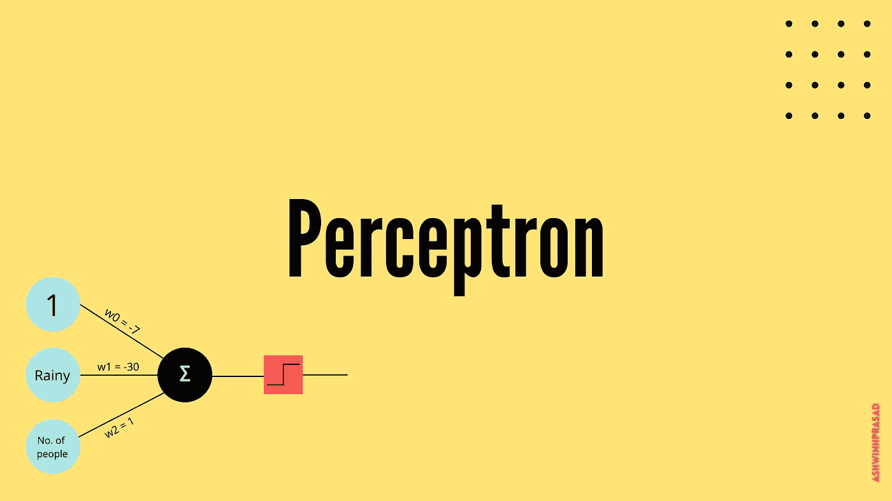
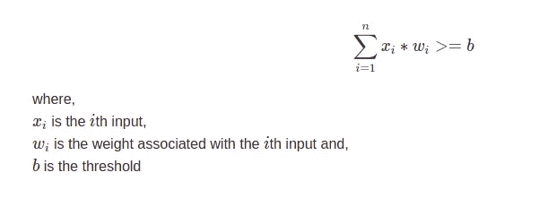
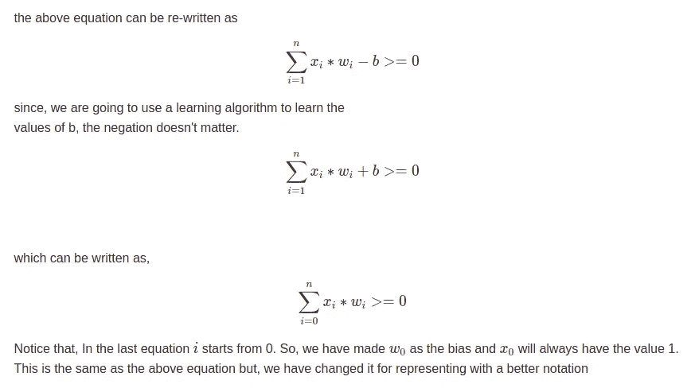
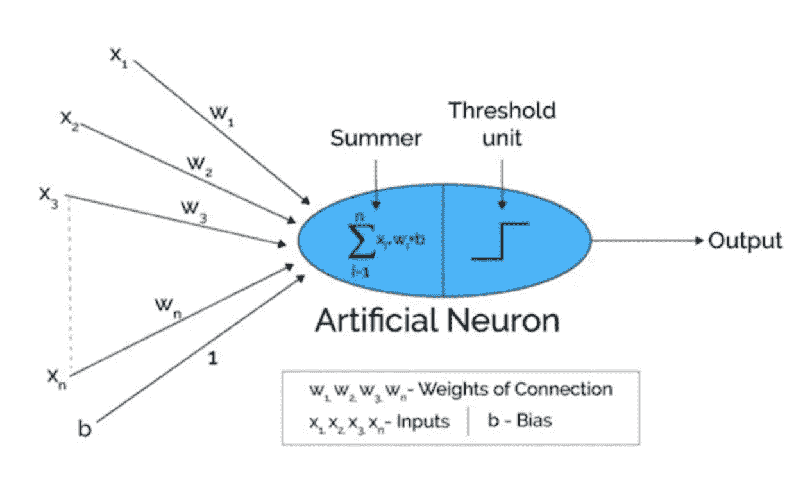
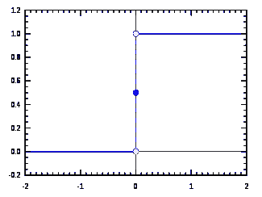
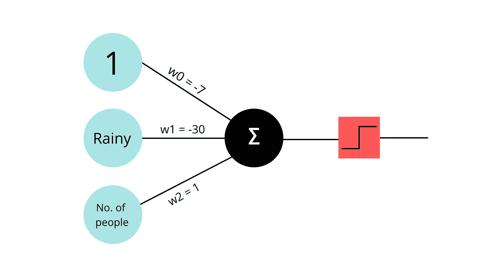

# 感知器

> 原文：<https://medium.com/analytics-vidhya/perceptrons-5af7e2432abf?source=collection_archive---------13----------------------->

## 神经网络基础

感知器和乙状结肠神经元都是接受一些输入、进行一些计算并提供一个输出的单元。这些通常用于监督学习问题。

# 感知器

假设我们有一些输入 *(x* ₁ *，x* ₂ *，…。，x* ₙ *)。*在将这些输入输入到感知器时，每个输入与分配给它的随机初始权重相乘，并将结果相加。如果加权和大于特定阈值，感知器输出 1，否则输出 0。

图 1.1

最初，我们不知道权重和阈值*(也称为偏差)。*我们将使用某种形式的学习算法，以便从数据中学习这些权重和阈值。我们将在后面讨论这个算法。现在，我们将随机初始化权重和偏差。

图 1.2

图 1.3:简单的感知器架构

总结一下我们之前看到的，感知器计算输入的加权和，然后传递给激活函数*(本例中为阶跃函数或阈值函数)*，然后给出输出。
简单来说，感知器的两个部分是加权和与激活函数。

# 阶跃函数

图 2.1

阶跃函数是输入≥ 0 返回 1，输入为< 0.

# Perceptron example Use-Case

Let’s say we want to predict if John plays football on a particular day or not. There are 2 factors that we take into account. The weather and number of people available. So, x₁ be “**下雨了吗？**"和 x₂成为"**可用人数"**。根据现有的数据，我们知道，如果下雨，如果人数很少，约翰不会踢足球，因为我们都知道，人数很少时就不能踢足球。如果人数多，Join 会踢足球。但是，即使人数很多，如果下雨，约翰也不会去踢足球。

x0 永远是 1，x1 是"**下雨了吗？***(0 表示‘否’，1 表示‘是’)*x2 为***可用人数**。 **w₀** 、 **w₁** 和 **w₂** 分别是与 **x₀** 、 **x₁** 和 **x₂** 关联的权重。*

**

*图 3.1:预测约翰是否会踢足球的感知机模型*

*因此，假设这些是我们在包含约翰踢足球的历史数据的数据集的帮助下训练感知机后得到的权重和偏差。*

1.  *在某个阳光明媚的日子，假设有 5 个人在那里踢足球。即 **x2=5** 。因此，我们的感知机的输入将是[“无雨”，5]。因此，加权和将是(1*-7)+(0*-30)+(5*1) = -7 + 5 = -2。As -2 ≤ 0，我们的感知机输出 0 *(约翰不会踢足球)。**
2.  *在某个阳光明媚的日子，假设有 11 个人在那里踢足球。即 **x2=11** 。因此，我们的感知机的输入将是[“无雨”，11]。因此，加权和将是(1*-7)+(0*-30)+(11*1) = -7 + 11= 4。当≥0 时，我们的感知器输出 1 *(约翰会踢足球)。**
3.  *下雨天，假设有 9 个人在那里踢足球。即 **x2=9** 。因此，我们的感知机的输入将是[“没有雨”，9]。因此，加权和将是(1 *-7)+(1 *-30)+(9 * 1)=-7+9–30 =-28。As -28≤0，我们的感知器输出 0 *(约翰不会踢足球)。**

*我们的感知机给了天气更多的权重，因为它知道天气比人数更重要。下雨的时候，有多少人可以去并不重要。*

*这里，我已经手动给出了权重。但是，有了由 X 和 Y 组成的数据集，我们的感知器将能够自动学习这些权重，以便以最佳方式映射 X 和 Y，我们现在将看到学习算法。*

# *更新权重*

*正如已经说过的，我们用随机值初始化感知器的权重，给定数据集，我们将要求感知器学习适当的权重，这将允许感知器对结果进行最佳分类并提高准确性。*

*现在，我不打算过多地讨论算法的技术细节。相反，让我给它一个要点。*

1.  *我们随机初始化权重。*
2.  *我们把输入交给感知器*
3.  *输入与其各自的权重相乘，偏差被添加到总加权和中。通过激活函数产生 0 或 1。*
4.  *我们在成本函数的帮助下计算损失，成本函数基本上是对感知机的输出与实际输出的偏差的估计*
5.  *我们找到损失函数对每一个权重的偏导数，这叫做权重梯度。我们通过用该权重减去权重的少量梯度来更新权重。*

*要理解为什么相对于定义的成本函数在与其梯度相反的方向上移动权重会减少误差并产生最佳权重，需要理解梯度下降算法。下面简单解释一下[梯度下降算法](/analytics-vidhya/linear-regression-with-gradient-descent-derivation-c10685ddf0f4)。*

*如果对这个概念仍有疑问，请参考下面的视频*

# *结论*

*因此，我们已经看到了输入是如何通过感知器传播的，以及它们如何被用来做出简单的决定。然而，感知器算法也有一些问题，sigmoid 神经元克服了这些问题。这将在接下来的博客中进一步讨论。*

# *谢谢你*