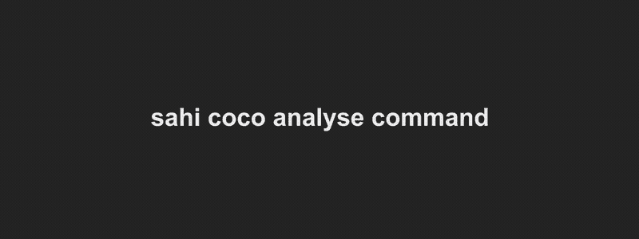

# 使用 YOLOv5 模型执行切片(平铺)推理和详细的错误分析

> 原文：<https://medium.com/analytics-vidhya/perform-sliced-tiled-inference-and-detailed-error-analysis-using-yolov5-models-69f0313de8e1?source=collection_archive---------21----------------------->


*   卫星图像或高分辨率图像上的小目标检测需要切片(平铺)推理吗？
*   您的检测模型需要可解释的度量标准吗(关于可能改进的见解)？
*   你需要一个交互式用户界面来可视化错误的预测吗？
*   你依赖 YOLOv5 车型吗？

所有这些都有可能与 SAHI 的 YOLOv5 集成🚀

[](https://github.com/obss/sahi) [## GitHub — obss/sahi:一个用于执行大规模目标检测的轻量级视觉库/…

### 目标检测和实例分割是计算机视觉中最重要的应用领域

github.com](https://github.com/obss/sahi) 

这篇文章将带你完成 YOLOv5 型号的**安装**、**切片推理**、**错误分析、**和**交互可视化**步骤。

## 装置

✔️安装 Pytorch:

```
conda install pytorch=1.10.0 torchvision=0.11.1 cudatoolkit=11.3 -c pytorch
```

✔️安装 SAHI:

```
conda install sahi -c conda-forge
or
pip install -U sahi
```

✔️安装 YOLOv5:

```
pip install -U yolov5
```

## 切片预测


显示 SAHI 切片预测能力的 Gif。

✔️用你的重量路径来执行推论:

```
sahi predict --source image_dir/ --model_type yolov5 --model_path yolov5s.pt --slice_height 512 --slice_width 512
```

## 误差分析图/指标

✔️使用 COCO 格式的数据集创建 COCO 格式的预测结果:


显示 SAHI COCO 格式数据集预测能力的 Gif。

```
sahi predict --source image_dir/ --dataset_json_path dataset.json --model_type yolov5 --model_path yolov5s.pt --no_sliced_prediction
```

✔️使用创建的 result.json 创建误差分析图:



Gif 展示了 SAHI 的错误分析能力。

```
sahi coco analyse --dataset_json_path dataset.json --result_json_path result.json
```

🎯指标的含义:

**C75:**IOU 阈值为 0.75 时的结果
**C50:**IOU 阈值为 0.50 时的结果
**Loc:** 忽略定位错误后的结果
**Sim:** 忽略超类别假阳性后的结果
**Oth:** 忽略所有类别混淆后的结果
**BG:** 忽略所有假阳性后的结果

📈可能的模型改进:

**C75-C50 和 C50-Loc=** 具有更精确边界框预测的潜在增益
**Loc-Sim=** 修复超级类别混淆后的潜在增益
**Loc-Oth=** 修复类别混淆后的潜在增益
**Oth-BG=** 修复所有假阳性后的潜在增益
**BG-FN=** 修复所有假阴性后的潜在增益

## 交互式可视化

✔️安装五十一:

```
pip install -U fiftyone
```

✔️用你的预测结果启动一个 web 应用程序:


Gif 展示了 SAHI 的交互式可视化能力。

```
sahi coco fiftyone --dataset_json_path dataset.json --image_dir image_dir/ result.json
```