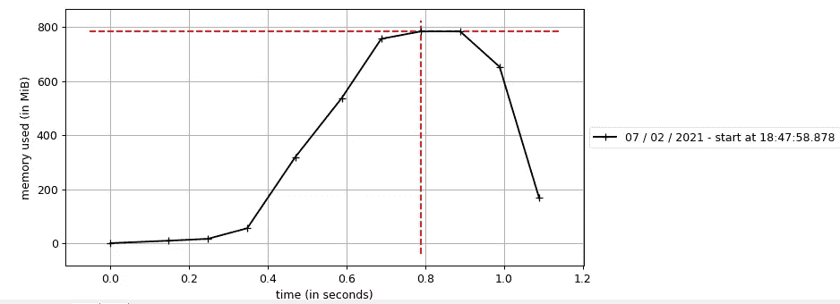

# Python 中的性能分析和优化

> 原文：<https://medium.com/analytics-vidhya/performance-analysis-and-optimization-in-python-c94939eceb91?source=collection_archive---------13----------------------->

作为一名程序员，最重要的任务之一就是分析代码并优化它，这样代码就可以使用更少的内存和时间。有人可能会认为，找到占用更多内存空间的代码部分是一项单调乏味的任务。但是等等，幸运的是在 Python 中，我们有不同的性能分析库，例如:cProfile，line-profiler，guppy，memory-profiler。在本文中，我们将讨论用于监控内存消耗的内存分析器库。

模块**内存分析器**返回 python 程序的内存消耗的逐行分析。

**安装**

```
pip install -U memory_profiler
```

要获得逐行分析，请遵循以下两个步骤:

1.  导入模块。
2.  使用装饰@配置文件

在下面的例子中，我们调用 my_func()，在其中我们只是做一些计算并存储在变量' a '中，然后我们删除了' a '。这个程序可能与实际问题无关，但是这个代码足以理解内存分析。

```
from memory_profiler import profile
@profile
def my_func(x):
    a = [x]*(10**8)
    del amy_func(20)
```

**输出:**

```
Line #    Mem usage    Increment  Occurences   Line Contents
============================================================
     2     20.3 MiB     20.3 MiB           1   [@profile](http://twitter.com/profile)
     3                                         def my_func(x):
     4    783.2 MiB    762.9 MiB           1       a = [x]*(10**8)
     5     20.3 MiB   -762.9 MiB           1       del a
```

第一列表示已被分析的代码的行号，第二列( *Mem usage* )表示该行被执行后使用的内存。第三列(*增量*)表示当前行相对于上一行的内存差异。第四列*(occurrences)*表示特定代码行的出现次数。最后一列(*行内容*)打印已经分析过的代码。

> ***注:*** *内存分析器*以 **MiB(兆字节)而非 MB(兆字节)表示内存使用量。**一个**兆字节**等于**1048576 字节**一个**兆字节等于**1000000 字节。****
> 
> 如果您已经观察到了上述示例的输出，内存分析器需要一些内存来进行分析，因此建议在开发中使用，而不是在生产中使用。

有时候，将完整的内存使用报告作为外部进程(无论是否是 Python 脚本)的时间函数(而不是逐行)是很有用的。在这种情况下，可执行文件 **mprof** 可能会有用。

首先需要在终端运行程序使用***mprov 运行<可执行>*** 命令:

**示例:**运行以下命令后，它将返回与上面相同的输出。

```
mprof run profiler.py
```

现在使用下面命令来绘制图形:

```
mprof plot
```



**其他 mprof 命令:**

*   ***mprof list:*** 以用户友好的方式列出所有记录的内存使用文件。
*   ***MPR of clean:****清除所有记录的内存使用文件。*
*   ****mprof rm:*** 清除具体记录内存使用情况的文件。*

*一旦你抓住了使用更多时间和空间的那部分代码，你就可以很容易地修改那部分代码来优化程序。*

***结论:**我们已经学会了监控程序的内存消耗和逐行分析。我们还学会了绘制内存消耗相对于时间的图表。*