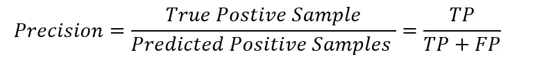

# 绩效评估指标

> 原文：<https://medium.com/analytics-vidhya/performance-evaluation-metrics-5c9104b2a407?source=collection_archive---------9----------------------->

马库斯·温克勒在 [Unsplash](https://unsplash.com?utm_source=medium&utm_medium=referral) 上的照片

照片由[维托达·克莱恩](https://unsplash.com/@little_klein?utm_source=medium&utm_medium=referral)在 [Unsplash](https://unsplash.com?utm_source=medium&utm_medium=referral) 上拍摄

在建立了一个机器学习模型之后，我们应该了解它的表现有多好。为了评估我们模型的性能，我们使用性能评估指标。大多数人在开始机器学习时，会犯这样的错误:没有首先评估模型的性能，就直接映射模型的结果。这些指标帮助我们改变模型的权重，以获得最佳结果。

性能指标的选择是非常关键的，因为它会影响我们模型的性能如何被测量以及如何与基准测试结果进行比较。这种选择取决于模型的类型及其应用。现在让我们看看不同类型的指标。

***内容:***

1.  ***混淆矩阵***
2.  ***准确度***
3.  ***精密***
4.  **回忆*回忆*回忆**
5.  ***特异性***
6.  ***F1——得分***
7.  ***对数损耗***
8.  ***AUC — ROC 曲线***
9.  ***均方差***
10.  ***平均绝对误差***
11.  ***均方根误差***
12.  ***基尼系数***
13.  ***科恩的卡帕系数***

**1。混淆矩阵:**这个指标用于分类问题，被认为是性能评估最简单的指标。混淆矩阵是一个简单的表格，有两个维度:“实际”和“预测”，对于这两个维度，它有相同的类别集。在一个简单的分类问题中，有两类:正类(1)和负类(0)。

考虑肿瘤分类问题的例子，这里分两类:人有肿瘤( **y = 1** )，人没有肿瘤( **y = 0** )。

混淆矩阵

混淆矩阵中有四个象限，分别代表以下内容:

*   **真阳性(TP):** 阳性(+)且正确归类为阳性(+)的病例数。

*例子:这个人实际上患有癌症，而模型正确地预测了这个人患有癌症。*

*   **假阳性(FP):** 阴性(-)并被错误归类为(+)的出现次数。这也称为类型 1 错误。

*示例:此人没有患癌症，而模型错误地预测此人患有癌症。*

*   **假阴性(FN):** 阳性(+)错误归类为阴性(-)的发生次数。这也称为第二类错误。

*示例:此人实际上患有癌症，而模型错误地预测此人没有癌症。*

*   **真阴性(TN):** 阴性(-)且正确归类为(-)的病例数。

*例:此人没有患癌症，模型正确预测此人没有患癌症。*

对于一个完美的分类器，应该没有误差，也就是说，类型 1 或类型 2 误差应该等于零，因此，假阳性=假阴性= 0。因此，为了提高模型的性能，我们应该尽量减少这些错误，假阳性和假阴性。混淆矩阵构成了其他性能指标的基础。

**2。准确性:**准确性是我们的模型做出的正确预测的度量。它等于模型所做预测总数的正确预测数。

当类的大小大致相等时，准确性会给出正确的结果。当班级中有大多数人时，不应该考虑这个问题。例如，如果数据集中总共有 100 人，其中 94 人没有癌症，6 人患有癌症。如果我们的模型预测他们都没有患癌症，那么准确率将为 94%，尽管该模型没有正确预测癌症患者。因此，精度和召回率优于准确度。

**3。精度:**是真阳性样本与所有分类为阳性样本的比值。它也被称为阳性预测值(PPV)。

在我们的示例中，precision 表示所有患者中，我们预测他们患有癌症(y =1)的，实际患有癌症的比例。

**4。召回:**是真阳性样本与所有实际阳性样本的比值。它也被称为真阳性率(TPR)或灵敏度。

在我们的示例中，回忆表示所有实际患有癌症的患者中，模型正确检测出患有癌症的比例。

**5。特异性:**被模型正确分类的阴性样本的分数。它也被称为真阴性率(TNR)或特异性。

在我们的示例中，特异性表示在所有未患癌症的患者中，模型正确检测到的未患癌症患者的比例。

**6。F1-Score:** 它是精确度和召回率的结合，这就是为什么它是一个流行的性能指标。f1-得分等于精确度(p)和召回率(r)的调和平均值。

像其他指标 F1 一样，得分最佳值为 1，最差值为 0。由于 F1 分数是精确度和召回率的组合，它在两者之间找到了平衡。因此，F1 分数的高值证实了精确度和召回率的高值。

**7。对数损耗:**在 Kaggle 比赛中这个指标被广泛使用。它也被称为对数损失或交叉熵损失。对数损失惩罚了错误的分类，从而量化了分类器的准确性。

*这里 p 是正类(y=1)的概率，N 是数据集中的样本数。*

模型的性能以 0 到 1 之间的概率值的预测输出来测量。因为这个度量是一个损失，它应该是最小的，因此，一个理想的模型应该有 0 的对数损失。

**8。** **AUC — ROC 曲线:1。**曲线下面积(AUC)受试者操作特征(ROC)曲线有助于我们可视化我们模型的性能。这是一个重要的评估指标。

绘制 ROC 曲线，y 轴为 TPR，x 轴为 FPR，即 TPR 对 FPR 图。两个轴都有从 0 到 1 的值。

理想模型在点(TPR = 1，FPR = 0)，最差模型在点(TPR = 0，FPR = 1)。因此，对于一个更好的模型，TPR 应该高，FPR 应该低。

ROC 曲线— [维基百科](https://en.wikipedia.org/wiki/Receiver_operating_characteristic)

为了发现 ROC 曲线的性能，我们计算 AUC。曲线下的面积也可用于比较两个或多个分类器。表现更好的模型将比其他模型具有更大的 AUC。此外，对于随机猜测分类器，ROC 是从(0，0)到(1，1)的直线，因此，AUC 等于 0.5。因此，好的分类器应该至少具有大于 0.5 的 AUC

**9。** **均方误差:**均方误差(MSE)等于预测值与目标(实际)值的均方差(距离/误差)。对于更好的模型，MSE 应该是最小的。

MSE 是回归问题中非常流行的度量标准。误差的平方是有益的，因为它总是给出正值，所以总和不会为零。此外，它还突出了较大的差异——这可能是好的，也可能是坏的(它确保我们训练的模型不包含异常值，而单个异常值会放大错误)。

10。 **平均绝对误差:**平均绝对误差(MAE)等于预测值与目标(实际)值之间的平均绝对差(距离)。

MSE 和 MAE 也是回归问题最常见的损失函数。

**11。** **均方根误差:**均方根误差(RMSE)是对 MSE 的修正。这个指标相当于 MSE 的平方根。像 MSE 和 MAE 一样，对于理想模型，RMSE 是零。

**12。** **基尼系数:**不，这与迪士尼的阿拉丁无关如果你是这么想的话。

disneyclips.com[上的阿拉丁神怪形象](https://www.disneyclips.com/images/aladdin-genie.html)

该指标用于对不同模型进行质量比较。基尼系数的值从 0 到 1，其中 0 代表完全平等，1 代表完全不平等。它通常用于不平衡的类值，其值越高表示数据越分散。

基尼系数可以从 ROC 曲线下的面积得出:

**13。** **科恩的 Kappa 系数:**也称为 Kappa 得分，它衡量两个评价者之间的一致程度，在 ML 模型评价度量中这两个是预测和实际输出值。一致基本上是匹配值的个数与值的总数之比。这种一致性的一部分可能是因为偶然，所以我们在 kappa 评分中引入了偶然一致性因子。

该度量主要用于多类分类问题。机会协议等于每个评估者对每个类别的条件概率的总和。

谢谢你看我的文章！希望对你有帮助。