# 文本生成自然语言处理模型——GPT-尼奥、GPT-2 和 XLNet 的性能评估

> 原文：<https://medium.com/analytics-vidhya/performance-evaluation-of-text-generating-nlp-models-gpt-neo-vs-gpt-2-vs-bert-ddb72547956f?source=collection_archive---------1----------------------->

一种实证方法，用于测试三个巨大的最先进的语言模型在应用于相同的文本生成下游任务时的性能。

纳迪·博罗迪纳在 [Unsplash](https://unsplash.com?utm_source=medium&utm_medium=referral) 上拍摄的照片

# **简介**

随着研究和技术的快速发展，自然语言模型已经进化了很多年。数据科学家将这些模型应用于下游任务和应用，如生成 SQL 代码、编写法律文档、发送自动邮件回复、聊天机器人和回答数学问题，取得了出色的成果。人们相信， [GPT-3](https://www.technologyreview.com/2020/07/20/1005454/openai-machine-learning-language-generator-gpt-3-nlp/) (预训练生成式[变形金刚](https://huggingface.co/transformers/)的最新产品)将通过向非技术人员开放该领域，并大规模创建一个全新的少数镜头学习产品领域，在 [AGI](https://www.technologyreview.com/2020/10/15/1010461/artificial-general-intelligence-robots-ai-agi-deepmind-google-openai/) (人工通用智能)采用方面开创一个新的范式。语言建模通常利用统计和概率技术来确定句子中给定单词序列的概率。为了进行单词预测，语言模型结合上下文、语法和词汇来分析之前的文本数据。

# **常识**

研究人员和开发人员正不知疲倦地致力于建立强大而有效的语言模型，他们认为，用互联网文本语料库对更多参数进行训练的更大的模型会产生更好的结果。毫不奇怪，预训练语言模型的参数大小越来越大，达到了 175B ( [GPT-3 大型](https://lambdalabs.com/blog/demystifying-gpt-3/))的数量，其动机是模型越大，它在来自特定领域数据的训练样本越少的情况下表现越好。显然，训练一个大型的集中式多任务模型也比单独为每个任务训练一个新模型更有效。在这篇文章中，我们努力比较三个这样的大规模语言模型来揭穿和揭开这个理论的神秘面纱。

> *在语言模型环境中，越大就意味着越好吗？*

# 人工智能社区的趋势是什么？

transformers 体系结构和迁移学习的结合引领着自然语言处理行业的黄金标准。有许多预先训练的语言模型具有自我注意变压器块，乍看之下它们是相似的，但是由于它们不同的内在训练算法，在现实世界任务中表现不同。像[伯特](https://huggingface.co/transformers/model_doc/bert.html)、 [GPT-2](https://openai.com/blog/gpt-2-1-5b-release/) 、GPT-3、[图灵 NLG](https://www.microsoft.com/en-us/research/blog/turing-nlg-a-17-billion-parameter-language-model-by-microsoft/) (微软)、[威震天](https://github.com/NVIDIA/Megatron-LM)(英伟达)和 [T5](https://github.com/google-research/text-to-text-transfer-transformer) (谷歌)这样的模型已经成为头条新闻，因为他们在无人监督的语言应用程序上的最先进的表现。

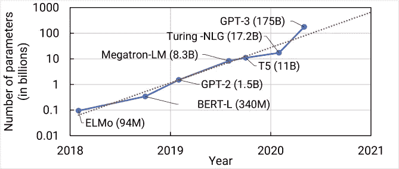

语言模型的进化。来源: [arXiv 研究论文](https://www.arxiv-vanity.com/papers/2104.04473/)

在我们努力选择三个候选模型进行比较评估的过程中，我们考虑了各个方面，例如开源代码的可用性、微调就绪性、适应性、可调参数和硬件计算时间。虽然在人工智能社区中有大量预训练的语言模型及其大小导数可用，但我们决定将自己限制在仅具有不寻常性能的基本语言模型。出于评估目的，我们最终选定了[***GPT-尼奥***](https://github.com/EleutherAI/gpt-neo) ***(GPT-3 的复制品)*** 、 ***GPT-2(前身)*** 和[***XLNet***](https://analyticsindiamag.com/guide-to-xlnet-for-language-understanding/)***(类伯特)*** ，因为这些模型都具有相当好的通用少量学习能力。

# 实验装置和数据集

我们将演示和评估上面选择的三个 NLP 模型的响应，方法是根据预测给定单词输入序列的下一个单词序列的简单目标来微调它们中的每一个。此外，进行综合比较以评估所有可能的预测。目标被设定为主要通过经验方法和渐进迭代来实现。

该实验旨在与新冠肺炎疫苗推文的 kaggle domain [数据集](https://www.kaggle.com/gpreda/all-covid19-vaccines-tweets)一起工作，该数据集包含来自疫苗制造商的条目，即辉瑞/BioNTech、国药控股、科兴生物、Moderna、牛津/阿斯利康、Covaxin 和 Sputnik V

使用 [tweepy](https://www.tweepy.org/) Python 包访问 Twitter API 来收集数据。对于每种疫苗，相关的搜索词(在 Twitter 中最常用来指代相应的疫苗)被用于合并所有疫苗制造商的所有来源的推文。我们将在这个数据集上微调这些语言模型，通过预测和生成符合上下文的下一个最佳单词序列来完成疫苗相关的提示或输入。

出于迁移学习的目的，我们选择使用 [Google Collaboratory](https://colab.research.google.com/?utm_source=scs-index) 免费实例和 GPU/TPU 运行时。此外，由于其共享的在线培训工作区，我们将只使用所有考虑中的语言模型的小型可比版本。对于本文，由于硬件限制，我们将选择**124 米**大小的 GPT-2、**125 米**大小的 GPT-尼奥和**110 米**大小的 XLNet 进行微调。

# 候选模型 1 : GPT 近地天体

GPT 代表“生成预训练变压器”。去年 7 月，Open AI 发布了 GPT-3，这是一个在公共数据集上训练的自回归语言模型，拥有 5000 亿个标记和 1750 亿个参数，至少比以前的非稀疏语言模型大十倍。客观地看，它的前身 GPT-2 只训练了 15 亿个参数。不幸的是，GPT-3(截至 2021 年 4 月)尚未开源。API 访问 GPT-3 只能通过邮件的私人测试批准。然而，有一个很有前途的替代方案叫做 GPT-尼奥，一个只有 2.7 B 参数的开源变压器模型，在设计和性能方面都类似于 GPT-3。在本文中，我们将实现 GPT-近地天体取代 GPT-3 作为替代。

Happy Transformer 是建立在[humping Face 的 Transformer 库](https://huggingface.co/transformers/)之上的一个包，它可以轻松地利用最先进的 NLP 模型进行推理，并在各种任务上训练它们，如文本生成、文本分类、问题回答、单词预测等。GPT-Neo-125M 是一个变压器模型，使用伊柳瑟雷复制的 GPT-3 架构设计。

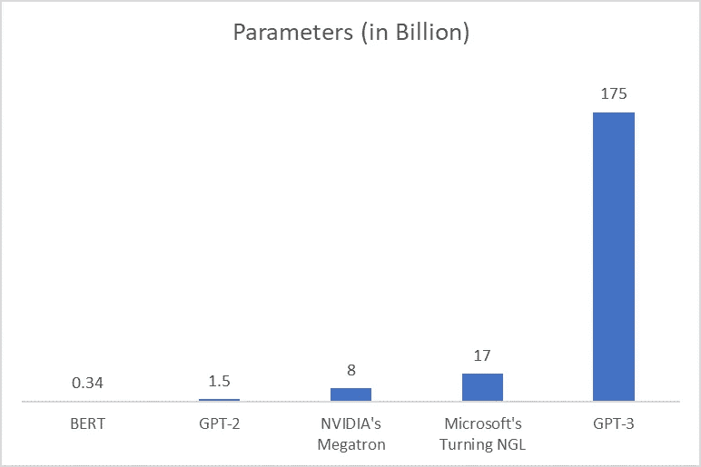

语言模型大小比较。来源:[谷歌图片](https://www.merkleinc.com/in/blog/ai-search-what-openais-gpt-3-means-google-and-seo-0)

# 候选模型 2: GPT-2

它是由 [OpenAI](https://en.wikipedia.org/wiki/OpenAI) 发布的原始系列语言模型的第二次迭代。GPT 目前有 3 种型号{v1、v2 和 v3}。其中只有 GPT 1 号和 GPT 2 号是完全开源的，因此我们将选择最新的 GPT 2 号进行实验。在技术方面，GPT-2 的体系结构由变压器体系结构的解码器部分组成。该块的编码器-解码器交叉关注部分被移除，因为没有编码器，并且自关注部分被替换为被屏蔽的自关注。

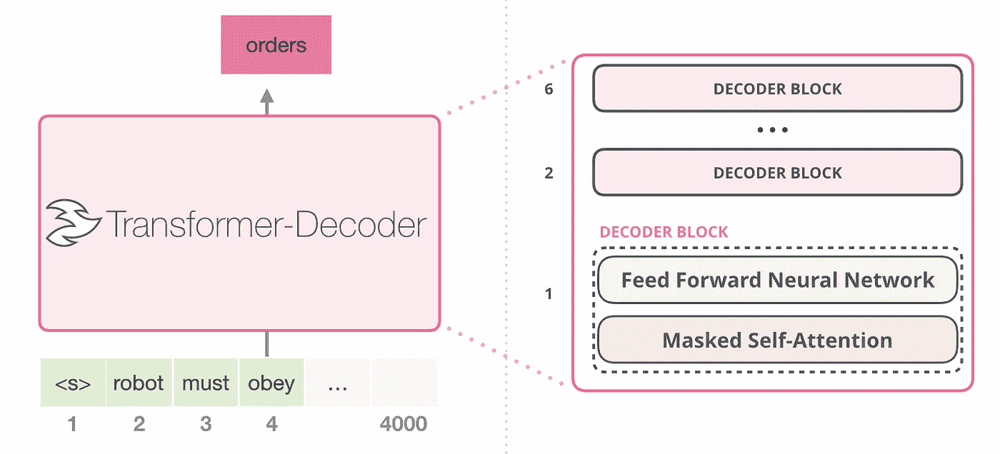

GPT-2 的插图。来源: [GPT 文件](https://jalammar.github.io/illustrated-gpt2/)

# 模型候选 3: **XLNet (BERT)**

XLNet 是另一种类似 BERT 的模型。但这是一个非常有前途和潜力的机会。XLNet 结合了广义自回归(AR)预训练方法。它是一个 AR 语言模型，使用上下文单词来预测下一个单词。但是这里上下文词被限制在两个方向，向前或向后，而不是同时向前和向后。语言模型由两个阶段组成，训练前阶段和微调阶段。XLNet 专注于训练前阶段。在预训练阶段，它提出了一个新的目标称为**置换语言建模使用置换**生成。

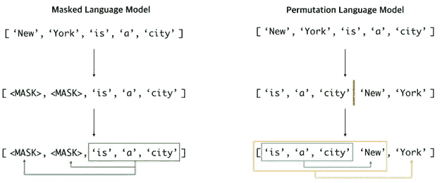

XLNet 的一个图解。来源:[SOTA XLNet](http://naveedshare-licensetoplay.blogspot.com/2019/08/xlnet-sota-model.html)

与 AR 语言模型不同，BERT 被归类为自动编码器(AE)语言模型。AE 语言模型旨在从损坏的输入中重建原始数据。损坏的输入表示在预训练阶段用于将原始令牌 ***替换为*** 的【掩码】。而目标是预测 ***变成*** 以得到原来的句子。AE 语言模型可以等效地看到前后两个方向的上下文。

# **结果&观察**

该实验包括通过迁移学习技术在疫苗数据集上微调预先训练的 GPT-尼奥、GPT-2 和 XLNet 的通用语言模型。为了实现这一点，我们分析了疫苗相关短语和短文本的少量提示，作为这些模型的输入前体，以优化最终几个神经网络层的权重和偏差。这使得模型能够通过以可理解的方式预测下一个最有意义的序列来对疫苗特异性文本提示做出响应。

为了简单和快速比较，我们在评估阶段对所有三个现在已经微调的语言模型解析了相同的文本提示，以记录它们对四次迭代的响应。下面的一组表格图像以综合的方式描述了所有这些响应的比较视图。

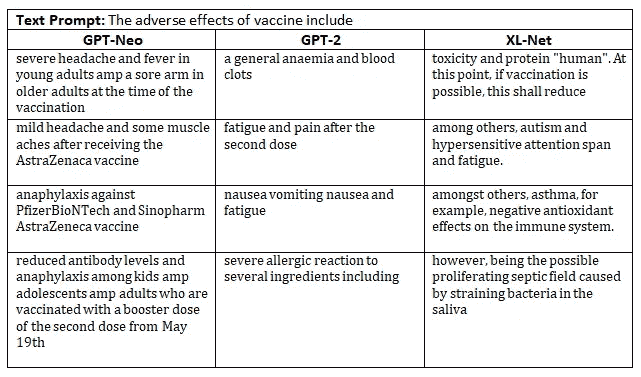

第一个文本提示的四次迭代。作者图片

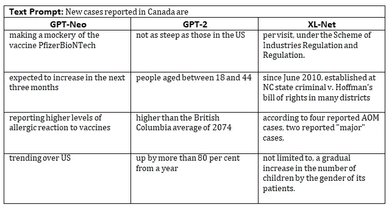

第二个文本提示的四次迭代。作者图片

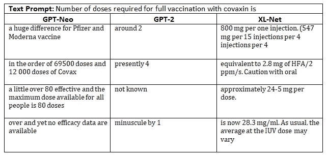

第三个文本提示的四次迭代。作者图片

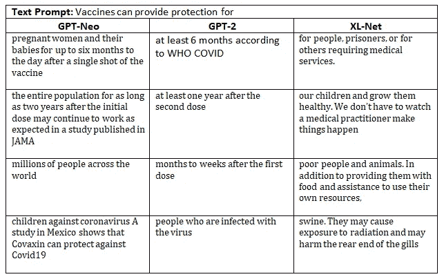

第四个文本提示的四次迭代。作者图片

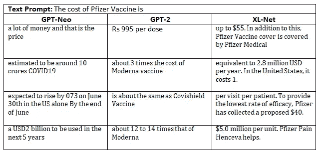

第五个文本提示的四次迭代。作者图片

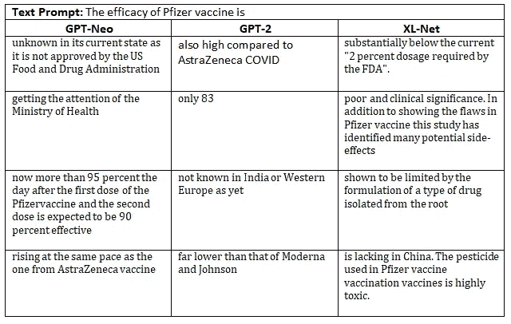

第六个文本提示的四次迭代。作者图片

总的来说，对于所有六个提示，GPT-近地天体比其他候选模型更好地检测和响应上下文。即使使用最优化的 [GENSettings](https://www.vennify.ai/gpt-neo-made-easy/) ，它也非常冗长。而 GPT-2 生成的上下文提示要短得多，在微调阶段需要更多的时间来优化。最后，XL-Net 在排名中排名垫底，因为它经常偏离上下文，并且由于其掩蔽的自然训练范式，还挑选不相关的词。

我们还建立了一个相对的 [BLEU](https://en.wikipedia.org/wiki/BLEU) ( *双语评估替角分数*)分数来衡量每个提示的每次迭代的结果，并将其列表如下:

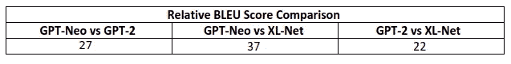

蓝色分数。作者图片

BLEU 是一个专注于精度的指标，它计算参考文本和生成文本的 n 元语法重叠。这种 n 元语法重叠意味着除了 n 元语法的术语关联之外，评估方案是独立于单词位置的。在 BLEU 中需要注意的一点是——有一个简短的惩罚，即当生成的文本与目标文本相比太小时应用的惩罚。所有的源代码都可以从这里的[分叉。](https://github.com/Shashank545/comparing-text-generating-NLP-models)

# **结论**

由此获得的结果是有趣的，因为它有助于解释迁移学习教学法，然后是预先训练的语言模型，以快速适应任何下游任务。此外，我们成功地测试了性能，并通过 BLEU 分数进行了验证，当然它需要通过跨更多时代的微调来改进。但是要点很清楚，因为这些模型在规模和多租户功能方面随着时间的推移会表现得更好。这些模型即使不是很好，也是很好的，当通过多次试验使用正确的配置进行微调时，可以产生有意义的结果。这使得它们成为完美的基线启动者，如果不是许多 NLP 应用的最先进的。

# **参考文献**

*   科林·拉弗尔，诺姆·沙泽尔，Adam Roberts，凯瑟琳·李和莎兰·纳朗。用统一的文本到文本转换器探索迁移学习的局限性。2020. [arXiv:1910.10683](https://arxiv.org/abs/1910.10683)
*   亚历克·拉德福德、杰弗里·吴、雷文·柴尔德、大卫·栾、达里奥·阿莫代伊、伊利亚·苏茨基弗等。语言模型是无人监督的多任务学习者。 *OpenAI 博客*，1(8):9，2019。
*   [GPT-尼奥](https://github.com/EleutherAI/gpt-neo)
*   [GPT-2](https://minimaxir.com/2019/09/howto-gpt2/)