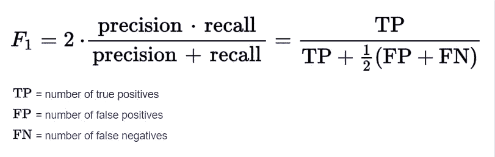

# 监督分类问题的性能度量。

> 原文：<https://medium.com/analytics-vidhya/performance-measures-for-supverised-classification-problem-33bf9ccfdace?source=collection_archive---------8----------------------->

## 看指标的目的是什么？

根据实际数据和预测数据找到问题的解决方案，帮助您根据数据问题选择正确的指标。

在为我们的问题选择正确的度量标准之前，我们需要知道一些分类问题的度量术语。困惑矩阵通过为问题选择正确的指标来帮助我们解决问题。

# 混淆矩阵

## 注意:

0 表示**缺勤(或)为负**

1 表示**存在(或)正**

## **1。真阴性(TN):**

**模型正确预测负类的结果。**例如，您没有 covid，而 ML 模型正确预测为 a not a covid 负值。

## 2.假阳性(FP):

**模型错误预测正类的结果。**例如，您没有 covid，而 ML 错误地预测为 covid 阳性。这种错误称为**1 型错误。**

## 3.假阴性(FN):

**模型错误预测负类的结果。**例如，您有一个 covid，但 ML 预测您没有 covid 负值。这种类型的错误称为**类型 2 错误。**

## 4.真阳性(TP):

**模型正确预测阳性类别的结果。**例如，您有一个 covid，ML 预测您有一个 covid 阳性，那么它就是真阳性。

**分类报告的一个著名例子。**

# 分类问题我们去表演吧。

我们可以通过调用分类报告来获得分类的性能，也可以手动计算它…

## 1.准确(性)

这是模型正确预测的一部分。**当我们的目标数据分布达到平衡时，我们将选择精度指标**。精度值越高，模型越好。

**准确度= (TP+ TN)/ (TP+ TN+FP+FN)**

## 2.精确

就是**预测阳性病例**的比例。精度值越高，模型越好。

**精度= TP/(TP+FP)**

## **3。召回**

是**实际阳性病例**的比例。它甚至被称为**敏感度或真阳性率。**召回值越高，模型越好。

**召回= TP/(TP+FN)**

## 4.假阳性率(FPR)

是**实际负面案例预测错误的比例。**FPR 越低，模型越好，因为我们错误地预测阳性病例。

**假阳性率= FP/(FP+TN)**

**(或)**

**假阳性率= 1-灵敏度**

## **5。特异性**

是**实际阴性病例被正确预测的比例。**

**特异性= TN/(TN+FP)**

## 6.F1 分数

它是**精度和召回**的调和平均值。它的最高分为 1，最低分为 0。

## 7.Kappa 评分

它用于模型的整体性能，即实际数据与预测数据的对比。

**Cohen Kappa 评分衡量本真实值与预测值的一致程度**

**以下 0 表示不同意**

**0.01 到 0.20 表示轻微一致**

0.21 到 0.40 表示公平一致

**0.41 到 0.60 表示中度一致**

**0.61 到 0.80 表示基本一致**

**0.81 比 1 表示几乎完全一致**

## 8.接收机工作特性(ROC)

**TPR 和 FPR 值随不同的阈值而变化**。ROC 曲线是 TPR 相对于在所有可能的阈值下获得的 FPR 值的图。

## 9.ROC 曲线下面积

这是目标变量类别之间的可分性。AUC 随着类间分离的增加而增加。AUC 越高，模型越好

这些是分类问题的性能度量。我们将根据领域知识选择性能指标。

希望你清楚地了解了这些概念。

感谢阅读:)