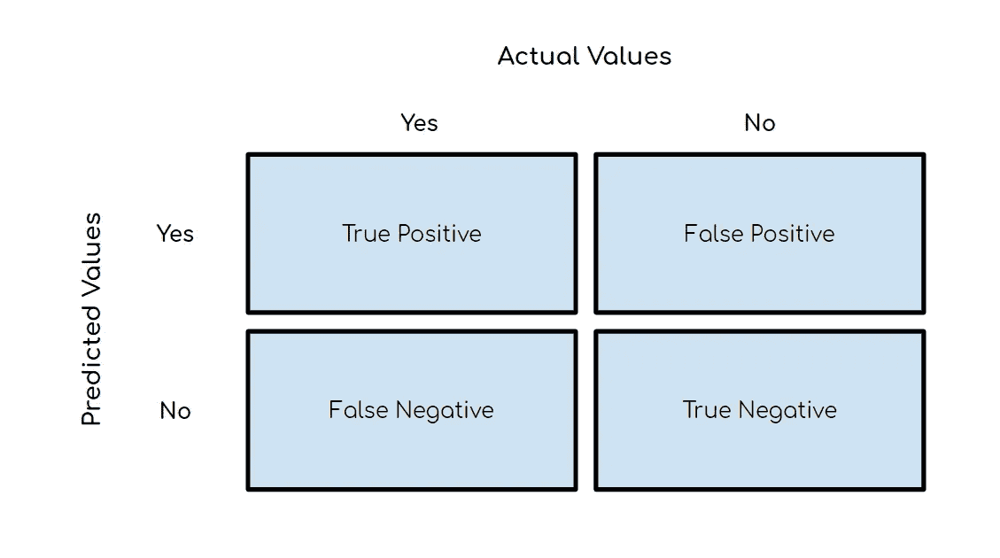
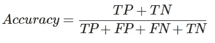
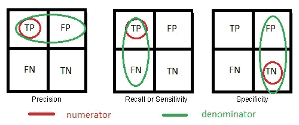
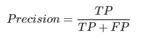
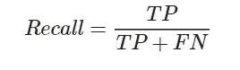
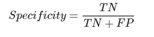
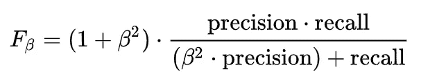
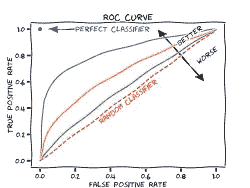
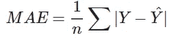
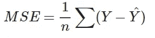

# 性能指标

> 原文：<https://medium.com/analytics-vidhya/performance-metrics-4d0b62abfdc?source=collection_archive---------18----------------------->

度量用于评估机器学习算法、分类以及回归算法的性能。我们必须仔细选择度量标准，因为机器学习算法的性能测量将完全取决于我们选择的度量标准。

# 分类的性能指标

## 混淆矩阵

它在分类问题中用于建立预测值和实际值之间的关系。它显示了每个类中有多少值预测正确，有多少值预测错误。我们可以推导出不同类型的度量标准来显示我们的模型有多适合。

## 对于余额数据集

## 1.准确(性)

当数据集平衡时，我们使用精确度。准确度表示正确预测值占总数值的百分比。

对于不平衡的数据集，我们不能使用精度，因为它可能不会给出一个好的结果。

例如:在 100 个值中，如果 TP=90，TN=0，精度仍然是 90%，这听起来不错，但不是因为 TN 没有被正确检测到，并且输出更偏向 TP。

## 对于不平衡数据集

## 1.精确

在所有**预测的**正值中，有多少是正确预测的。

当误报更重要时使用精度，例如在垃圾邮件检测中，如果一封邮件不是垃圾邮件，而模型预测它是垃圾邮件，我们会因为这个错误而错过一封非常重要的邮件。

## 2.回忆还是敏感

在所有的**实际**正值中，有多少是预测正确的。它也被称为**真阳性率(TPR)。**

当假阴性更重要时，使用 Precision，例如患者 covid 阳性，但模型检测为阴性，这将对医疗保健造成很大影响。如果患者不是 covid 阳性但仍被检测为阳性，我们可以为此做进一步的检测，但不应该出现副 vera。

## 3.特征

在所有的**实际负**值中，有多少是正确预测的。**假阳性率(FPR)**= 1-特异性

## 4.fβ分数

它显示了精确度和召回率之间的关系。

当 F=1 时，F1 将是精度和召回的调和平均值，即 2*pr*re/(pr+re)

如果精确度比 F>1 更重要，如果回忆比 F<1 更重要。

## ROC 和 AUC 曲线

我们需要尝试不同的阈值来获得最佳的 TPR 和 FPR 值。我们不能手动尝试所有的值。为此，我们使用 ROC 和 AUC 曲线。

我们可以尝试不同的 TPR 和 FPR 值，也可以尝试不同的算法来找到最适合我们数据的算法。符合曲线下大多数数据的模型被认为是最佳模型。

# 回归问题的性能度量

对于回归，问题度量相对容易理解。

## 1.平均绝对误差

它基本上是预测值和实际值之间的绝对差值的平均值之和。

## 2.均方误差

MSE 类似于 MAE，但唯一的区别是它在将实际输出值和预测输出值相加之前对它们的差进行平方，而不是使用绝对值。

> 我分享了重置两个指标的链接，即 R 平方和调整后的 R 平方。我已经更详细地解释了它们。

## 3. [R 平方](/analytics-vidhya/r-squared-formula-explanation-6dc0096ce3ba)

## 4.[调整后的 R 平方](/analytics-vidhya/adjusted-r-squared-formula-explanation-1ce033e25699)

# **最后的想法**

理解指标非常重要，因为它们告诉我们模型的性能。如果使用不当，它们也会误导我们。我们需要理解数据，并选择最适合我们模型的指标。