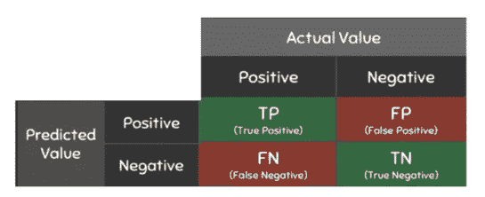
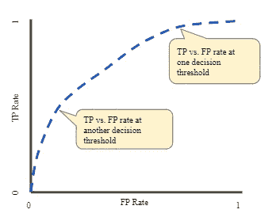

# 分类的性能指标

> 原文：<https://medium.com/analytics-vidhya/performance-metrics-for-classification-fd358c153894?source=collection_archive---------6----------------------->

凯文·Ku 在 [Unsplash](https://unsplash.com?utm_source=medium&utm_medium=referral) 上的照片

在本文中，我们将研究常用的分类性能指标。让我们了解一下什么是机器学习中的分类问题。分类是一种监督学习算法。它可以被定义为一种将一组给定的数据分成多个类别的方法。这些类通常被称为目标或标签。例如，我们希望将电子邮件分为垃圾邮件和非垃圾邮件两类。这被认为是一个分类问题，我们将预测一封电子邮件是否是垃圾邮件。

现在，让我们继续讨论最常用的分类性能指标。

## **精度**

准确度被定义为所有正确分类的数据点与总数据点的比率。

准确度=正确预测数/预测总数。

当您的数据接近平衡时，这是一个很好的衡量标准，这意味着所有的类标签都平等地出现在数据集中。在不平衡数据集的情况下，通过简单地将所有数据点分类为多数类，很容易实现高精度。因此，如果您的数据不平衡，就不应该使用精确度。

## 混淆矩阵

在理解混淆矩阵之前，让我们先看看真阳性、假阳性、真阴性和假阴性。

**真阳性(TP)** -可以解释为属于阳性类，被模型归类为阳性类。

**假阳性(FP)**——可以解释为属于阴性类，被模型归类为阳性类。

**真阴性(TN)** -可以解释为属于阴性类，被模型归类为阴性类。

**假阴性(FN)**——可以解释为属于阳性类，被模型归类为阴性类。

混淆矩阵只不过是一个二维表格。实际和预测，两个维度都有 TP、FP、TN 和 FN。

对于性能良好的模型，对角线元素即 TP 和 TN 应该是高的，非对角线元素即 FP 和 FN 应该是低的。混淆矩阵提供了一个关于哪些类被正确或不正确地分类，以及模型所犯的所有错误的详细描述。

## 精确度和召回率

精确度定义为所有预测阳性点中正确分类阳性的分数。

回忆被定义为正确分类的积极点在所有实际积极点中所占的比例。

精度= TP/TP+FP

召回= TP/TP+FN

在某些情况下，精确度比回忆更重要，而在其他情况下，反之亦然。

比方说，我们必须将电子邮件分类为垃圾邮件或非垃圾邮件。我们不希望我们的任何重要电子邮件被发送到垃圾邮件文件夹，而任何垃圾邮件仍然可以放在主文件夹中。因此，在这种情况下，FP 的成本大于 FN 的成本。因此，这里精确比回忆更重要。

我们再举一个例子。让我们做一个 Covid 诊断测试。我们不希望任何阳性病例不被发现，而如果一些阴性病例被显示为阳性，那么它的危害就小得多。因此，在这种情况下，FN 的成本大于 FP 的成本。所以回忆比精确重要得多。

## F1 分数

当我们想要在精确度和召回率之间取得平衡时，F1 分数是需要的。

它是精确率和召回率的调和平均值，因此考虑了误报和漏报。此外，如果我们有一个班级不平衡，F1 分数是一个很好的衡量标准。

现在让我们来看看 F1 分数的两个不同变量。

**宏观 F1 得分** -宏观 F1 得分也称为宏观平均 F1 得分。它给予所有类别标签同等的权重。

其中 I 是类/标签索引，N 是类的数量。

它可以解释为类别/标签 F1 分数的平均值。对于只在普通类上表现良好而在稀有类上表现不佳的模型，它将是低的。这是 F1 分数的默认汇总方法。

**微观 F1 得分** -微观 F1 得分也称为微观平均 F1 得分。它衡量所有班级的综合贡献的 F1 分数。当计算 F1 分数时，我们将不同组的所有单个真阳性、假阳性和假阴性相加，并从总和中计算微精度和微召回。最后，我们计算微精度和微召回的调和平均值，这为我们提供了微 F1 分数。

微观平均更加强调数据中的共同标签，因为它对每个样本给予同样的重视。

让我们用一个例子来了解一下微 F1 的分数。

(TP1)=12
(FP1)=9
(FN1)=3

那么精度(P1)和召回(R1)将是 57.14 和 80

对于不同的数据集，系统的

(TP2)=50
(FP2)=23
(FN2)=9

那么精确度(P2)和召回率(R2)将是 68.49 和 84.75

现在，使用微平均方法的系统的平均精度和召回率是

微平均精度=(TP1+TP2)/(TP1+TP2+FP1+FP2)=(12+50)/(12+50+9+23)= 0.6596
微平均召回率=(TP1+TP2)/(TP1+TP2+FN1+FN2)=(12+50)/(12+50+3+9)= 0.8378

微 F1 得分= 2 * 0.6596 * 0.8378/0.6596+0.8378 = 0.737

## AUC-ROC

这是在各种阈值设置下对分类问题的性能测量。它告诉我们我们的模型可以区分多少给定的类。

AUC-ROC 值的范围从 0 到 1。它越接近 1，我们的模型就越能准确地预测正类为正类，负类为负类。ROC(接收机工作特性曲线)描绘了两个主要参数:

真实阳性率

假阳性率

ROC 曲线绘制了 TPR 对不同阈值的 FPR。降低阈值会将更多的项目分类为阳性，因此假阳性会增加，而如果我们提高阈值，则会将更多的项目分类为阴性，因此假阴性会增加。

现在，我们来看看 AUC。它代表 ROC 曲线下的面积，测量整个 ROC 曲线下的面积。它提供了跨所有可能的分类阈值的综合性能度量。一个优秀的模型的 AUC 接近 1，这意味着它具有良好的可分性。一个差模型的 AUC 为 0，这意味着它具有最差的可分性度量，即它在重复结果。在另一种情况下，如果 AUC 为 0.5，则意味着该模型无论如何都没有类别分离能力。

我们已经介绍了分类的主要指标。如果您喜欢阅读，请关注我[此处](https://vaishali4175.medium.com/)了解更多数据科学内容，也可以在 Linkedin 上与我联系，我们很乐意与您谈论数据世界。

感谢阅读。