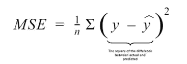
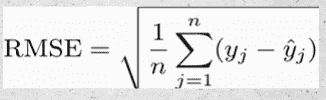
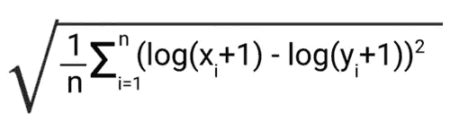
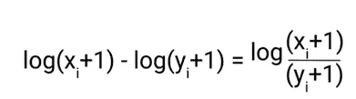
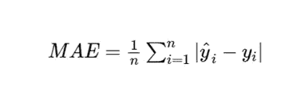
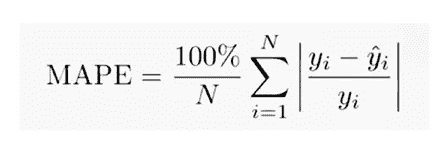
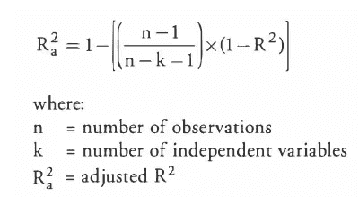

# 回归的性能指标

> 原文：<https://medium.com/analytics-vidhya/performance-metrics-for-regression-ed9c0ea180c3?source=collection_archive---------4----------------------->

斯蒂芬·道森在 [Unsplash](https://unsplash.com?utm_source=medium&utm_medium=referral) 上拍摄的照片

在本文中，我们将研究常用的回归性能指标。

我们先来了解一下什么是回归。回归是一种监督学习，用于估计因变量和一个或多个自变量之间的关系。它用于预测给定一个或多个预测变量的连续结果。比方说，我们想预测某个特定城市的房价。所以房子的价格取决于很多因素，比如房子的房间数量，房子的年龄，房子的位置，房子的地毯面积。因此，这些因素将是预测变量，而房价将是因变量。因此，可以使用上述预测值进行回归来预测房价。现在让我们转到最常用的回归性能指标。

**均方差(MSE)**——均方差是最常见的回归指标之一。它被定义为实际值和预测值之间的平方差。它消除了符号效应，从而产生正值误差。

平方也会对误差产生膨胀或放大效应。也就是说，实际值和预测值之间的差异越大，正误差的平方就越大。实际值和预测值之间的差异越大，对模型的影响越大。

MSE 的主要优点是它是完全可微的，因此它可以很容易地用作损失函数。但是也有一些缺点。首先，由于 MSE 中的平方效应，您得到的输出单位将始终是平方单位。这由 RMSE 负责，稍后会讨论。

如果你的数据中有异常值，MSE 会有很大波动，这将变得更难解释。此外，如果您使用 MSE 作为您的度量标准，那么建议将您的数据标准化或规范化，否则，度量标准将会膨胀很多。

**均方根误差(RMSE)-** 这是最广泛使用的回归指标。RMSE 被简单地定义为均方差的平方根。

RMSE 注意到了 MSE 的一些优点。RMSE 中的平方根导致单位与目标值的原始单位相同。此外，它消除了 MSE 的膨胀效应，因为它是相同的平方根。像 RMSE 一样，MSE 也惩罚有大误差的模型。因此，在较大的错误比较小的错误更不受欢迎的情况下，它更有用。但是因为我们先求差的平方，然后求平方根，RMSE 对异常值也很敏感。

**均方根对数误差(RMSLE)-** 它被定义为实际值和预测值的对数之间的平方差的平方根。让我们看看下面的公式:

RMSLE 几乎没有什么独特的属性。首先，RMSLE 对异常值具有鲁棒性。当我们取目标值的对数时，离群值对 RMSLE 没有太大影响，而 MSE 或 RMSE 会膨胀。

如果我们考虑等式的主要部分:

RMSLE 实际上考虑了实际值和预测值的比率。因此，RMSLE 可用于我们对实际值和预测值之间的相对误差感兴趣的场景。即使幅度增加，但是如果比率相同，则 RMSLE 值将是相同的。此外，在目标值具有长尾分布的一些情况下，可以使用 RMSLE。

**平均绝对误差(MAE)——**它测量实际值和预测值之间的绝对差值的平均值。

从上面的公式中我们可以看出，MAE 取实际值和预测值之间的绝对差值，因此误差总是正的。此外，由于没有平方，单位将与目标值的原始单位相同。MAE 不会给不同类型的错误更多或更少的权重，它会同等地惩罚较大和较小的错误。因此，它对异常值更鲁棒，并线性增加。在任何情况下，如果您想更多地关注离群值，那么 MAE 可能不是一个合适的选择。

**平均绝对百分比误差(MAPE)-** 它也是相对误差的一种形式，用百分比表示。让我们看看下面的公式:

从上面的公式中我们可以看出，误差是用百分比表示的。此外，我们可以看到，实际值在分母中，因此，与低估相比，MAPE 会因高估目标变量而更多地惩罚模型。如果你的基础真值为零，MAPE 也不能使用。

**R-Square-** 该指标衡量模型和因变量之间的关系强度。它解释了拟合优度，也就是说，这个指标给了我们一个概念，自变量可以识别的因变量的方差百分比。

它是当前模型与基线模型的比率。这里，我们认为基线模型是预测目标变量平均值的模型。它将我们当前的模型与基线模型进行比较，并告诉我们它的表现有多好或多差。r 平方将始终小于 1。

如果 R 平方值为 0，那么我们当前的模型并不比基线模型好，如果 R 平方值为 1，那么我们当前的模型预测的是目标变量的实际值。后一种情况不可能出现。负的 r 平方值表示当前模型比基线模型差。通常，较高的 r 平方值表明我们的回归模型非常适合我们的目标观测值。

这种方法的主要缺点是你不能估计预测是否有偏差。这可以通过使用残差图来评估。此外，它随着预测变量的数量而增长，因此它偏向于更复杂的模型。

**调整过的 R-square-** 这是 R-square 的即兴版本。如上所述，r-square 随着预测变量数量的增加而增加，但模型性能可能不会有显著改善。这可能使我们对我们的模型做出错误的结论。调整的 r-square 解决了这个问题。

它对模型不利，因为它增加了更多不一定适合模型的独立变量。仅当独立变量有助于改善模型性能时，调整后的 r-square 才会增加。

因此，我们已经涵盖了所有常用的回归指标。我还会带来分类指标，敬请关注。

如果您喜欢阅读，请关注我[这里](https://vaishali4175.medium.com/)了解更多数据科学内容，也可以在 Linkedin 上与我联系，我们很乐意与您谈论数据世界。

感谢阅读。