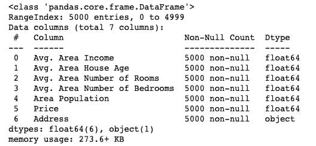

# 回归中的性能指标

> 原文：<https://medium.com/analytics-vidhya/performance-metrics-in-regression-98f796ca3011?source=collection_archive---------23----------------------->

性能指标用于衡量机器学习模型的性能。性能指标有两种不同应用；在分类模型和回归模型中。

我使用 Scikit-learn 库演示了在回归模型中使用性能指标，这个项目中使用的指标是平均绝对误差、均方误差和均方根误差。

# 数据收集:

这个项目使用的数据是美国住房数据集。在导入了所需的库之后，我加载了数据集，并使用 head()函数可视化了前五列。我还使用 describe()函数可视化了统计信息，使用 info()函数可视化了数据信息。

# 数据可视化:

接下来，我使用可视化库以图形方式探索和比较数据集中的一些要素。对于平均面积房屋年龄和面积人口，我使用了联合地块。

对于平均地区收入和价格，我使用了 LMplot。

我使用 Pairplot 来可视化整个数据集。

# 数据预处理:

在这个阶段，我首先使用 Scikit-learn MinMaxScaler 库缩放数据集，并删除了地址列。我对数据集进行了转换，并命名了我的变量。

**拆分数据:**

我使用 Sckit-learn 将数据分成训练和测试，测试大小为 40%，随机状态为 101。

# 型号:

我使用线性回归建立并训练了模型，然后显示了其系数和截距的输出。

# 模型预测:

我预测了这个模型，并使用散点图可视化了它的预测。

我还使用了 Distplot 来可视化残差

# 绩效指标:

**平均绝对误差(MAE):** 此度量计算预测值和真实值之间的平均绝对误差之和，不考虑方向。这个指标的缺点是它不能给出关于模型过冲或欠冲的信息，所以它越小，模型越好。

在我的模型中应用了这个原则，这就是结果

**均方差(MSE):** 该指标是目标值和回归模型预测值之间的平方差的平均值。这个指标的缺点是它对数据集中出现的异常值更敏感。

我对这个指标的应用

**均方根误差(RMSE):** 该指标是估计残差标准差的均方误差的平方根，描述了残差与模型中最佳拟合线和噪声的分布。低 RMSE 假设模型产生的误差与真实值有小的偏差。

我对这个指标的应用

最后，我使用 r2_score 库检查了模型预测分数，得到了 92%的准确率。

# 结论:

这个项目很有见地，我从中学到了很多。这个项目来自我在哈莫耶的实习。代码可以在我的[回购](https://github.com/Nwosu-Ihueze/housing_regression)里找到。您可以通过 [LinkendIn](https://www.linkedin.com/in/rosemary-nwosu-ihueze/) 与我联系，寻求建议或修改。感谢您的阅读。