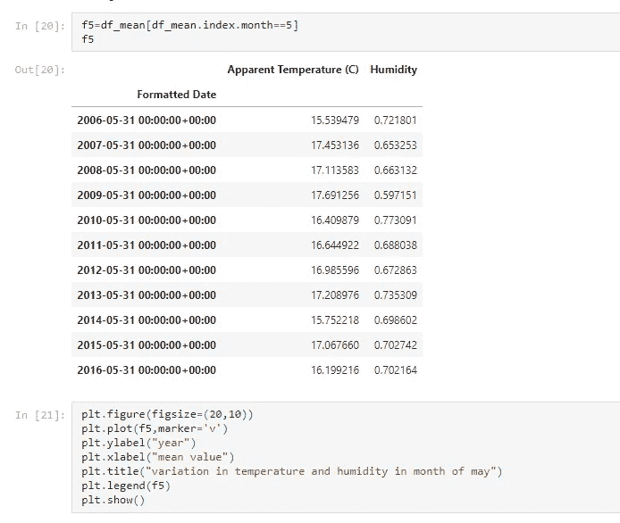

# 对气象数据进行分析

> 原文：<https://medium.com/analytics-vidhya/performing-analysis-of-meteorological-data-48667a5ef751?source=collection_archive---------17----------------------->

在这里，我将分析北欧国家芬兰的天气数据。该数据集记录了从 2006 年 4 月 1 日 00:00:00.000 +0200 到 2016 年 9 月 9 日 23:00:00.000 +0200 的过去 10 年的每小时温度。你可以在 Kaggle 上找到数据集。我将使用 pandas 和 Python 的 matplotlib 库。我已经给出了下面数据集的链接。

 [## 天气数据集

### Kaggle 是世界上最大的数据科学社区，拥有强大的工具和资源来帮助您实现您的数据…

www.kaggle.com](https://www.kaggle.com/muthuj7/weather-dataset) 

分析的假设是 ***“跨 10 年的数据逐月比较的表观温度和湿度表明由于全球变暖而增加”。***

# **实现**

这里我用的是 Jupyter 笔记本。

首先，我们将导入所需的库。

必需的库

现在我们将读取 CSV 文件

csv 文件中的数据

# **准备数据**

删除不需要的列

删除不需要的列后的数据

将时间数据转换为日期数据

将时间转换为日期后的数据

将格式化日期设置为索引

将日期格式化为索引

# **重采样数据**

按月和平均值重新采样数据

# **可视化和最终洞察**

首先，我们将想象每年，然后每月的智慧。在可视化中，我们将看到表观温度和湿度之间的变化。

正如我们在图表中看到的，表观温度和湿度之间没有关系。温度有很大的变化，这是因为全球变暖。现在，为了更好地了解情况，我们来看看月份。

# **1 月**

一月份的温度和湿度

在这里，我们可以看到全年的温度不是恒定的，而湿度几乎每年都相同。2006 年和 2010 年最低温度为零下 4 摄氏度，2007 年最高温度超过 2 摄氏度。从数据中可以清楚地看出，温度和湿度之间没有关系。全球变暖已经影响了温度和湿度 10 年不变。

# **二月**

二月的温度和湿度

在这里，我们可以看到全年的温度不是恒定的，而湿度几乎每年都相同。2012 年最低温度超过零下 8 摄氏度，2016 年最高温度超过 4 摄氏度。从数据中可以清楚地看出，温度和湿度之间没有关系。全球变暖已经影响了温度和湿度 10 年不变。

# **三月**

三月的温度和湿度

在这里，我们可以看到全年的温度不是恒定的，而湿度几乎每年都相同。2006 年和 2013 年最低温度为 2 摄氏度，2015 年最高温度超过 8 摄氏度。从数据中可以清楚地看出，温度和湿度之间没有关系。全球变暖已经影响了温度和湿度 10 年不变。

# **四月**

四月的温度和湿度

在这里，我们可以看到全年的温度不是恒定的，而湿度几乎每年都相同。2008 年和 2015 年最低温度为 12°C，2009 年最高温度超过 14°C。从数据中可以清楚地看出，温度和湿度之间没有关系。全球变暖已经影响了温度和湿度 10 年不变。

# **五月**

五月的温度和湿度

在这里，我们可以看到全年的温度不是恒定的，而湿度几乎每年都相同。2006 年中旬和 2014 年 5 月的最低温度为 15.5 摄氏度，2007 年和 2015 年的最高温度超过 17.5 摄氏度。从数据中可以清楚地看出，温度和湿度之间没有关系。全球变暖已经影响了温度和湿度 10 年不变。

# **六月**

六月的温度和湿度

在这里，我们可以看到全年的温度不是恒定的，而湿度几乎每年都相同。2006 年、2009 年和 2014 年最低温度为 15.5 摄氏度，2007 年、2012 年和 2016 年最高温度超过 20 摄氏度。从数据中可以清楚地看出，温度和湿度之间没有关系。全球变暖已经影响了温度和湿度 10 年不变。

# **七月**

七月的温度和湿度

在这里，我们可以看到全年的温度不是恒定的，而湿度几乎每年都相同。2008 年、2011 年和 2014 年最低温度为 21 摄氏度，2012 年最高温度为 24 摄氏度。从数据中可以清楚地看出，温度和湿度之间没有关系。全球变暖已经影响了温度和湿度 10 年不变。

# **八月**

八月的温度和湿度

在这里，我们可以看到全年的温度不是恒定的，而湿度几乎每年都相同。最低温度是 2006 年的 19 摄氏度，最高温度是 2007 年、2012 年和 2015 年的 23 摄氏度。从数据中可以清楚地看出，温度和湿度之间没有关系。全球变暖已经影响了温度和湿度 10 年不变。

# **九月**

九月的温度和湿度

在这里，我们可以看到全年的温度不是恒定的，而湿度几乎每年都相同。最低温度是 2007 年的 14 摄氏度，最高温度是 2011 年的 20 摄氏度。从数据中可以清楚地看出，温度和湿度之间没有关系。全球变暖已经影响了温度和湿度 10 年不变。

# **十月**

十月的温度和湿度

在这里，我们可以看到全年的温度不是恒定的，而湿度几乎每年都相同。最低温度是 2011 年的 8 摄氏度，最高温度是 2006 年、2008 年、2013 年和 2014 年的 12 摄氏度。从数据中可以清楚地看出，温度和湿度之间没有关系。全球变暖已经影响了温度和湿度 10 年不变。

# **11 月**

11 月的温度和湿度

在这里，我们可以看到全年的温度不是恒定的，而湿度几乎每年都相同。2008 年和 2012 年最低温度为 1°C，2011 年最高温度为 7°C。从数据中可以清楚地看出，温度和湿度之间没有关系。全球变暖已经影响了温度和湿度 10 年不变。

# **12 月**

十二月的温度和湿度

在这里，我们可以看到全年的温度不是恒定的，而湿度几乎每年都相同。最低温度是 2006 年的零下 4 摄氏度，最高温度是 2016 年的 1 摄氏度。从数据中可以清楚地看出，温度和湿度之间没有关系。全球变暖已经影响了温度和湿度 10 年不变。

代码可以参考我的 github 库…

 [## Meg ha 067/执行气象数据分析

### 在这里，我将分析北欧国家芬兰的天气数据。数据集有…

github.com](https://github.com/Megha067/Performing-Analysis-of-Meteorological-Data)