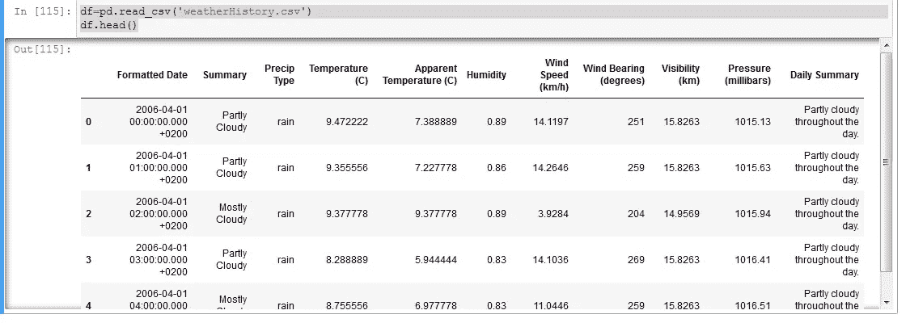
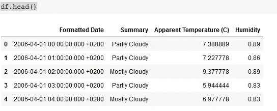
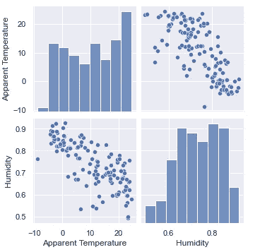
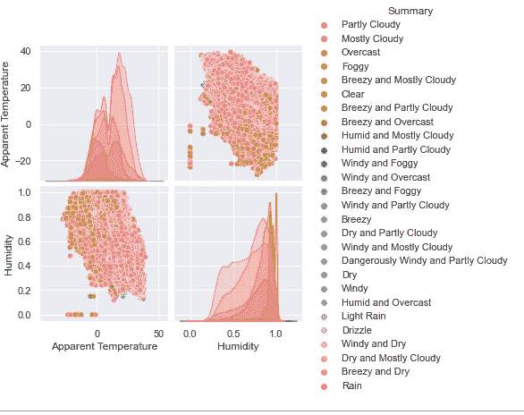
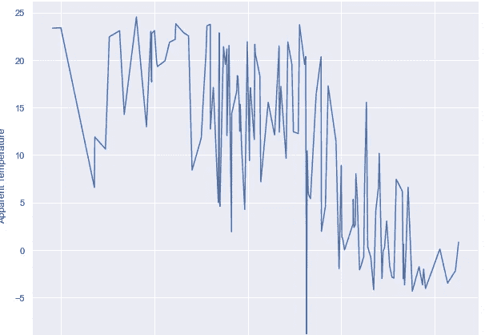
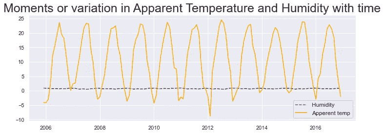
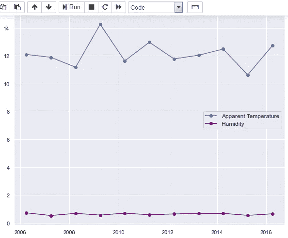

# 对气象数据进行分析

> 原文：<https://medium.com/analytics-vidhya/performing-analysis-of-meteorological-data-698c30c7326b?source=collection_archive---------30----------------------->

## 无效假设是“过去 10 年的数据中，每月的表观温度和湿度是否表明全球变暖导致了温度和湿度的增加”

***假设*** 是指我们需要发现从 2006 年到 2016 年开始的一个月中的一个月(比如 4 月)的平均表观温度和同期的平均湿度是否增加了。

一种更容易在网上找到的数据是天气数据。许多网站提供许多气象参数的历史数据，如气压、温度、湿度、风速、能见度等。因此，我们将从 https://www.kaggle.com/muthuj7/weather-dataset[的 ka ggle](https://www.kaggle.com/muthuj7/weather-dataset)获取数据集

因此，首先我们将导入本次分析所需的所有库:

然后，我们将读取 csv 文件并查看它

之后，您必须删除所有不需要的要素并查看数据框。

现在，我们必须将 ***【格式化日期】*** 特征作为数据框的索引，然后将我们的数据从每小时重新采样到每月。

然后，我们将可视化我们的数据，以了解并得出关于我们的 ***假设的结论。***

现在我们将可视化全年(2006 年至 2016 年)的温度和湿度变化。

现在，我们将可视化四月份的温度和湿度变化。

# ***结论:***

全球变暖对芬兰的天气状况有很大影响。湿度*保持不变*一年或一段时间内，湿度会有极大的变化。2009 年，表观温度急剧上升。表观温度没有剧烈的变化，但有少量的峰值。