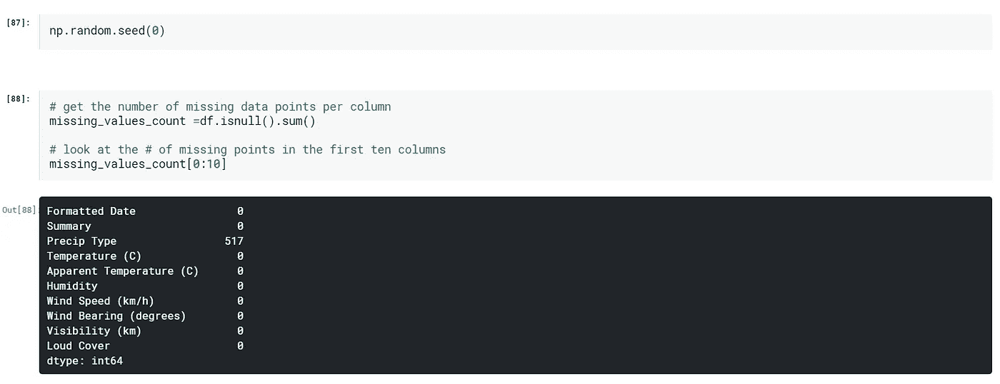

# 对气象数据进行分析

> 原文：<https://medium.com/analytics-vidhya/performing-analysis-of-meteorological-data-72d55483c8ee?source=collection_archive---------8----------------------->

https://internship.suvenconsultants.com 提供了令人敬畏的问题陈述，并给了我们许多人一次编码实习经历。
@[www.suvenconsultants.com](http://www.suvenconsultants.com)

> 一种更容易在网上找到的数据是天气数据。许多网站提供许多气象参数的历史数据，如气压、温度、湿度、风速、能见度等。
> 
> 天气数据集来自**
> 
> ***源代码**[***Github***](https://github.com/SB2507/Performing-Analysis-of-Meteorological-Data)***

**我们的目标是将原始数据转化为信息，然后将信息转化为知识。我们将执行一些基本任务来执行我们的分析，例如**

> ****数据清理****
> 
> ****数据标准化****
> 
> ****检验假设****

> ****零假设 H0 是“有跨 10 年逐月比较的数据表明表观温度和湿度由于全球变暖而增加”****

> **h0 意味着我们需要发现从 2006 年到 2016 年开始的一个月中的一个月(比如 4 月)的平均表观温度和同期的平均湿度是否增加了。这种月度分析必须在 10 年期间的所有 12 个月进行。因此，你基本上是从每小时到每月对数据进行重新采样，然后在 10 年期间比较同一个月。**

***那么让我们开始吧***

> **我们需要做的第一件事是加载我们将要使用的库和数据集。**

****

> **当你得到一个新的数据集时，要做的第一件事就是查看它的一部分。这可以让您看到所有的读取都是不正确的，并了解数据的情况。在这种情况下，让我们看看是否有任何缺少的值，这些值将用 NaN 或 None 表示。**
> 
> **我们有多少缺失的数据点？好了，现在我们知道我们确实有一些丢失的值。让我们看看每列有多少。**

****

> **那似乎是很多！看看我们的数据集中丢失了多少百分比的值可能有助于我们更好地了解这个问题的严重程度:**

********

> **关注重要因素，排除其他因素。这里我们需要表观温度(°C)、湿度和格式化的日期，这样我们就可以对数据进行重新采样。**

****

> **现在，我们需要规范化数据集，以便进行分析，因此，我们需要将格式化的日期列转换为日期时间。使用 Pandas 函数 to_datetime()可以很容易地做到这一点。**
> 
> **重采样后的数据预览:**

****

> ****【M】**月初我们使用 mean()函数计算表观温度和湿度的平均值。**

**让我们使用 Matplotlib 函数 plot()为我们的数据绘制图表。**

****

> **该图将显示表观温度和湿度随时间的变化。**

********

> **这种方法用于绘制数据和线性回归模型拟合。估计回归模型有许多互斥的选项。**

****

> **现在让我们绘制另一个图来得到一个更好的推论。超过 10 年的五月份的温度和湿度。**

****

> **很明显，2010 年气温急剧上升，而 2014 年气温下降。但是让我们来看一些更直观的图像，以便获得更好的信念。**

****

# ****结论****

**全球变暖正在恶化气候，并影响环境的各种参数。因此，根据这一分析，我们推断，在过去的 10 年里，要么气温急剧上升，要么急剧下降。因此，我们可以得出结论，全球变暖已经导致了温度可预测性的重大差异和不可靠性，同时考虑到湿度，我们可以说在过去的几年中几乎保持不变。**