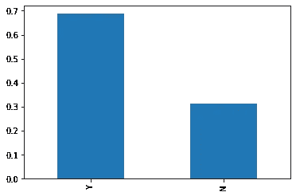
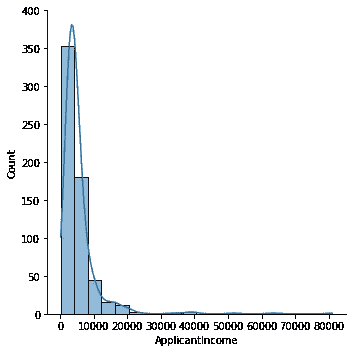
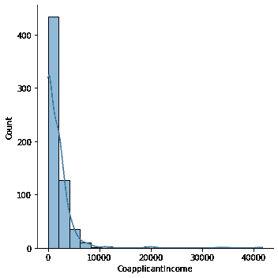
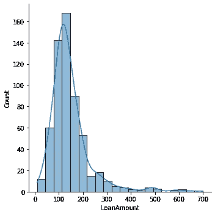
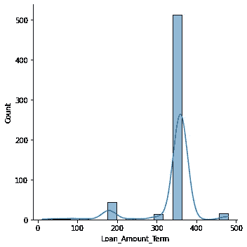
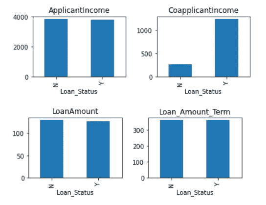
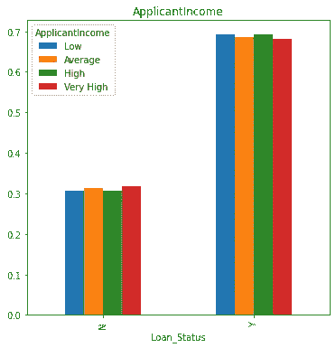
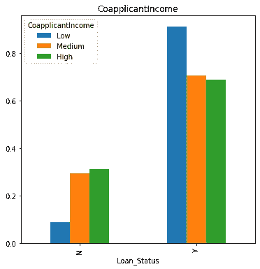
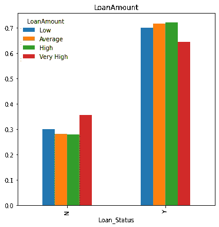
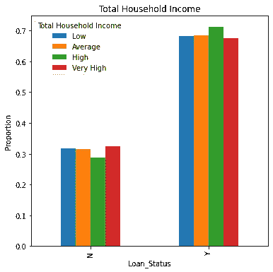

# 在 Python 中执行探索性数据分析。

> 原文：<https://medium.com/analytics-vidhya/performing-exploratory-data-analysis-in-python-45b6ad37fc41?source=collection_archive---------8----------------------->

探索性数据分析是对数据进行初步调查的过程，以发现模式，发现异常值，并用汇总统计数据和图形表示来测试假设。
分享一下我对这个概念的理解。我将举一个贷款接受数据集的例子，并使用 python 来研究它。

## 数据描述

从 Analytics Vidhya 网站下载数据。以下 URL 包含训练和测试 CSV 数据。

网址:[https://data hack . analyticsvidhya . com/contest/practice-problem-loan-prediction-iii/](https://datahack.analyticsvidhya.com/contest/practice-problem-loan-prediction-iii/)

上述链接中提供的数据集是 Dream Housing Finance company 提供的，该公司负责在城市、半城市和农村地区发放房屋贷款。

它由以下变量组成:性别、婚姻状况、教育程度、受抚养人人数、申请人收入、共同申请人收入、贷款金额(千)、信用记录、唯一贷款 ID、自营职业状态、贷款金额期限(月)、财产面积、贷款状态(如果贷款获得批准，则为 Y else N)。

**训练 csv 数据**包含贷款状态变量(目标变量)和用于训练我们的模型的其他变量。

**测试 csv 数据**不包含贷款状态变量(目标变量)，因为模型将应用于该数据来预测贷款状态。

## 影响贷款接受决策的因素

所有贷款人都有自己的标准，但在批准贷款申请时，主要考虑这些因素

*   **家庭收入:**较高的家庭收入增加了贷款获批的机会。
*   **信用记录:**有及时偿还债务记录的申请人获得批准的可能性更大。
*   **贷款金额:**贷款金额越低，审批率越高。
*   **债务偿还:**每月债务偿还额较低的申请人，其申请获得批准的概率较高。
*   教育:个人更高的资历增加了获得高薪工作的可能性。因此，导致更高的收入和增加贷款批准的机会。
*   **被赡养人**:家庭中被赡养人的数量越少，贷款获批的几率越大。

## 在 Jupyter 笔记本中加载数据集

```
#Importing Libraries 
import pandas as pd
# Loading the train and test dataset 
traindf = pd.read_csv("C:\\Users\\welcome\\Desktop\\MLProjects\\Loan Prediction\\train_ctrUa4K.csv")
testdf = pd.read_csv("C:\\Users\\welcome\\Desktop\\ML Projects\\Loan Prediction\\test_lAUu6dG.csv")
```

## 探索训练数据集

```
# In the train dataset there are 614  rows and 13 columns 
traindf.shape
**(614, 13)**# In the test dataset there are 367  rows and 12 columns 
testdf.shape
**(367,12**)# Features in the Train Dataset
columns = traindf.columns
print(columns)
**Index(['Loan_ID', 'Gender', 'Married', 'Dependents', 'Education',
       'Self_Employed', 'ApplicantIncome', 'CoapplicantIncome',    'LoanAmount','Loan_Amount_Term', 'Credit_History', 'Property_Area', 'Loan_Status'])**# Data Type and number of observations in each column
traindf.info()
<class 'pandas.core.frame.DataFrame'>
RangeIndex: 614 entries, 0 to 613
Data columns (total 13 columns):
 **#   Column             Non-Null Count  Dtype  
---  ------             --------------  -----  
 0   Loan_ID            614 non-null    object 
 1   Gender             601 non-null    object 
 2   Married            611 non-null    object 
 3   Dependents         599 non-null    object 
 4   Education          614 non-null    object 
 5   Self_Employed      582 non-null    object 
 6   ApplicantIncome    614 non-null    int64  
 7   CoapplicantIncome  614 non-null    float64
 8   LoanAmount         592 non-null    float64
 9   Loan_Amount_Term   600 non-null    float64
 10  Credit_History     564 non-null    float64
 11  Property_Area      614 non-null    object 
 12  Loan_Status        614 non-null    object 
dtypes: float64(4), int64(1), object(8)****#There are three data types in the train data set - Float, Integer and Object**#Categorical Columns in the train dataset are features with data type object
**Gender,Married,Dependents,Education,Self_Employed,Property_Area,LoanStatus**# Numerical Columns in the train dataset are features with datatype float and integer 
**ApplicantIncome,CoapplicantIncome,LoanAmount,LoanAmount_term,CreditHistory**# There are also missing values in **Gender, married,Dependents,Self Employed,Loan Amount, Loan Amount Term and Credit History features.**
```

## 分析数据集中的变量

```
#Checking the proportion of Approved Loan Applications in the data
#68% of the loan applications in the train data got approved while 31% applications were rejected.traindf['Loan_Status'].value_counts(normalize = True)
**Y    0.687296
N    0.312704**
Name: Loan_Status, dtype: float64# Plotting the Loan Status bar chart
traindf['Loan_Status'].value_counts(normalize = True).plot.bar()
```



**图 1:贷款申请批准率**

```
# Analyzing the categorical variables in the datacategorical_columns = ['Gender', 'Married', 'Dependents', 'Education','Self_Employed','Property_Area','Loan_Status','Credit_History']for j in categorical_columns : 
     a = traindf[j].value_counts(normalize = True)
     b = a*100
     print(b)**Output :****Male      80.0
Female    18.0
Name: Gender, dtype: float64****Yes    65.0
No     35.0
Name: Married, dtype: float64****0     56.0
1     17.0
2     16.0
3+     8.0
Name: Dependents, dtype: float64****Graduate        78.0
Not Graduate    22.0
Name: Education, dtype: float64****No     85.910653
Yes    14.089347
Name: Self_Employed, dtype: float64****Semiurban    37.947883
Urban        32.899023
Rural        29.153094
Name: Property_Area, dtype: float64****Y    68.729642
N    31.270358
Name: Loan_Status, dtype: float64****1.0    84.219858
0.0    15.780142
Name: Credit_History, dtype: float64**
```

*   在训练数据集中，80%的申请者是男性，18%是女性。
*   在培训数据中，65%的申请人已婚。
*   56%的申请人没有家属。
*   百分之七十八的申请者是毕业生。
*   14%的申请者是个体经营者
*   85%的申请人已经按时偿还了贷款。
*   大多数申请者来自半城市地区(38%)，其次是城市地区(33%)。

```
# Finding mean and median of the numerical columns
for j in numerical_columns :
    print (j ,round(traindf[j].mean(),2),round(traindf[j].median(),2))
                   **Mean**      **Median
ApplicantIncome    5403.46   3812.5
CoapplicantIncome  1621.25   1188.5
LoanAmount         146.41    128.0
Loan_Amount_Term   342.0     360.0**# Plotting the Distribution of the Numerical Variables in the datasetnumerical_columns = ['ApplicantIncome', 'CoapplicantIncome', 'LoanAmount','Loan_Amount_Term']for idx,num_col in enumerate(numerical_columns):
    sns.displot(x= num_col,data=traindf,bins=20,kde= True)
    plt.show()
```

*   申请人收入的分布是右偏的，申请人收入的中位数是 5403。
*   共同申请人收入的分布是右偏的，共同申请人收入的中位数是 1621。
*   贷款金额的分布(000 ')是右偏的，贷款金额的中位数是 12.8 万。
*   贷款期限分布呈左偏，贷款期限中位数为 30 年。



## 数据集中变量与目标变量(贷款状态)的关系

```
categorical_columns1 = ['Gender', 'Married', 'Dependents', 'Education', 'Self_Employed', 'Property_Area','Credit_History']
for i in categorical_columns1 :
    j = pd.crosstab(traindf['Loan_Status'],traindf[i],normalize = 'columns')
 print(j)
 j.plot(kind = 'bar', stacked = False, figsize = (6,6))**Gender         Female      Male
Loan_Status                    
N            0.330357  0.306748
Y            0.669643  0.693252****# The approval rate of both the genders is almost the same****Married**           ** No**      **Yes**
**Loan_Status                   
N            0.370892  0.28392
Y            0.629108  0.71608****# The approval rate of married applicants is more vis-a-vis unmarried applicants****Dependents          0         1         2        3+
Loan_Status                                        
N            0.310145  0.352941  0.247525  0.352941
Y            0.689855  0.647059  0.752475  0.647059****# The approval rate is the highest for applicants with two dependents followed by applicants with no - dependency.****Education    Graduate  Not Graduate
Loan_Status                        
N            0.291667       0.38806
Y            0.708333       0.61194****# The approval rate for Graduates is higher vis-a-vis applicants with no graduation.****Self_Employed     No       Yes
Loan_Status                   
N              0.314  0.317073
Y              0.686  0.682927
# The approval rate of self- employed applicants is the same as non- self employed applicants.****Property_Area     Rural  Semiurban     Urban
Loan_Status                                 
N              0.385475    0.23176  0.341584
Y              0.614525    0.76824  0.658416
# The applicants with the property in Semi-Urban has the highest approval rate.****Credit_History       0.0       1.0
Loan_Status                       
N               0.921348  0.204211
Y               0.078652  0.795789****# High Approval rate of applicants with good credit history.**
```

*   男性的贷款批准率略高于女性。
*   已婚申请者比其他人有更高的支持率。
*   有两个受抚养人的申请人的批准率最高，其次是没有受抚养人的申请人。
*   毕业生的批准率比没有毕业的申请者多。
*   个体户的批准率与非个体户相同。
*   在半城市地区拥有房产的贷款申请人的批准率最高。
*   具有良好信用记录的申请人的批准率比其他人高。

```
numerical_columns = ['ApplicantIncome', 'CoapplicantIncome', 'LoanAmount','Loan_Amount_Term']
for idx,m in enumerate(numerical_columns):
    plt.subplot(222)
    a = traindf.groupby('Loan_Status')[m].median()
    print(a)
    a.plot.bar(title = m)
    plt.show()**Loan_Status
N    3833.5
Y    3812.5
Name: ApplicantIncome, dtype: float64****Loan_Status
N     268.0
Y    1239.5
Name: CoapplicantIncome, dtype: float64****Loan_Status
N    129.0
Y    126.0
Name: LoanAmount, dtype: float64****Loan_Status
N    360.0
Y    360.0
Name: Loan_Amount_Term, dtype: float64**
```



*   具有批准贷款状态的贷款申请人具有较高的共同申请人收入中位数。
*   从申请人收入一栏得出的推论并不重要。
*   具有批准贷款状态的贷款申请人申请的贷款金额比具有拒绝状态的申请人申请的贷款金额稍低。

此外，为申请人收入、共同申请人收入和贷款额变量创建箱可以帮助从数据中获得有意义的见解。

```
**# Plotting the Applicant Income and Loan Amount after creating bins**
import numpy as np
from numpy import nanpercentile
analysiscolumns = ['ApplicantIncome', 'LoanAmount']
for idx, i in enumerate(analysiscolumns):
    a = int(traindf[i].min())
    b = int(nanpercentile(traindf[i],25))
    c = int(nanpercentile(traindf[i],50))
    d = int(nanpercentile(traindf[i],75))
    e = int(traindf[i].max())
    bins = [a,b,c,d,e] 
    group = ['Low','Average', 'High','Very High']
    j = pd.cut(traindf[i],bins , labels = group)
    r =  pd.crosstab(traindf['Loan_Status'],j,normalize = 'columns')
    r.plot(kind = 'bar', stacked = False, figsize = (6,6),title = i)
    print(r)**# Plotting the CoApplicant Income after creating bins** import numpy as np
from numpy import nanpercentile
analysis = ['CoapplicantIncome']
for idx, i in enumerate(analysis):
    a = int(traindf[i].min())
    c = int(nanpercentile(traindf[i],50))
    d = int(nanpercentile(traindf[i],75))
    e = int(traindf[i].max())
    bins = [a,c,d,e] 
    group = ['Low','Medium','High']
    j = pd.cut(traindf[i],bins , labels = group)
    r =  pd.crosstab(traindf['Loan_Status'],j,normalize = 'columns')
    r.plot(kind = 'bar', stacked = True, figsize = (6,6),title = i)
    print(r)
```

*   申请人的收入不影响贷款批准率(见下图)。
*   申请更高贷款金额的申请人面临更高的拒绝率。
*   低共同申请人收入的申请人被拒率最少(是无效结论。因此，尝试合并申请人和共同申请人的收入作为总收入)。



```
**# Plotting the Total Household Income after creating bins** traindf['Total Household Income'] = traindf['ApplicantIncome']+ traindf['CoapplicantIncome']import numpy as np
from numpy import nanpercentile
analysiscolumns = ['Total Household Income']
for idx, i in enumerate(analysiscolumns):
    a = int(traindf[i].min())
    b = int(nanpercentile(traindf[i],25))
    c = int(nanpercentile(traindf[i],50))
    d = int(nanpercentile(traindf[i],75))
    e = int(traindf[i].max())
    bins = [a,b,c,d,e] 
    group = ['Low','Average', 'High','Very High']
    j = pd.cut(traindf[i],bins , labels = group)
    r =  pd.crosstab(traindf['Loan_Status'],j,normalize = 'columns')
    r.plot(kind = 'bar', stacked = False, figsize = (6,6),title = i)
    print(r)
```

*   高收入申请者的批准率是所有收入群体中最高的。但是对于收入非常高的申请人来说是最低的。(这个结果是违反直觉的)。



## 使用贷款状态特征检查数据集中数值变量之间的相关性

检查数据集中数字变量与贷款状态特征的相关性。贷款状态列中的“Y”和“N”被替换为 1 和 0。为了直观显示这种相关性，我们使用了热图。颜色越深表示变量之间的相关性越高。

在支付每月债务付款后的家庭总收入变量被创建，以查看它是否影响贷款批准率，与我们的预期不同，该变量与贷款批准率无关。

```
traindf['Monthly Loan payment'] =traindf['LoanAmount']/traindf['Loan_Amount_Term']traindf['Total Household Income after debt repayments'] = traindf['Total Household Income']-traindf['Monthly Loan payment']traindf[‘Loan_Status’].replace([‘Y’,’ N’],[1,0], inplace = True)import seaborn as sns
matrix = traindf.corr()
f, ax = plt.subplots(figsize=(10, 12))
sns.heatmap(matrix, vmax=.8, square=True, cmap=”BuPu”,annot=True) 
```


*   申请人收入和家庭收入之间的高度正相关。
*   贷款金额与申请人收入呈正相关。
*   贷款金额与家庭收入正相关。
*   批准的贷款状况和良好的信用记录之间的正相关关系。
*   贷款批准率与家庭总收入、贷款期限、贷款金额、共同申请人收入和每月债务偿还后剩余的总收入没有相关性。

## 结论

在本文中，我们研究了贷款接受数据集，并对其结构和特性有了较高的理解。点击💚如果你喜欢这篇文章。有问题可以写在下面的评论区，我会尽力解答。