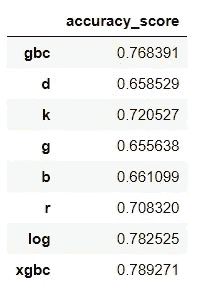

# 对 Yelp 餐馆评论进行情感分析

> 原文：<https://medium.com/analytics-vidhya/performing-sentiment-analysis-on-yelp-restaurant-reviews-962334d6336d?source=collection_archive---------5----------------------->


拉斯维加斯的自助酒宴

在这篇文章中，我们将使用 Yelp 数据集，其中包含拉斯维加斯自助餐的客户评论，我们将通过使用自然语言处理步骤来完成创建分类模型的整个过程。

我们的目标是分析用户评论的情感，并创建一个分类模型来预测给定评论的情感值。我们将使用 CSV 格式的数据，可以从[这里](https://github.com/zeynep394/AIZA-NLP-Sentiment-Analysis/blob/main/restaurant.csv)下载。

**目录:**

1.  数据分析和可视化
2.  语言检测
3.  删除字符
4.  计算极性和主观性
5.  创建 WordCloud
6.  应用引理假设
7.  分类步骤

# 数据分析和可视化


导入“restaurant.csv”文件后的数据框

由于我们的目标是使用以前的客户评论和与它们相关的星级来找到给定文本的情感，很明显我们将只需要这个数据框架的两列；文本和星星栏。

为了更好地理解文本和 stars 列之间的关系，首先我们检查 stars 列；它包含了多少唯一值？各星级分布如何？哪些评级被认为是正面情绪，哪些被认为是负面情绪？

```
df.stars.unique()
#How many unique star values are there>>array([5, 4, 1, 3, 2], dtype=int64)df.stars.value_counts()
#shows the distribution for each star value
```


```
#Let's see the distribution of each star rating as a pie chart
#This way we can see that most of our data contains positive comments by costumersplt.figure(figsize=(8,8))df[‘stars’].value_counts().plot.pie(autopct=’%1.1f%%’, startangle=60)plt.title(‘Yıldızların Dağılım Grafiği’)
```


```
x=df['stars'].value_counts()
x=x.sort_index()plt.figure(figsize=(10,6))
ax= sns.barplot(x.index, x.values, alpha=0.8)
plt.title("Star Rating Distribution")
plt.ylabel('count')
plt.xlabel('Star Ratings')rects = ax.patches
labels = x.valuesfor rect, label in zip(rects, labels):
    height = rect.get_height()
    ax.text(rect.get_x() + rect.get_width()/2, height + 5, label, ha='center', va='bottom')plt.show();
```


我们使用了三种不同的方法来展示星级的分布。我们可以看到，从 1 到 5 有 5 个不同的评分值。

因此，我们可以有把握地假设评分 4 和 5 代表积极情绪，而 1 和 2 代表消极情绪，这一分组将评分 3 留在后面，因此我们将它标记为中性情绪。

为了形成新决定的列，我们使用`loc`选择我们想要的组，并创建一个名为“情感”的列，然后我们分配情感分组值。

```
df.loc[df['stars'] == 3, 'sentiment'] = 'neutral' 
df.loc[df['stars'] < 3, 'sentiment'] = 'negative' 
df.loc[df['stars'] > 3, 'sentiment'] = 'positive'
```


# 语言检测

标注完情感类型，就到了语言检测的时候了。由于我们的数据来自全球数据集，一些用户评论不是英文的，在这一点上，我们可以用两种方式处理这个过程；一种是检测非英语语言并使用 TextBlob 翻译文本，另一种是简单地删除非英语语言。对于这个解决方案，我们将遵循第二个。

就像我们上面所说的，我们只需要处理“星星”、“情感”和“文本”列，因此为了简化数据框，我们只选择这些列。

```
new_df= df[['stars', 'sentiment','text']]
```

有许多不同的库和方法来检测语言，如 TextBlob、Polyglot、chardet 和 langid，但我们今天将使用 langdetect，这是一个支持 55 种语言的 python 库。

```
$ pip install langdetect
#install the libraryfrom langdetect import detect
#import detect function from langdetectnonen=new_df[new_df['text'].apply(detect)!='en']
#nonen is the dataframe of non-english user reviews
```


选择所有英文文本，创建一个名为 yelp 的新数据框架。Yelp 是我们从现在开始将要使用的数据框架。

```
yelp=new_df[new_df['text'].apply(detect)=='en']
#yelp is the data frame we will continue to work on.
#yelp only contains English reviews
```


# 删除字符

```
yelp['text']=yelp['text'].str.lower()
#change all strings to be loweryelp['text']=yelp['text'].str.replace('[^\w\s]','')
#get rid of unwanted characters such as punctuation marksyelp['text']=yelp['text'].str.replace('\d+','') 
#removing numeralsyelp['text']=yelp['text'].str.replace('\n',' ').str.replace('\r','')
```


# 计算极性和主观性

情感分析是确定给定文本的情感的过程，无论它是积极的还是消极的，或者是中性的。

TextBlob 的*情感*功能通过返回两个属性**极性**和**主观性**来帮助我们理解文本的潜在情感。

Polarity 返回一个在[-1，1]范围内的浮点值，其中 1 表示肯定的陈述，而-1 表示否定的陈述。主观性也是一个在[0，1]范围内的浮点值。0 表示个人观点，1 表示事实信息。

```
yelp['polarity'] = yelp['text'].apply(lambda x: TextBlob(x). sentiment)
#applt textblob sentiment to yelp text column
#and assign it to a new column named polaritysentiment_series = yelp['polarity'].tolist()

yelp[['polaarity','subjectivity']]=pd.DataFrame(sentiment_series,
       index=yelp.index)
       yelp.drop('polarity', inplace=True, axis=1)#split the list into two and create two new columns
#assign the return values of sentiment function;
#polarity and subjectivity to those columns
```


# 创建单词云

Word cloud 是用于基于文本的数据的可视化工具。它有助于确定文本数据中每个单词的频率或重要性。一个词云的基本逻辑是；特定单词在文本中出现得越多，它在单词云中出现得就越大、越粗。

构建词云有三个步骤

*   摘录评论
*   创建并生成单词云图像
*   使用 matplotlib 显示云

```
from wordcloud import WordCloudwc = WordCloud( background_color="white", colormap="Dark2",
               max_font_size=150, random_state=42)
```

单词云函数将字符串作为参数，因为我们希望找到正面和负面评论的单词云，所以我们通过 star 值选择文本值，并使用 pandas 的“join”方法将所有数据组合成一个字符串格式。

```
text_5_star=yelp[yelp['stars']>3]
text_5_startext_5_star_review = " ".join(review for review in text_5_star.text)
text_5_star_reviewtext_1_star=yelp[yelp['stars']<3]
text_1_startext_1_star_review = " ".join(review for review in text_1_star.text)
text_1_star_review
```

为了给我们的单词云创建一个不同于默认单词云形状的形状，我们需要找到一个 PNG 文件作为蒙版。将我们的单词云遮罩成我们想要的形状后，下一步是使用`wc.generate()`生成它，然后我们可以使用 matplotlib 的`imshow()`函数将其可视化。


# 应用引理假设

词汇化基本上是一种将任何种类的单词转换成其基本词根模式的方法*。*由于语法原因，文档使用一个单词的不同形式，例如 *runs，running，*和 *ran* 都是 *run 这个单词的变体。*

由于那些形式对我们的机器学习模型没有任何意义，所以我们的工作是告诉模型那些单词都是同一个词根的变体。这个过程被称为词汇化。

在开始词汇化步骤之前，我们应该清除文本中不需要的字符，并应用标记化，这是一种将文本分成更小的称为标记的单元的方法。对文本数据进行标记后，我们将其存储在一个名为 clean_text 的列中，现在我们可以对该列中的每个单词应用词汇化。

```
yelp['text']=yelp['text'].str.replace('[^a-zA-Z]',' ')yelp['clean_text'] = yelp['text'].apply(lambda x: nltk.word_tokenize(x) ) 
```


Python `nltk`是提供 **WordNet 词条解释器**的包，它使用 WordNet 数据库来查找单词的词条。我们将导入这个包，并使用它的 WordNetLemmatizer()方法对我们的文本进行 lemmatize，并将其存储在名为 stem_text 的列中。

```
import nltk
from nltk.stem import WordNetLemmatizer
lemmetizer_output= WordNetLemmatizer()

yelp['stem_text'] = yelp['clean_text'].apply(lambda x: [lemmetizer_output.lemmatize(j) for j in x if not j in set(STOP_WORDS)] )
#applying lemmatization to each word of every column 
#by using pandas apply method
#and checking for stop words at the same time
```


完成词汇化后，我们使用 pandas join()方法将文本从数组格式转换为文本格式，从而改变数据的格式。

```
yelp['cleaned_text'] = yelp['stem_text'].apply(lambda x: ' '.join(x) ) 
```


现在，我们的数据可以进行矢量化了。

# 分类步骤

很明显，计算机不能理解文本，至少我们不能理解文本，所以在你开始使用文本数据进行预测建模之前，文本数据需要特殊的准备。

为了使用这些我们花了很大力气清理的文本数据，我们必须找到一种让计算机理解的方法，这就是计数矢量化的用武之地；

计数矢量化是一种使用 one-hot-encoding 将文本数据表示为数值的方法。输出向量的维数将等于我们的词汇表的大小。

为了更好地理解，让我们举个例子:

```
x=yelp.cleaned_text #assign cleaned_text column to variable x 
y=yelp.sentiment #assign sentiment column to variable yx_train, x_test, y_train, y_test = train_test_split(x,y, test_size=0.3,random_state=42)#create train and test data
```

要创建计数矢量器，我们需要实例化一个。在制作矢量器时，我们可以设置一些特殊的参数(为了进一步的[阅读](https://scikit-learn.org/stable/modules/generated/sklearn.feature_extraction.text.CountVectorizer.html))。但目前我们只会将`lowercase`设为 true，将`stop_words`设为 English

```
vect = CountVectorizer(lowercase=True, stop_words='english')
x_train_dtm= vect.fit_transform(x_train) 
# Call the *fit_transform()* function in order to learn a vocabulary from a document and transform it to a vector.

print(x_train_dtm)x_test_dtm=vect.transform(x_test)
```


现在让我们将矢量转换为数据框架，以便更好地理解它；

```
tf=pd.DataFrame(x_train_dtm.toarray(),columns=vect.get_feature_names())
tf.head()
```


既然我们已经了解了如何对文本数据进行矢量化，以及矢量化意味着什么，我们可以使用我们所了解的知识来训练分类算法，以对每个用户评论的情感进行分类。

```
vect = CountVectorizer(ngram_range=(1,2))
tokenize_test(models,vect)
#call the models function defined above to observe 
#accuracy scores of different classification algorithms
```



感谢您的阅读！