# 个人电影内容分析

> 原文：<https://medium.com/analytics-vidhya/personal-film-content-analysis-word-cloud-ad867c772775?source=collection_archive---------20----------------------->

由于我有写日志的习惯，所以，我看的电影或戏剧也记录在我的日志里。在收集了大约 4 年的每日日志数据后，我想看看我看得最多的是哪种电影。为了得到这个答案，我用了两种方法。基本上，这两种方式也是基于 WordCloud 模块，但是输入不同。第一个纯粹只是使用电影片名第二个是用自己定义的类型给每部电影贴上标签，然后以此作为输入。

第一步是获取数据并清理数据。我们需要的信息只是电影内容，所以首先我们用我们需要的列创建日期框架。然后我们通过设置这个条件过滤掉空值: ***ac_log['Film']。isnull()==False*** 。
之后，我们将电影内容的“新闻”输入到每一行数据中，如果它不包括这些信息，因为我实际上每天都在看新闻，但不知何故在某些时候我不再记录它了。

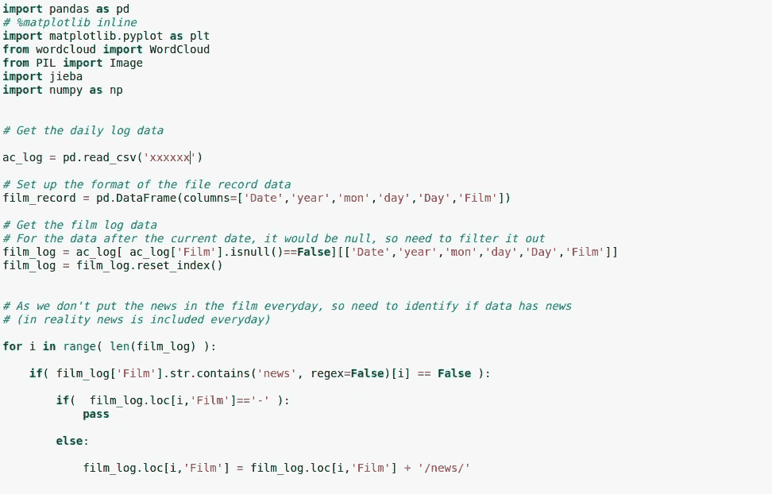

将该电影内容添加到新闻数据中

然后下一步就是调整格式了，因为影片是以斜杠作为分隔符的 XXX/XXX/XXX 这样的格式录制的。为了使每一行成为独立的电影内容，我们必须将其拆分，然后附加到我们之前创建的数据帧中。

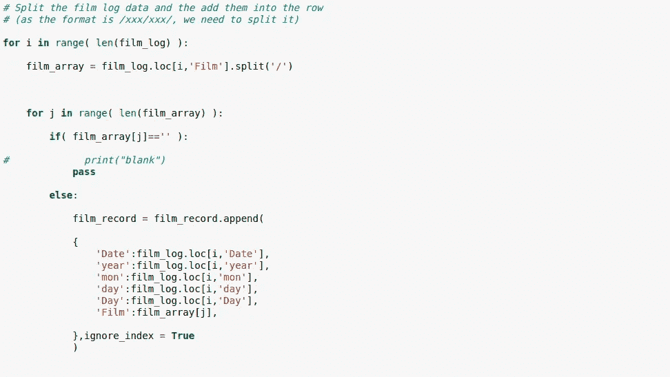

调整数据格式

经过处理后，我们将得到如下表所示的结果。

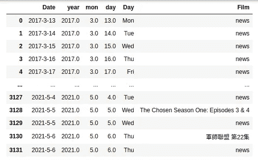

格式调整后的表格

我们得到的数据范围是 2017 年到 2021 年，然而数据标注只做了 2017 年到 2020 年，所以这里需要过滤掉 2021 年的数据。同时，我们还想删除里面带“-”表示没有值的数据。在处理完所有这些事情之后，我们创建一个名为“count”的列来帮助我们以后做一些计算。

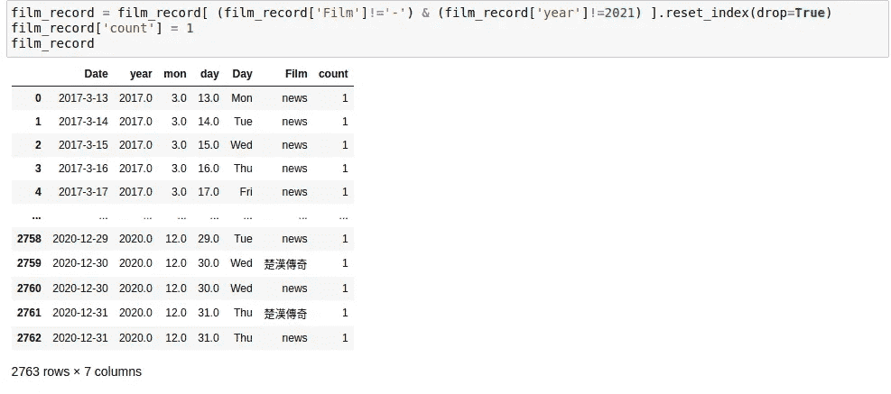

过滤掉 2021 年的数据

然后，我们用计数列将数据按胶片分组，以计算每张胶片的计数。下表显示了这一结果，显然我看了相当多的中国历史剧。然而，我实际上也看了很多纪录片，但由于这些纪录片不在同一个系列中，因此它们不会显示在这个计数排名表中。

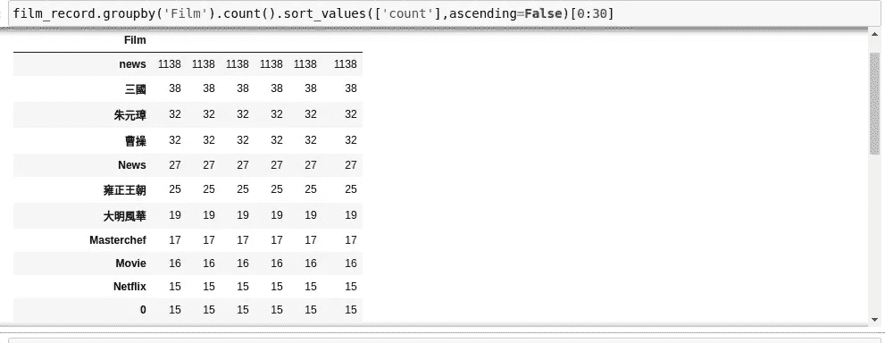

电影计数表

为了去神秘化我实际看的是什么样的内容，标签表是必不可少的。一开始，我试图寻找是否有一个 AI 工具可以帮助我标记这些电影内容，但遗憾的是我还没有找到。如果你正在阅读我的文章，并且知道如何做，请给我留言，因为这将节省我大量的时间🙏。在找到这个好工具之前，唯一的标注方式就是一个一个的手工标注。总的来说，我根据自己的主观判断将我的电影内容分为 30 类。那么我们将得到如下表所示的结果。

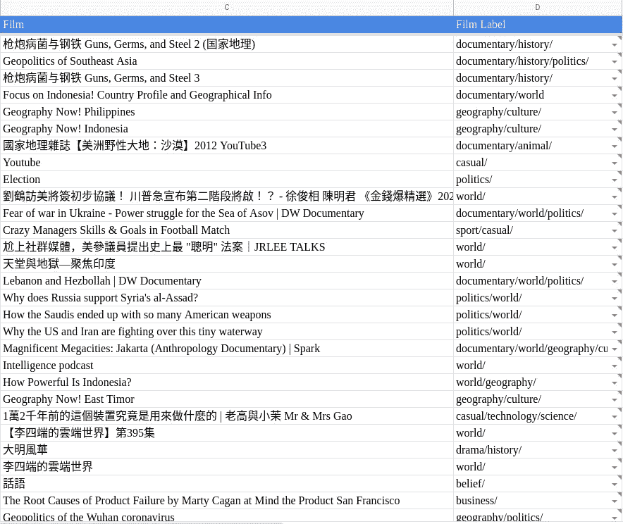

胶片标签表

由于我们没有 2016 年的任何电影记录数据，所以需要过滤掉 2016 年的数据。此外，2017 年和 2018 年的标签数据也不完整，但在这里我们只是凑合着用，因为标签数据真的很繁琐😞。下表显示了薄膜标签的内容。

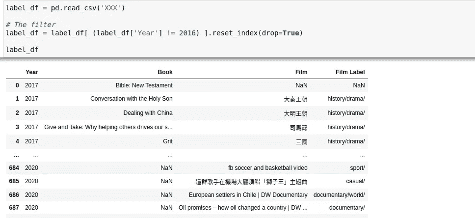

但是，由于电影标签也像电影记录一样用斜线分割，所以我们也需要像电影记录一样做一些格式调整。因此，我们将得到如下表所示的结果。

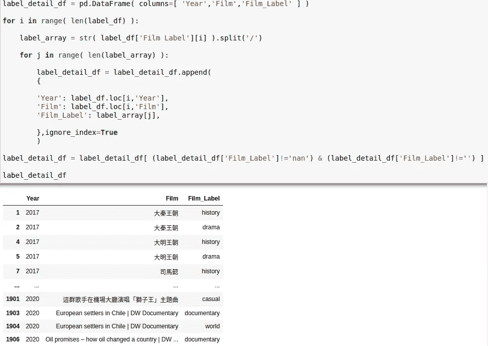

调整后的胶片标签表

下一步是将胶片记录数据与标签表进行匹配。这里我们用 difflib 模块来完成这个过程。并且如果电影记录可以在标签表中找到匹配的电影名称(足够相似以匹配)，则标签表的电影名称将被给予电影记录，否则它将被给予值 0。

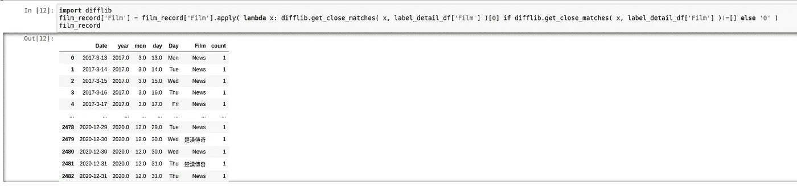

胶片匹配过程

之后，我们检查丢失的数据，发现大约有 870 个数据丢失。大约有三分之一的数据丢失，这个结果并不理想。正如我们所知，2017 年至 2018 年**的电影数据不是真正干净的**，我们也没有将这两年的所有电影记录放入标签流程。然而，我们**现在可能还不能处理这个，**但是我们会用这个来看看结果会怎么样。

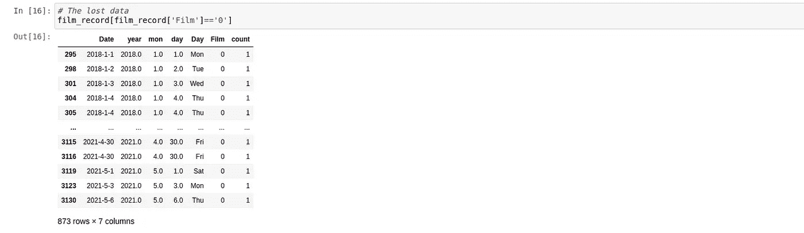

丢失数据表

然后，我们将匹配标签表的结果与电影记录表合并，如下所示。

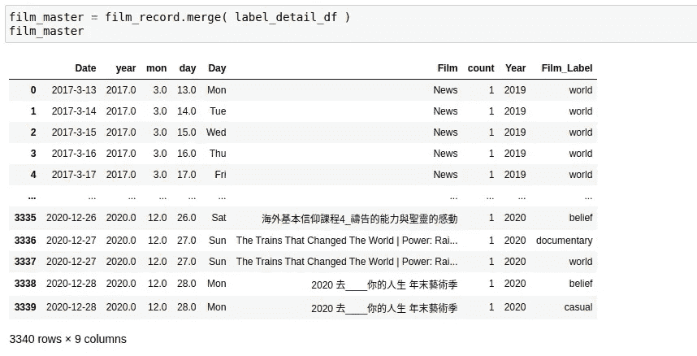

带有标签的电影记录的合并结果

我们根据电影标签对数据进行分组。在这里，我们可以发现我看的前 5 个电影类别是**新闻、历史、戏剧、世界和纪录片**。

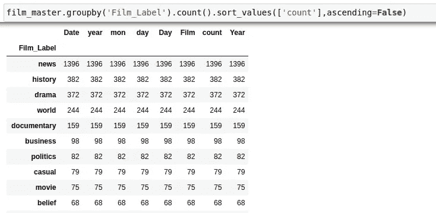

电影标签数量排名

最后，让我们用上面提到的两种方法来看看“云”这个词。第一种方法基于电影名称，第二种方法基于电影标签。

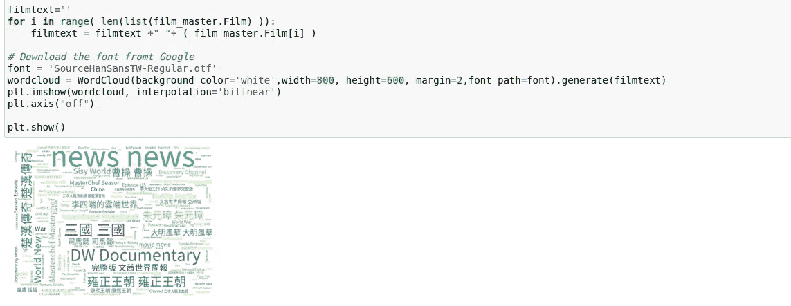

电影片名的字云

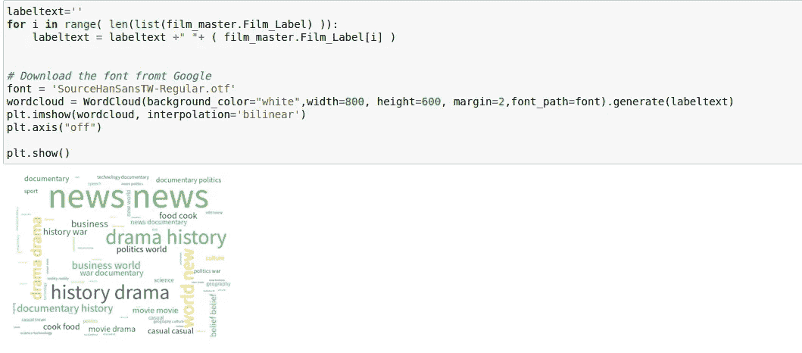

电影标签的文字云

总结一下，我的五大电影类别**新闻、历史、戏剧、世界、纪录片**。我看的大部分电视剧都与历史有关。纪录片这种电影类型在某种程度上也是与历史相关的电影类型。据此，我们可以推断我可能是喜欢**听故事**、**从历史**中学习并且**对世界上发生的事情**好奇的人。

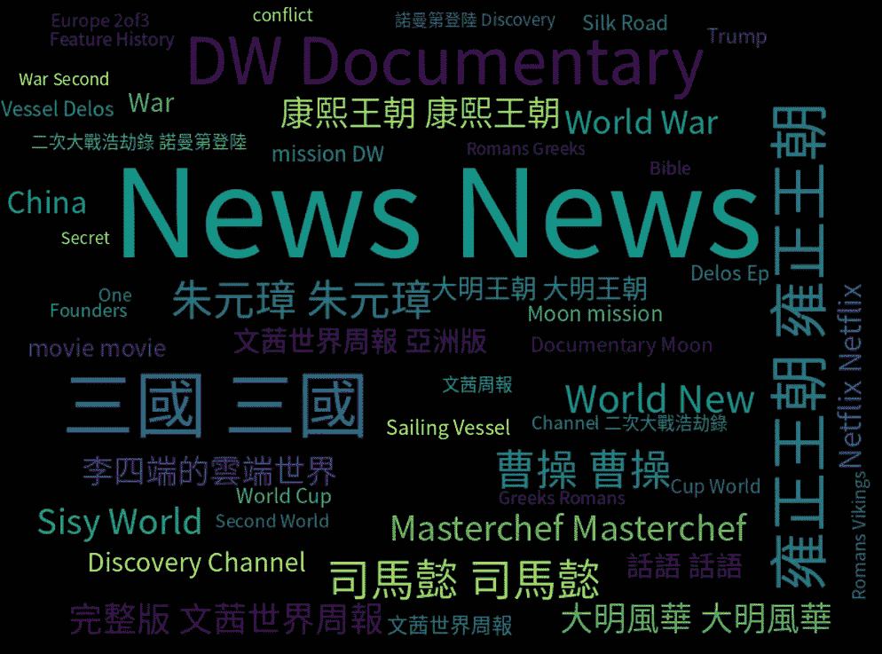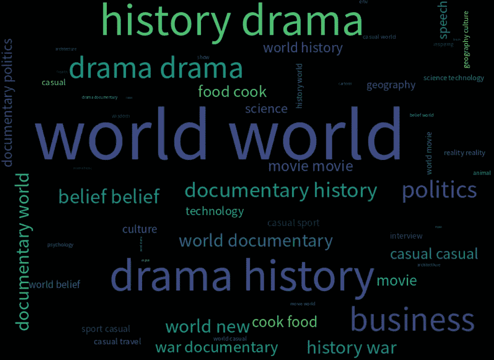