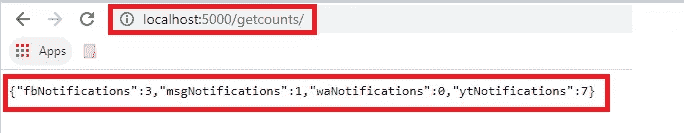

# 个人通知中心

> 原文：<https://medium.com/analytics-vidhya/personal-notification-hub-97eb1ee48fb3?source=collection_archive---------25----------------------->

很久以前，我的一个朋友让我验证一下这个很酷的想法，它只是一个小小的显示设备，“*让你随时了解对你来说重要的事情*”。不知何故，这个想法没能筹集到资金，最终不了了之。


仅供参考。无意制造精确的装置。这幅图像完全是 https://smart-stickers.com/的[的一部分。红色部分是我们试图通过这篇文章达到的目的](http://smart-stickers.com/)

# 这个想法

虽然我不可能为这样的想法创造硬件(如果你有那样的技术水平，请随时联系我)，但我试图实现这个想法的软件部分。我试图创建的是一个集中的中心，为我提供不同社交平台(WhatsApp、Skype、脸书、Youtube)上的*未读通知* *计数*。该中心将只提供未读通知计数，而不是未读邮件，因为这个想法只是有一个事情的简明摘要，而不是详细的视图。你不必打开手机来检查你是否错过了一条信息。如果你注意到一个计数，你总是有移动电话去查看消息。

# 市场上当前可用的选项

当我尝试谷歌搜索时，我没有遇到任何服务于此目的的工具或应用程序。这给了我创建这个工具的另一个原因。我想到的第一个想法是，我将点击 web 服务，比如说脸书，并获得一个通知计数。类似地，我会点击 WhatsApp 的 web 服务并获得我的计数。不幸的是，这些平台没有这样的服务(脸书曾经有一个，但现在停止了)。Slack 非常擅长为自己提供这种有用的网络服务，我认为其他社交平台应该认真考虑这一点。此外，要很好地理解每个社交媒体平台提供的网络服务，并加上它们可能是付费的或对点击量/日有一些限制，这可能是一项非常乏味的任务。

# 履行

当什么都没用的时候，你总是可以选择*网页抓取*。是的，读了 scraping 这个词，你们中的大多数人应该已经知道这篇文章接下来要讲什么了。是的，我们将使用 Selenium Python 框架，为每个社交媒体平台开放并行浏览器实例，并进行搜集。为了增加这个工具，我们将创建一个基于 Flask 的微服务，这样你点击该服务，它将返回每个社交媒体平台的未读通知的计数。我个人已经在 Windows 系统上完成了实现，但是如果在 Linux 或 Raspberry 系统上也可以尝试一下(它们可能不支持 head 模式下的自动化工具)。

1.  首先，你需要可以从[这里](https://chromedriver.chromium.org/downloads)下载的 Chromedriver for Windows。任何版本都可以。
2.  导入必要的包:用于抓取目的的 selenium，用于为每个社交媒体平台创建并行线程的 threading，以及用于创建最终微服务的 flask。

```
from selenium import webdriver
import time
import threading
from flask import Flask, request, jsonify, make_response
```

3.为每个社交媒体平台创建驱动程序实例

```
fbDriver = webdriver.Chrome("chromedriver")
fbDriver.get("https://www.facebook.com/")
waDriver = webdriver.Chrome("chromedriver")
waDriver.get("https://web.whatsapp.com/")
ytDriver = webdriver.Chrome("chromedriver")
ytDriver.get("https://www.youtube.com/")
```

4.定义保存每个(社交媒体)平台计数的全局变量。为什么是全球？以便 scraping(变量的设置者)和 Flask-microservice(最终用户的变量获取者)使用相同的变量，并且在值上没有差异。

```
fbNotifications=0   #for facebook related notification
msgNotifications=0  #for messenger related notification
waNotifications=0   #for whatsapp related notification
ytNotifications=0   # for youtube related notiifcation
```

5.为每一个社交媒体平台创建一个处理函数，真正的抓取工作就发生在这个平台上。更新函数内部的全局变量。这是一个脸书刮函数的例子

```
def fbCountManager():
    global fbNotifications
    global msgNotifications
    while True:
        try:
            fbNotifications=fbDriver.find_element_by_id('notificationsCountValue')
            msgNotifications=fbDriver.find_element_by_id('mercurymessagesCountValue')
        except:
            fbNotifications=0
            msgNotifications=0

        fbDriver.refresh()
        time.sleep(20)
```


我们想要的是 UI 中这两个标记的值(第一个标记给出 messenger 的通知计数，第二个标记给出脸书通知计数)。我不会讨论我是如何识别元素 id 的，但是您可以通过 Selenium 语法和教程来查看更多相关信息。

下面是 whatsapp 的一个类似功能

```
def waCountManager():
    global waNotifications
    while True:
        try:
            waNotifications=0
            allMsgs=waDriver.find_elements_by_css_selector('.OUeyt')

            for msg in allMsgs: 
                waNotifications=waNotifications+int(msg.text) 

        except:

            waNotifications=0

        waDriver.refresh()
        time.sleep(20)
```

> 请注意，出于安全考虑，我们不会在 python 代码中存储任何平台的任何凭证。因此，您必须一次手动登录到每个平台。虽然这个登录过程也可以通过 Selenium 实现自动化，但是我建议不要在普通的脚本文件中泄露您的凭证。

6.你同样可以为每个社交媒体平台创建抓取功能。接下来，您必须为每个平台创建并启动并行线程。这是你如何做它。目标参数接受这个线程应该调用的函数。

```
fbThread = threading.Thread(target=fbCountManager)
fbThread.start()

waThread = threading.Thread(target=waCountManager)
waThread.start()

ytThread = threading.Thread(target=ytCountManager)
ytThread.start()
```

7.最后一部分是创建一个基于 [Flask](https://flask.palletsprojects.com/) 的微服务，以便最终用户(也就是你)点击服务并获得包含每个社交媒体平台计数的累积响应。我非常喜欢微服务的概念(用户并不关心数据是如何获取的，他只是点击服务并获得结果。他是快乐的)

```
app=Flask(__name__)

@app.route('/getcounts/', methods=['GET'])
def respond():
    response_body = {
            "fbNotifications":fbNotifications,
            "msgNotifications": msgNotifications,
            "waNotifications": waNotifications,
            "ytNotifications": ytNotifications
        }

    res = make_response(jsonify(response_body), 200)
    return res

@app.route('/')
def index():
    getCoronaCounts()
    return '<h1>Notiifcation App</h1>'

if __name__ == '__main__':
    # Threaded option to enable multiple instances for multiple user access support
    app.run(threaded=True, port=5000)
```

注意我们是如何使用之前定义的全局变量的。我知道我可以在这里做得更好，增加一些安全性或一些更花哨的功能。但目标是创造一个快速的解决方案。但是现在你意识到了这个想法，你总是有改进的余地。

8.一切就绪，让我们试着测试这个微服务返回的响应是什么。该服务运行在我们在最后一行中定义的端口 5000 上。



基于烧瓶的终点的响应

# 下一步怎么样

如果您已经完成了实用程序或 hub 的创建，您有以下使用该实用程序的想法(这些我都没有亲自做过，所以如果您能与我分享，我会很高兴)

1.  试着在 Raspberry Pi 上部署它，这样你就不用整天依赖你的个人笔记本电脑来运行它了。
2.  使用 [ngrok](https://ngrok.com/) 将通知计数服务创建为 public，这样您就可以在家庭网络之外访问计数。
3.  在智能镜子或背景墙显示器中使用它。


图片来自 DIYPerks。查看如何创建[智能镜子](https://www.youtube.com/watch?v=puFSdfIRNIw)

# 使用条款

我想清楚地提到，这个工具或集线器只是供您个人使用。正如你已经清楚地看到，没有增加或额外的安全存在，**所以非常小心地使用它**。此外，请参考您正在抓取的网站的使用条款，在某些网站上执行任何类型的抓取都是不合法的。