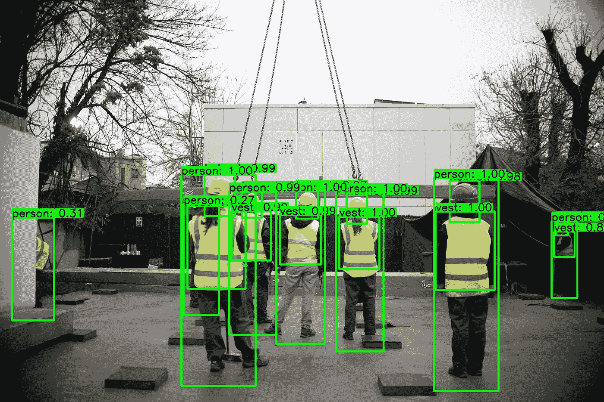

# 由 Deepstream 和 NVIDIA Jetson Xavier NX 支持的个人防护设备(PPE)检测

> 原文：<https://medium.com/analytics-vidhya/personal-protective-equipment-ppe-detection-powered-by-deepstream-and-nvidia-jetson-xavier-nx-b03be5a106ae?source=collection_archive---------5----------------------->


Jetson Xavier NX 开发套件

建筑业每年报告的致命伤害事故数量最多。即使在进行了彻底的风险评估并在工作环境中实施了充分的控制措施后，工人仍然可能面临危险带来的健康和安全风险，这就是个人防护设备如此重要的原因。


PPE 施工中使用的主要工具

该项目的主要目标是实时识别工人服装中的一些强制性安全元素，如头盔、反光背心、面罩、耳机等。

# 介绍

PPE 检测应用由智能视频分析管道组成，由 Deepstream 和 NVIDIA Jetson Xavier NX 提供支持

这个项目是一个概念验证，试图使用计算机视觉监控建筑工地上工人的安全，并使用 NVIDIA Deepstream 加速，可以通过监控摄像头和机载 Jetson 平台完成。

这个项目检测这 7 类物体-头，头盔，面具，耳机，胸部，背心和人



# Deepstream 设置

这篇文章假设你有一个功能齐全的 Jetson 设备。如果没有，可以参考这里的文档[。](https://docs.nvidia.com/jetson/jetpack/install-jetpack/index.html)

# 1.安装系统依赖项

```
sudo apt install \
libssl1.0.0 \
libgstreamer1.0-0 \
gstreamer1.0-tools \
gstreamer1.0-plugins-good \
gstreamer1.0-plugins-bad \
gstreamer1.0-plugins-ugly \
gstreamer1.0-libav \
libgstrtspserver-1.0-0 \
libjansson4=2.11-1
```

# 2.安装 Deepstream

将 DeepStream 5.0.1 Jetson Debian 包`deepstream-5.1_5.1.0-1_arm64.deb`下载到 Jetson 设备上。然后输入命令:

```
sudo apt-get install ./deepstream-5.1_5.1.0-1_arm64.deb
```

# 运行应用程序

# 1.克隆存储库

这是一个简单的步骤，但是，如果您不熟悉 git 或 git-lfs，我建议浏览一下这些步骤。

首先，安装 git 和 git-lfs

```
sudo apt install git git-lfs
```

接下来，克隆存储库

```
# Using HTTPS
git clone [https://github.com/FalconMadhab/PPE-Deepstream.git](https://github.com/FalconMadhab/PPE-Deepstream.git)#Using SSh
git@github.com:FalconMadhab/PPE-Deepstream.git
```

# 2.重量:[此处](https://drive.google.com/file/d/1y-XouaZKwFPY07-3plXhQ8WJUwg-_VZ2/view?usp=sharing)

从上面的链接下载重量文件并移动到这个文件夹

# 3.编制

*   x86 平台

```
CUDA_VER=11.1 make -C nvdsinfer_custom_impl_Yolo
```

*   杰特森平台

```
CUDA_VER=10.2 make -C nvdsinfer_custom_impl_Yolo
```

这是一次性的步骤，只有在修改源代码时才需要这样做。

# 了解和编辑 deepstream_app_config

要理解和编辑 deepstream_app_config.txt 文件，请阅读 [DeepStream SDK 开发指南—配置组](https://docs.nvidia.com/metropolis/deepstream/dev-guide/text/DS_ref_app_deepstream.html#configuration-groups)

*   编辑来源

1 个源的示例:

```
[source0]
enable=1
# 1=Camera (V4L2), 2=URI, 3=MultiURI, 4=RTSP, 5=Camera (CSI; Jetson only)
type=3
# Stream URL
uri=file:///home/user/Videos/input.mp4 or <rtsp url>
# Number of sources copy (if > 1, you need edit rows/columns in tiled-display section and batch-size in streammux section and config_infer_primary.txt; need type=3 for more than 1 source)
num-sources=1
gpu-id=0
cudadec-memtype=0
```

两个源的示例:

```
[source0]
enable=1
type=3
uri=file:///home/user/Videos/input.mp4 or <rtsp url>
num-sources=1
gpu-id=0
cudadec-memtype=0[source1]
enable=1
type=3
uri=file:///home/user/Videos/input.mp4 or <rtsp url>
num-sources=1
gpu-id=0
cudadec-memtype=0
```

现在，通过运行以下命令来运行应用程序:

```
deepstream-app -c deepstream_app_config.txt
```

# 应用程序的视频演示

推论 _ 结果 _ 杰特森

# 参考文献

*   大众-PPE 数据集+论文:[http://aimir.isti.cnr.it/vw-ppe](http://aimir.isti.cnr.it/vw-ppe)
*   彩色头盔数据集:[https://github.com/wujixiu/helmet-detection](https://github.com/wujixiu/helmet-detection)
*   暗网知识库(仅用于培训):【https://github.com/AlexeyAB/darknet 
*   YOLOv4 Tensorflow 实现(测试):【https://github.com/hunglc007/tensorflow-yolov4-tflite 
*   Hermes-使用 NVIDIA Jetson 和 Ryze 泰洛进行野火检测:[https://towards data science . com/Hermes-wild fire-Detection-using-NVIDIA-Jetson-and-Ryze-tello-8da 123 f 05 c 64](https://towardsdatascience.com/hermes-wildfire-detection-using-nvidia-jetson-and-ryze-tello-8da123f05c64)
*   用于检测的 Youtube 视频:[https://www.youtube.com/watch?v=lfoTLeFooR4&t = 265s](https://www.youtube.com/watch?v=lfoTLeFooR4&t=265s)