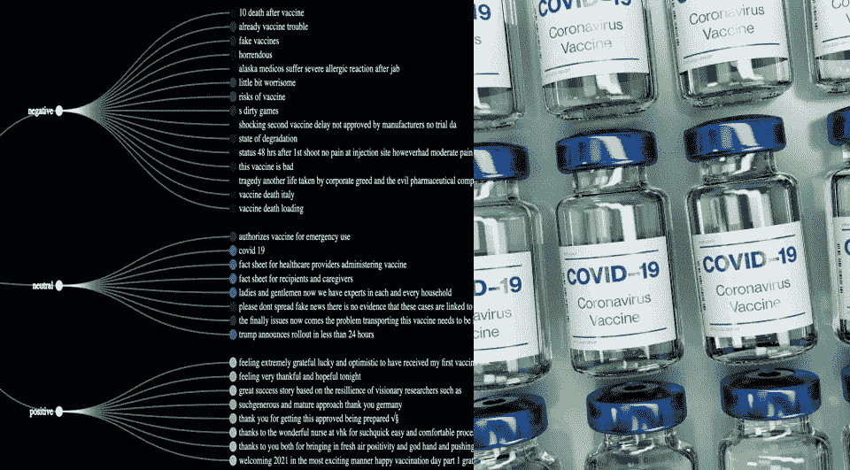

# COVID 疫苗推文分析

> 原文：<https://medium.com/analytics-vidhya/pfizer-vaccine-tweet-analytics-c73113bcdec4?source=collection_archive---------14----------------------->

## 使用数据科学了解我们周围的世界

丹尼尔·施鲁迪在 [Unsplash](https://unsplash.com/s/photos/vaccines?utm_source=unsplash&utm_medium=referral&utm_content=creditCopyText) 上拍摄的照片

目前，每个人的心思都被 COVID 疫苗接种这个话题占据了。因此，在这个故事中，你将看到我们如何利用数据科学来了解人们对疫苗接种的看法以及他们对此的讨论