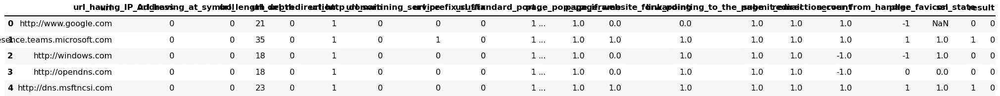
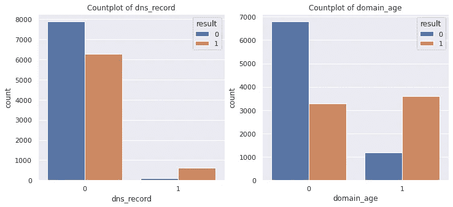
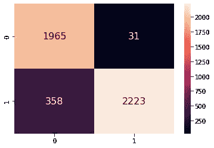
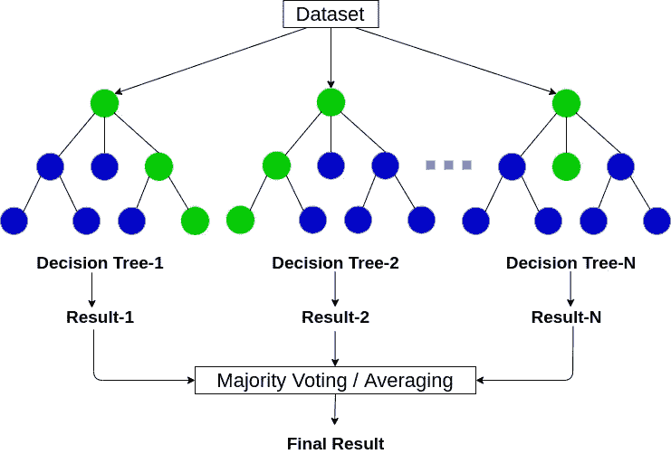

# 使用 ML 的网络钓鱼 URL 检测

> 原文：<https://medium.com/analytics-vidhya/phishing-url-detection-using-ml-4114d9930d61?source=collection_archive---------0----------------------->

[](https://www.bleepstatic.com/content/hl-images/2021/03/15/phishing-header.jpg)

**网络钓鱼**代表一种欺诈过程，攻击者试图从受害者那里获取敏感信息。通常，这类攻击是通过电子邮件、短信或网站进行的。如今，钓鱼网站越来越多，看起来和合法网站一样。但是，他们的后端被设计用来收集受害者输入的敏感信息。发现和检测钓鱼网站最近也获得了机器学习社区的关注，该社区已经建立了钓鱼网站的模型并对其进行了分类。

这可以使用不同的方法来完成，比如一种是网页的视觉相似性，另一种是使用文本矢量化技术，使用徽标，使用 URL 等。在这个案例研究中，我们将了解不同的技术，以及机器学习如何帮助实现我们的目标。

## 业务问题:

网络钓鱼是网络安全领域的一个大问题。攻击者通过不同的技术来做到这一点，例如通过创建或复制与合法页面类似的页面，以便用户可以错误地将个人信息或帐户信息提供给攻击者，另一种是通过电子邮件，如彩票中奖或任何 95%折扣的产品等，其中攻击者试图在交易完成时获取用户帐户信息等。这就是为什么像双因素认证这样的黑客会出现。

在这个领域中，通过创建一个 web 应用程序，其中用户输入 URL，应用程序返回 URL 是否合法，我们得到了一种机器学习方法。因为有像 PhishTank 这样的网站，但这些网站依赖于用户的投票，但通过从 URL 中提取特征并使用机器学习模型，我们可以通过提供概率得分来实现类似的事情。

## 业务限制:

*   要求低延迟。
*   错误的代价可能非常高，就像用户在网络钓鱼网站上执行交易一样，它可能会使用户付出金钱或信息丢失的代价。
*   概率解释是可取的。

## 商业问题的 ML 公式:

二元分类问题

1 ->网络钓鱼

0 ->合法

## 绩效指标:

roc_auc_score

*   因为代表接收器工作特性的 ROC 是用于说明使用可变阈值的二元分类问题的性能的图，其中假阳性率是 x 轴，真阳性率是 y 轴。
*   roc_auc_score 是一个计分函数，它计算 roc 下的面积，并将其汇总为一个数字。
*   它基于 predict_proba 进行计算，predict _ proba 给出了各个预测值的概率。

## 数据收集:

使用以下链接收集网络钓鱼网址:【https://www.phishtank.com/developer_info.php 

它由 12841 个 URL 组成。

合法的网址是通过链接收集的:[https://hackertarget.com/top-million-site-list-download/](https://hackertarget.com/top-million-site-list-download/)

它由 1000000 个网址组成。

随机抽取网址，从中抽取 10000 个网址。

使用 FeatureExtractor.ipynb 从 URL 中提取特征，它由几个函数组成，并细分为以下三类:

*   基于 Url 的功能
*   基于 DNS 记录的功能
*   基于页面内容/ html 的功能

为了提取功能，需要发送 HTTP 请求，并使用 bs4 进行其余的抓取，使用 whois 数据库进行域提取，因此创建了一个名为 requests_fetcher 的类，通过使用它的多线程功能，并行化或加速请求。这是继承的主类，它的 get_response 方法根据特征提取过程被覆盖。

```
# https://stackoverflow.com/a/68583332/5994461
class requests_fetcher:
  THREAD_POOL = 1024

  # This is how to create a reusable connection pool with python requests.
  session = requests.Session()
  session.mount(
      'https://',
      requests.adapters.HTTPAdapter(pool_maxsize=THREAD_POOL,
                                    max_retries=3,
                                    pool_block=True)
  )

  def get_response(self, url, verify = False):
    try:
      self.response = self.session.get(url, timeout = 2, verify = verify)
      # logging.info("request was completed in %s seconds [%s]", response.elapsed.total_seconds(), response.url)
      # if response.status_code != 200:
      #     logging.error("request failed, error code %s [%s]", response.status_code, response.url)
      if 500 <= self.response.status_code < 600:
          # server is overloaded? give it a break
          time.sleep(5)

      return self.response

    except:
      self.response = ""
      return self.response

  def download(self, urls, cl = None):
      with ThreadPoolExecutor(max_workers= self.THREAD_POOL) as executor:
          # wrap in a list() to wait for all requests to complete
          if(cl):
            ls = list(executor.map(cl.get_response, urls))
          else:
            ls = list(executor.map(self.get_response, urls))
          return ls// explanation of the above function
```

最终特征提取 csv 文件的前五行



*该数据集包含 22932 行/样本和 27 列/特征。*

## 现有方法:

1.  黑名单/白名单:将合法网址放入白名单，或将钓鱼网址放入黑名单。
2.  基于机器学习的 CANTINA:它使用页面上重复次数最多的单词来检查搜索引擎中的页面。比方说，通过使用整个 HTML 页面中单词的 tf-idf，使用频率并相应地对单词进行排序，它选择前 5 个单词并使用它们作为搜索引擎中搜索的页面描述符，如果域名出现在前 N 个搜索结果中，则它声明该 url 是合法的，否则是网络钓鱼。
3.  CANTINA+:除了在 CANTINA 中设计的特性之外，从 HTML 页面中提取的 15 个新特性也在数据集中使用。

缺点:该技术工作良好，但有一些限制，因为它需要额外的搜索操作，这造成了额外的网络负载。另一个问题是，如果攻击者将 url 提升到顶部搜索，系统可能无法预测该 url 是合法的还是网络钓鱼。

## 解决该问题的方法:

这是从特征提取开始的，特征提取有助于确定 url 的性质，随后是数据预处理，如处理缺失值、移除恒定特征、移除异常值等。然后是探索性的数据分析，以了解更多的特性、它们的重要性以及与目标值的关系。之后是特征工程，它后来帮助模型更准确地找出模式。然后是特征缩放和建模。

## 探索性数据分析

## 将数据集分为训练集和测试集，以避免数据泄漏，即只有训练数据集应作为信息存在于模型训练中，而不是整个数据集，以避免差异。如果在模型训练期间整个数据集都涉及到，那么它对该数据集的预测很好，但对生产期间出现的新查询的预测却不好。

> 数据类型和缺失值

```
X_train.info()<class 'pandas.core.frame.DataFrame'>
Int64Index: 18345 entries, 11992 to 18551
Data columns (total 27 columns):
 #   Column                      Non-Null Count  Dtype  
---  ------                      --------------  -----  
 0   url                         18345 non-null  object 
 1   url_having_IP_Address       18345 non-null  int64  
 2   url_having_at_symbol        18345 non-null  int64  
 3   url_length                  18345 non-null  int64  
 4   url_depth                   18345 non-null  int64  
 5   url_redirection             18345 non-null  int64  
 6   url_http_domain             18345 non-null  int64  
 7   url_sortining_service       18345 non-null  int64  
 8   url_prefix_suffix           18345 non-null  int64  
 9   url_standard_port           18345 non-null  int64  
 10  url_google_index            18345 non-null  int64  
 11  dns_record                  18345 non-null  int64  
 12  domain_age                  18345 non-null  int64  
 13  domain_registration_length  18345 non-null  int64  
 14  statistical_report          16161 non-null  float64
 15  page_mouse_over             18345 non-null  int64  
 16  page_right_click_disable    18345 non-null  int64  
 17  page_pop_up                 18344 non-null  float64
 18  page_iframe                 18343 non-null  float64
 19  page_website_forwarding     18342 non-null  float64
 20  link_pointing_to_the_page   18323 non-null  float64
 21  submit_email                18321 non-null  float64
 22  redirection_count           18315 non-null  float64
 23  server_from_handler         18345 non-null  int64  
 24  page_favicon                11586 non-null  float64
 25  ssl_state                   18345 non-null  int64  
 26  result                      18345 non-null  int64  
dtypes: float64(8), int64(18), object(1)
memory usage: 3.9+ MB
```

**见解**:

该数据集在 8 列中有空值:

统计 _ 报告、页面 _ 弹出、页面 _iframe、页面 _ 网站 _ 转发链接 _ 指向 _ 页面、提交 _ 电子邮件、重定向 _ 计数和页面 _ 图标。

列 url 是文本数据。

列结果是我们的目标特性。

> 恒定特征

*那些对于所有的观察值只包含一个值的特征，它们在任务分类中不提供任何信息，所以最好去除这些不好的特征*

```
# dropping constant urls
X_train = X_train.loc[:,X_train.apply(pd.Series.nunique) != 1]
```

> **处理缺失值**

```
# https://github.com/ResidentMario/missingno
import missingno as msno# Gives positional information of the missing values
msno.matrix(X_train.drop(columns = ['url', 'result']))<matplotlib.axes._subplots.AxesSubplot at 0x7f8e5dd46b10>
```


```
msno.dendrogram(X_train.drop(columns = ['url', 'result']))<matplotlib.axes._subplots.AxesSubplot at 0x7f8e554428d0>
```


```
# percentage of data missing in features wrt. total no. of rows

missing_variables = X_train.isnull().mean()[X_train.isnull().mean() != 0]
missing_variablesstatistical_report           0.119052
page_pop_up                  0.000055
page_iframe                  0.000109
page_website_forwarding      0.000164
link_pointing_to_the_page    0.001199
submit_email                 0.001308
redirection_count            0.001635
page_favicon                 0.368438
dtype: float64
```

有许多方法可以处理空值，例如:

丢弃空值，

用平均值/众数/中位数代替它

使用最常用/新类别进行输入

为缺失值创建新要素

使用基于模型的估算器等。

我们必须知道它的原因，以避免使用统计工具的偏见，如:MCAR，马尔，MNAR。[链接](https://www.youtube.com/watch?v=YpqUbirqFxQ)

完全随机缺失:这是因为缺失值和目标值之间没有系统差异。

随机缺失:当缺失不是随机的，而是依赖于其他一些独立的特征。

不是随机缺失:它发生在由选择导致的缺失时，因此变量与变量本身相关。

> 缺少有价值的特征=> statistical_report

```
missing_statistical_report['result'] = X_train.result

missing_statistical_report.groupby('statistical_report')['result'].mean()statistical_report
0    0.455797
1    0.453205
Name: result, dtype: float64
```

该特征的缺失与从属值之间没有关系，推断为随机类型完全缺失。

```
# creating an unknown variable as -1

X_train['statistical_report'] = X_train['statistical_report'].fillna(-1)
```

> 缺少有价值的要素=> page_favicon

```
missing_page_favicon['result'] = X_train.result

missing_page_favicon.groupby('page_favicon')['result'].mean()page_favicon
0    0.456293
1    0.454089
Name: result, dtype: float64
```

这是完全随意缺失的类型。由于丢失的值占总数据集的 36%,因此创建一个新列比删除它要好。

```
X_train['page_favicon'] = X_train['page_favicon'].fillna(-1)
```

> 缺少有值特征= >重定向计数

```
missing_redirection_count['result'] = X_train.result

missing_redirection_count.groupby('redirection_count')['result'].mean()redirection_count
0    0.455351
1    0.545455
Name: result, dtype: float64# filling na with 1    
X_train['redirection_count'] = X_train['redirection_count'].fillna(1)
```

删除了不常用的空值行。

## 单变量特征分析:用于一次分析一个独立的特征。从属特征。

```
print('Unique values in result column: ',X_train.result.value_counts())

sns.countplot(X_train.result)Unique values in result column:  1    10333
0     7988
Name: result, dtype: int64
```


```
% of phishing data points:  56.39975983843677
% of legitimate data points:  43.60024016156323
```

*结果特征是合法数据点的值为 0，网络钓鱼数据点的值为 1*。

*数据集*略有不平衡。

## 基于 url 的功能

*url_length 和 url_depth 是数字特征，而其他是分类特征，数字格式为 0 和 1。*

> **url_length**


url_length 的分布是高度正偏的。有很少的点向右侧弯曲，这意味着很少的数据点具有较大的 url 长度。


上图表示 url 长度有异常值。

> 使用分位数检测并移除异常值，这往往会从数据集中丢弃%年龄的点:9 . 49486 . 49869898991


在该图中，得出结论，每密度的网络钓鱼点的长度大于合法点，因为同一性几乎相等，但是在图中，与网络钓鱼点相比，合法点的密度更接近模式。区分类别是一个有用的特性。

> **url_depth**


上图表示 url 长度在结果值 1 中有异常值，即网络钓鱼。

> 使用分位数检测并移除异常值，这往往会从数据集中丢弃%年龄的点:10 . 44667 . 48686868661


在此图中，推断网络钓鱼点的长度大于合法点的长度。区分类别是一个有用的特性。

> **url_having_at_symbol**


该图显示所有合法点都属于该特征的值 0。并且网络钓鱼点在 0 和 1 值中。但是值 0 仍然有重叠。

> **URL _ 重定向**


*上图显示，该特性 wrt 的值 1 存在重叠。目标值。*

*对于该特征，只有 4 个点的值为 0，并且它们都属于类别 0，即合法。*

*这不是一个有用的特性。*

> **url_http_domain**


*上图显示，对于所有合法的数据点，该特征值为 0，而对于网络钓鱼，大多数数据点的特征值为 1。*

*这是一个有用的功能。*

> **网址分类服务**
> 
> **网址 _ 前缀 _ 后缀**


*这些图表明，这些特征对两个值都不太有用，尽管目标几乎重叠，但这两个值是完全可区分的。*

> **网址 _ 标准 _ 端口**
> 
> **网址 _ 谷歌 _ 索引**


上图显示的是:

*url_standard_port 是一个不好的特征，因为几乎所有的点都属于值 1，并且目标高度重叠。*

url_google_index 是一个很好的特征，目标很容易区分。

## 基于域的功能



两者都是有用的特性。至于特征名称 domain_age，结果 0，即合法的很大程度上属于该特征的值 0。并且对于 dns_record，值 1 的网络钓鱼点的频率更高。

## 基于页面的功能


*上面绘制的两个特征都没有帮助，因为它们对于 0 和 1 都是重叠的。*


*redirection_count 功能对结果没有任何意义。submit_email 可能会有所帮助，因为与合法点数相比，很少网络钓鱼点数的值为 0。*


*server_from_handler 和 ssl_state 是不好的特性。在 page_favicon 特性中，-1 表示未知值，但在合法的情况下为高，可能是恶意特性。*

## 主成分分析

这是一种用来降低数据集维数的技术。

它使用数据的协方差矩阵，利用协方差矩阵能够提取作为主分量的特征向量。

[链接](https://en.wikipedia.org/wiki/Principal_component_analysis)


该图直观地表明，只有 15 个组件或特征提供了 95%以上的可解释可变性。

## 特征选择

这是机器学习的预处理步骤。它通过使用得分函数最大化相关信息来选择重要特征，并帮助发现冗余和不相关的特征，以便在模型训练过程中避免它们。

## 交互信息


它根据两个随机变量的交集来计算分数，其中随机变量是独立变量和非独立变量。它类似于信息增益。

I(X；Y) = H(X) — H(X | Y)

其中 I(X；Y)是 X 和 Y 的互信息，H(X)是 X 的熵，H(X | Y)是给定 Y 时 X 的条件熵。

```
def select_features(X_train, y_train):
  '''
  This function takes X and y as input
  calculates K best features using scoring function, for this mutual_info_classif is being used as score function
  returns the k best features with their scores
  '''
  fs = SelectKBest(score_func=mutual_info_classif, k='all')
  fs.fit(X_train, y_train)
  return fs
```


使用上面的图，我们可以得出前 5 个薄弱特征:

1.  url _ 排序 _ 服务
2.  指向页面的链接
3.  页面弹出
4.  page _ 右键单击 _ 禁用
5.  统计报告

由于数据集很小，最好不要删除任何要素以避免过度拟合。

## 相关矩阵

它用于找出变量之间的线性关系。

它的系数分为正、负和零。


使用上面的图，一些见解如下:

1.  url_length，url_depth，url_http_domain，url_google_index，domain_age 与结果有很强的相关性。
2.  数据集中存在多重共线性。可能有助于特征工程，通过构造新特征和执行进一步的特征交互。

## 特征工程

创建了一些新功能，如下所示:

*   长度深度= url 长度+ url 深度
*   端口重定向= url 标准端口+重定向计数
*   var_median = df.median(轴= 1)
*   var_max = df.max(轴= 1)
*   var_std = df.std(轴= 1)
*   var_sum = df.sum(轴= 1)

## 模特培训

将数据输入到机器学习算法中的过程，以便可以通过某种方式对其进行训练，从而从数据集中识别模式。

## 首次切割方法:

我尝试了广义 spot 分类建模方法，它类似于 autoML，其中训练数据集参与模型训练过程，而模型不确定，在多个模型中牵引相同的数据集，以使用 cross_val_score 和 score 函数找出哪个模型与其他模型相比表现更好。

其中包括的型号如下:

**物流回归**

*   顾名思义，它使用逻辑函数来建模一个二元分类问题。

[](https://www.equiskill.com/wp-content/uploads/2018/07/WhatsApp-Image-2020-02-11-at-8.30.11-PM.jpeg)

*   这是一个线性模型。
*   它考虑了几个假设，包括没有多重共线性，观测值是独立的，等等。
*   建模前执行要素缩放非常有用，因为它是一种基于距离的算法。

**支持向量机分类器**

*   它是一个基于线性模型的分类器，可以解决基于右核的线性和非线性问题。

[](https://learnopencv.com/wp-content/uploads/2018/07/support-vectors-and-maximum-margin.png)

*   它的工作原理是基于边际最大化，即通过增加边际空间来分离两类数据点。
*   它在列数大于行数的情况下工作得很好，但由于其训练时间的复杂性，在大型数据集上工作得不太好。

**决策树分类器**

*   它是一个基于树的分类器，通过构建决策树来创建模型。其每个节点指定一个特征，并且从该节点向下的每个分支指定该特征的一个可能值。


*   它不需要特征缩放。
*   它根据信息增益、基尼系数和熵来选择节点。
*   这在需要解释能力但不稳定的情况下是有利的，即数据的小变化会导致其结构的大变化。

**knarestneighborsclassifier**

*   它是基于实例的模型，即它在训练中不学习任何东西，它使用基于距离的相似性来为查询点选择 k 个最近的点，从而预测具有多数的点。

[](https://www.researchgate.net/profile/Altyeb-Taha/publication/318096864/figure/fig1/AS:511659855024128@1499000623355/A-k-nearest-neighbor-KNN-classifier-KNN-is-explained-as-follows.png)

*   由于这是一种基于距离的算法，因此需要对要素进行缩放。它遭受了维度的诅咒。
*   由于其时间复杂性，它不能很好地处理大型数据集。

**高斯恩布**

*   它是一种基于贝叶斯定理的分类技术，具有特征独立性的假设。
*   它可以处理连续数据和分类数据，也可以处理大型数据集。

```
# prepare models
models = []
models.append(('LR', LogisticRegression()))
models.append(('KNN', KNeighborsClassifier()))
models.append(('Decision Tree', DecisionTreeClassifier()))
models.append(('NB', GaussianNB()))
models.append(('SVM', SGDClassifier(loss = 'hinge')))

# evaluate each model in turn
results = []
names = []
scoring = 'accuracy'
for name, model in models:
	kfold = model_selection.KFold(n_splits=5)
	cv_results = model_selection.cross_val_score(model, X_train, y_train, cv=kfold, scoring=scoring)
	results.append(cv_results)
	names.append(name)
	msg = "%s: %f (%f)" % (name, cv_results.mean(), cv_results.std())
	print(msg)Output
LR: 0.994823 (0.002677)
KNN: 0.926516 (0.005201)
Decision Tree: 0.959527 (0.003563)
NB: 0.893640 (0.005924)
SVM: 0.906282 (0.041549)
```

使用上述方法，我们可以得出结论，逻辑回归在速度和准确性方面都表现得非常好。

## 超参数调谐

为参数化模型寻找最佳参数以使其性能良好的过程。

为此使用 GridSearchCV，它循环遍历以 dict 对象形式传递的参数的所有组合，并因此通过采用 score 函数作为评分参数，使用交叉验证方法来评估每个组合的模型。

> 逻辑回归

## 特征缩放

[](https://curiousily.com/static/146d23a712d6a0617cfabbfda2c80533/3e3fe/min-max-scaling.png)

为了标准化要素的范围，需要对其进行缩放。在使用距离来计算数据点之间的相似性的情况下，这是必不可少的。

这里使用了 MinMaxScaler，它通过将 feature_range 作为一个参数来重新缩放特征的范围，以在 0 和 1 或-1 和 1 之间缩放范围。

```
ls=[10**-4, 10**-2, 10**0, 10**2, 10**4]
tuned_parameters = [{'logisticregression__C': ls}]

# creating pipeline
pipe = make_pipeline(MinMaxScaler(), LogisticRegression())
#Using GridSearchCV
search = GridSearchCV(pipe, tuned_parameters, scoring = 'roc_auc', cv=5, return_train_score= True, n_jobs =-1)
search.fit(X_train, y_train)Output:
Best hyper parameter:  {'logisticregression__C': 10000}
Model Score:  0.9826442776350583
Model estimator:  Pipeline(steps=[('minmaxscaler', MinMaxScaler()),
                ('logisticregression', LogisticRegression(C=10000))])
```



逻辑回归模型的混淆矩阵

在该图中，假阴性或 2 型错误占总阴性数据点的 14%。然而，真正的积极和真正的消极是好的，这表明我们可以信任这个模型。

## 应用系综

集成方法是一种机器学习技术，它组合了几个基本模型，其中基本模型可以相同或不同，以便产生一个最佳预测模型，该模型是一组组合的最终预测。

## 随机森林分类器

*   这是一个基于集成的模型，其中决策树被用作其基础学习器。
*   决策树的集合使用自举采样进行随机特征选择和模型训练，然后聚合并返回基于投票方案的预测，因此被称为 bagging，即自举聚合。

[](https://files.ai-pool.com/a/3406775c0c6f8fd9f8701c7ca671dad9.png)

*   它是可解释的，并使用信息增益等基于基础学习者的聚合 FI 返回特征重要性。
*   基础学习器，即决策树，应该以获得高方差的方式建模，该方差随后在聚集时达到平衡。因此，与决策树一样，随机森林中的大多数超参数是相同的，如最大深度、n 估计量、最小样本分裂、最小样本叶等。

```
depth = [1, 10, 50, 100, 500, 1000]
n_estimators = [100, 200, 300, 400, 500]
tuned_parameters = [{'randomforestclassifier__max_depth':depth, 'randomforestclassifier__n_estimators': n_estimators}]

# Applying RandomizedSearchCV with k folds = 5 and taking 'roc_auc' as score metric
pipe = make_pipeline(MinMaxScaler(), RandomForestClassifier())
clf = GridSearchCV(pipe, tuned_parameters, scoring = 'roc_auc', cv=5, return_train_score= True, verbose = 10, n_jobs= -1)
clf.fit(X_train, y_train)Output:
Best hyper parameter:  {'randomforestclassifier__max_depth': 500, 'randomforestclassifier__n_estimators': 500}
Model Score:  0.9937430027759891
Model estimator:  Pipeline(steps=[('minmaxscaler', MinMaxScaler()),
                ('randomforestclassifier',
                 RandomForestClassifier(max_depth=500, n_estimators=500))])
```


射频分类器的混淆矩阵

该混淆矩阵显示，与假阳性和假阴性相比，真阳性和真阴性相对较高，因此我们可以信任该模型。由于真实值较高，因此 f1 的精度和召回率也会较高。

## 特征重要性

```
importance = rf_model.steps[1][1].feature_importances_

plot_feature_importance(importance, X_train.columns,'RANDOM FOREST')
```


按照这个剧情来看，除了 url_http_domain 和 url_depth 之外，特征工程中构造的特征还是相当有帮助的。

## 模型比较

```
+---------------------+---------------------------------+-------+-------+---------------+
|        Model        |         Hyper parameter         | Train |  Test | roc_auc_score |
+---------------------+---------------------------------+-------+-------+---------------+
| Logistic regression |             C=10000             | 0.975 |  0.97 |     0.968     |
|    Random Forest    | max_depth=500, n_estimators=500 | 0.995 | 0.987 |     0.995     |
+---------------------+---------------------------------+-------+-------+---------------+
```

看这个图，很容易识别随机森林分类器是赢家。

## 未来工作:

我们可以尝试一种基于转换器的方法，将每个 URL 分成单个字符标记，并在末尾附加一个分类标记“CLS”。将该令牌化的输入应用于填充，使用另一个令牌作为“填充”等等。这可能会极大地提高性能，但为此，我们需要数据集在数量和质量方面更加复杂。

## 参考资料:

*   [https://www.appliedaicourse.com/](https://www.appliedaicourse.com/)
*   https://arxiv.org/pdf/2009.11116v1.pdf
*   [https://www . science direct . com/science/article/pii/s 2352340920313202](https://www.sciencedirect.com/science/article/pii/S2352340920313202)
*   [https://arxiv.org/ftp/arxiv/papers/2110/2110.13424.pdf](https://arxiv.org/ftp/arxiv/papers/2110/2110.13424.pdf)
*   [https://www.phishtank.com/](https://www.phishtank.com/)
*   [https://www.alexa.com/topsites](https://www.alexa.com/topsites)
*   [https://github.com/ResidentMario/missingno](https://github.com/ResidentMario/missingno)
*   [https://sci kit-learn . org/stable/modules/generated/sk learn . feature _ selection . mutual _ info _ classif . html](https://scikit-learn.org/stable/modules/generated/sklearn.feature_selection.mutual_info_classif.html)
*   [https://machine learning mastery . com/feature-selection-with-category-data/](https://machinelearningmastery.com/feature-selection-with-categorical-data/)
*   [https://machine learning mastery . com/compare-machine-learning-algorithms-python-scikit-learn/](https://machinelearningmastery.com/compare-machine-learning-algorithms-python-scikit-learn/)

## Github 回购:

[](https://github.com/joshiKuldeep/Phishing-Detection-using-ML) [## GitHub-joshiKuldeep/网络钓鱼-检测-使用-ML

### 网络钓鱼代表一种欺诈过程，攻击者试图从受害者那里获取敏感信息。这个…

github.com](https://github.com/joshiKuldeep/Phishing-Detection-using-ML)