# 用神经网络进行照片地理定位:如何做和如何不做

> 原文：<https://medium.com/analytics-vidhya/photo-geolocation-with-neural-networks-how-to-and-how-not-to-8aa7f10abb34?source=collection_archive---------1----------------------->

建立一个可以对户外图像进行地理标记的神经网络，以及如何用 grad-cam 捕捉作弊的神经网络

卷积神经网络(CNN)是目前计算机视觉领域的最新技术。在本文中，我讨论了我构建 CNN 模型地理标记图像的经验——将图像作为输入，并预测该图像的位置作为输出。我还讨论了该模型的前一次迭代，它愚弄了我，让我相信该模型已经变得非常擅长地理定位，但结果证明这是一个数据泄漏的案例。

该模型在谷歌街景图像数据集上进行训练。我搜集了印度随机地点的图像来生成这个数据集。这个模型在预测方面相当不错。它通常预测实际位置的附近。

这是一个针对不耐烦者的结果快速视图-阴影区域表示得分高的格网，预测位置是格网质心和得分的加权平均值:

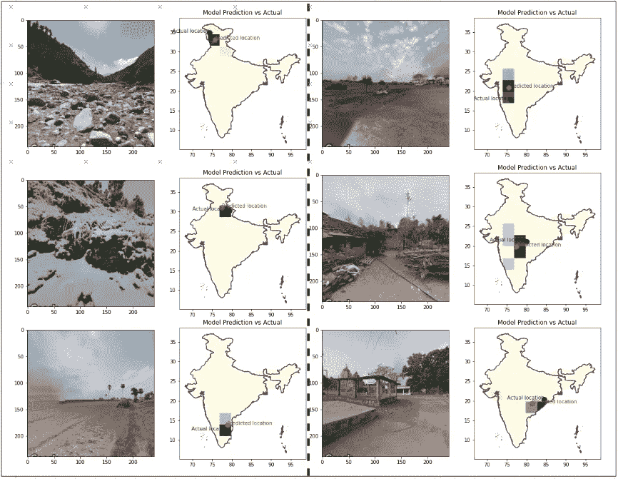

地理位置模型评估-阴影区域表示得分高的格网，预测位置是格网质心和得分的加权平均值

这些都是精心挑选的好例子。即使模型的预测位置是错误的，预测的网格也是合理的:

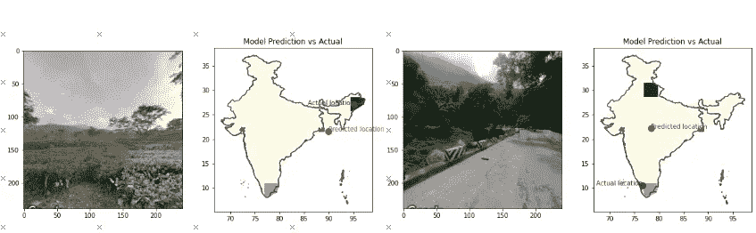

可原谅的错误-阴影区域表示得分高的格网，预测位置是格网质心和得分的加权平均值

# **抓骗子**

我的第一次模型迭代给了我非常好的结果。准确率达到了 60%，这对于这种方法来说是不可思议的，远远高于类似研究中提到的基准。这激起了我的怀疑，我进一步挖掘。

经过进一步的研究，我发现即使对于质量不好的图像，预测也非常准确。

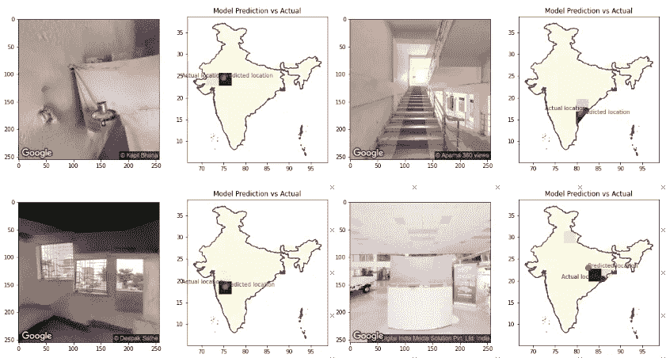

对低质量图像的良好预测——非常可疑

这是非常可疑的，因为在损失曲线中没有过度拟合的迹象。然后，我决定使用 grad-cam 方法研究神经网络中的层激活，以了解模型在做出这些决定时在看什么。不料，骗局被揭穿了！！

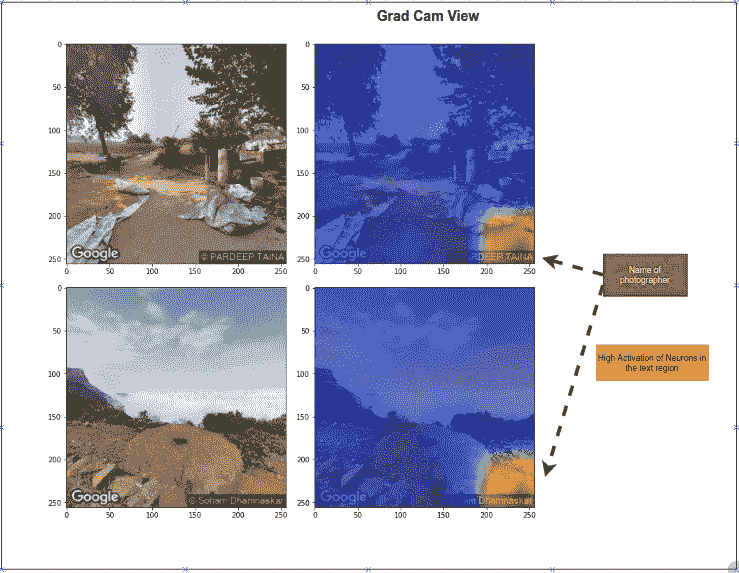

模特如何作弊

该模型在谷歌图像中查看上传者的名字，并使用它来预测位置。非常狡猾。多亏了 gradcam，我们现在可以照亮“黑匣子”了。

当我遮住右下角的名字时。模型失控了。抓住你了。

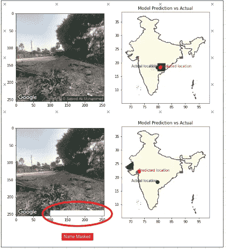

当摄影师的名字被掩盖时，预测的准确性急剧下降

在后来的迭代中，我裁剪掉了图像的底部。模型精度不是很高，但它能够提取一些一般的模式，如景观、建筑物、植被、道路、地形等。做预测的时候。

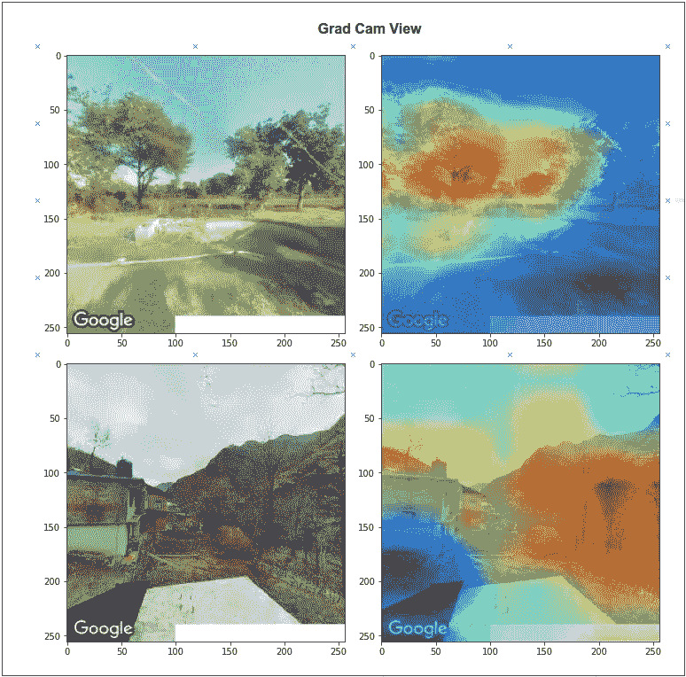

为了防止作弊，模特在照片上接受了重新训练，并掩盖了摄影师的名字

## **建模方法:**

我把这个框定为多类分类问题。我把印度地图分割成网格，用网格数作为目标变量训练模型。

**数据集准备**

我在印度地图上叠加了一个等距网格。生成的网格中包含模型需要预测的目标变量。

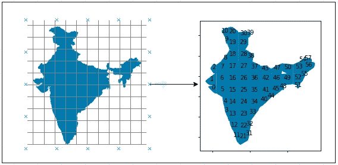

然后，我在每个网格中均匀采样点，使用谷歌的街景 API 获得与街景图像最近的位置，并从 360°视图中抓取角度为 0、90、180 和 270 度的 4 幅图像。

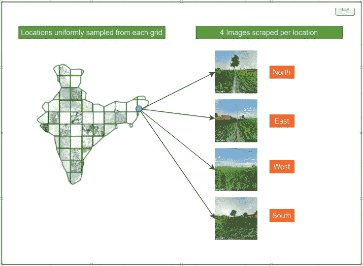

数据准备——从网格中随机采样位置坐标并采集图像

**造型**

模型架构:ResNext50

班级数量:58

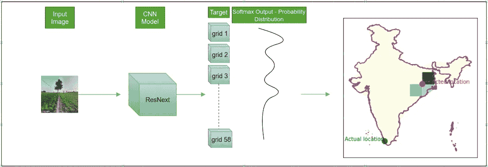

最终预测的坐标计算为预测概率分布的质心的加权和。

**评测**

**方法:【KFold 分组— 10 个拆分—按位置分组**

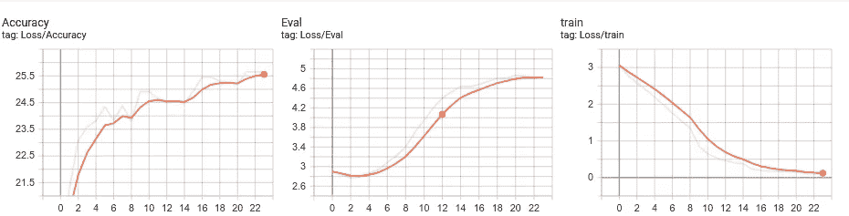

**混淆矩阵:**

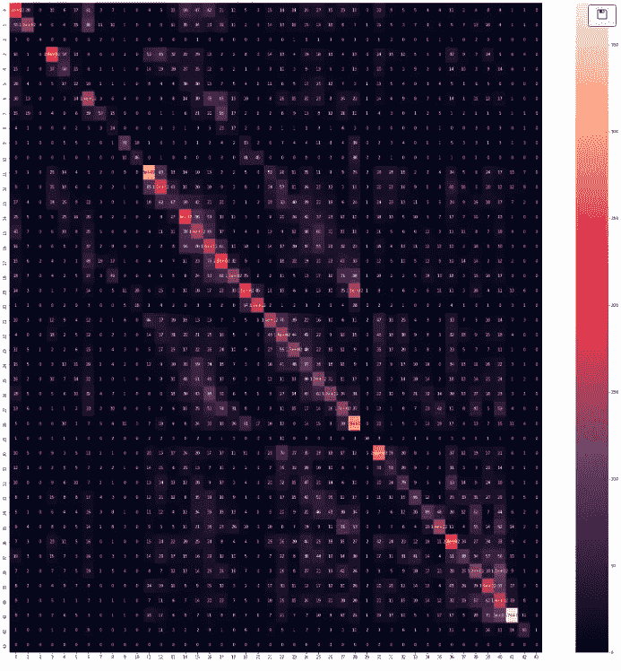

评估数据集上的混淆矩阵

**平均准确率:** 25%

**GitHub 回购:**[https://github.com/kvsnoufal/ImageGeoLocation](https://github.com/kvsnoufal/ImageGeoLocation)

**巨人的肩膀**

1.  具有卷积神经网络的行星地理定位—[https://static . Google user content . com/media/research . Google . com/en//pubs/archive/45488 . pdf](https://static.googleusercontent.com/media/research.google.com/en//pubs/archive/45488.pdf)
2.  DeepGeo:深度神经网络照片定位—[https://arxiv.org/abs/1810.03077](https://arxiv.org/abs/1810.03077)
3.  https://www.kaggle.com/skylord/grad-cam-on-resnext

> **关于作者**
> 
> 我在阿联酋迪拜控股公司工作，是一名数据科学家。你可以到 kvsnoufal@gmail.com 或 https://www.linkedin.com/in/kvsnoufal/找我