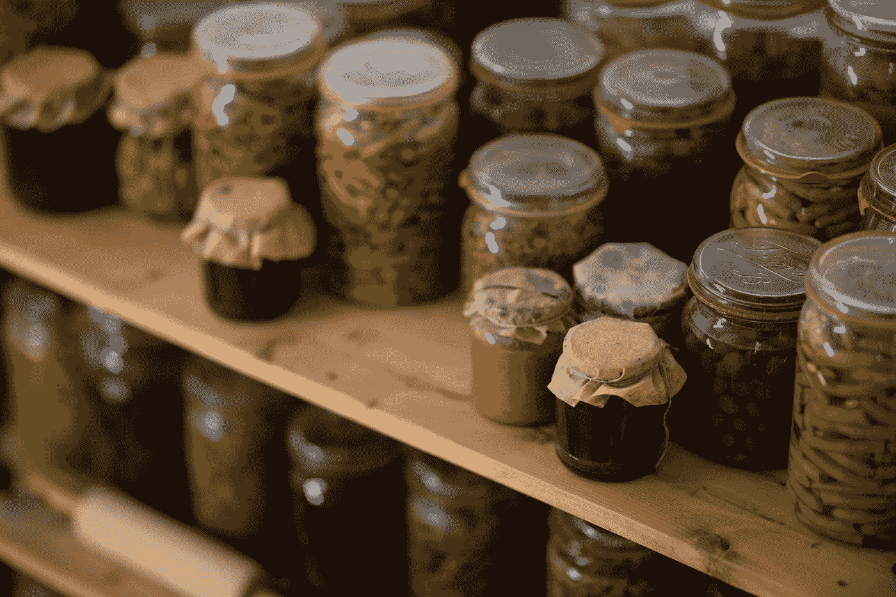

# Python 的腌菜:腌菜讲解

> 原文：<https://medium.com/analytics-vidhya/pickling-explained-pythons-pickle-11ec758d2b3?source=collection_archive---------2----------------------->

照片由 [Aysegul Yahsi](https://unsplash.com/@aysegulyahsi?utm_source=medium&utm_medium=referral) 在 [Unsplash](https://unsplash.com?utm_source=medium&utm_medium=referral) 上拍摄

`[pickle](https://docs.python.org/3/library/pickle.html#module-pickle)`模块实现了二进制协议，用于序列化和反序列化 Python 对象结构。*【pickle】*是将 Python 对象层次转换成字节流的过程，*【unpickle】*是逆操作，将字节流(来自[二进制文件](https://docs.python.org/3/glossary.html#term-binary-file)或[类字节对象](https://docs.python.org/3/glossary.html#term-bytes-like-object))转换回对象层次。酸洗(和拆洗)也称为“序列化”…