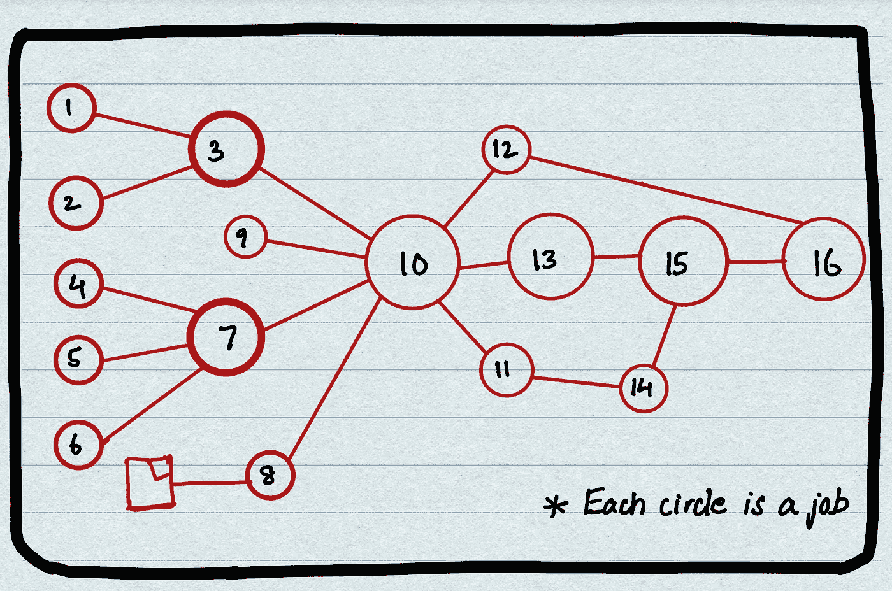
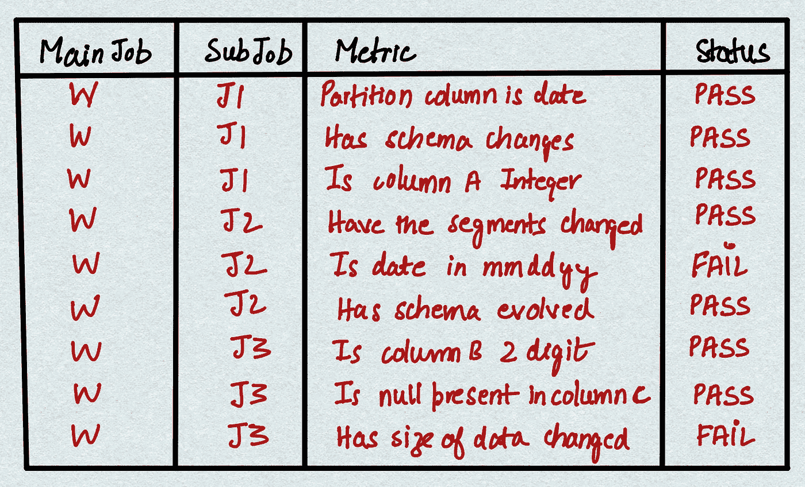

# 管道丛林

> 原文：<https://medium.com/analytics-vidhya/pipeline-jungles-8fce3522e4a9?source=collection_archive---------16----------------------->

这个词出现在我有大量工作负载在生产中运行，并且我无法再保证我的机器学习工作负载的 SLA 之后。我觉得我最终遇到了管道丛林问题。

# **什么是管道丛林？**

机器学习工作负载由多个实时或批量摄取作业驱动，以工程作业为特色，并且很可能所有这些作业都由不同部门和多个工程团队开发和拥有。所有作业中的数据通常来自各种数据源—数据湖、数据仓库和事件。数据正确性和完整性的责任和所有权属于各个工程团队。机器学习工作负载总是各种上游工作负载的消费者。当机器学习模型的输出不正确时，会花费相当多的时间来调试来自所有上游作业的数据。

这就导致了管道丛林的问题。

# **管道丛林是什么样子的？**

典型管道丛林的图示

管道丛林由各种工作组成，端到端地解决多个业务问题。

*这看起来复杂吗？对我来说绝对是！我们如何破译管道丛林？我们如何在管道丛林中导航，并为技术/业务团队提供每个工作的正确 SLA？我们如何确保每份工作的正确合同在工作的整个生命周期内都有保证？*

我对此有一些想法—

1.  在每个作业之上产生监控，以检查数据新近性、数据质量、数据正确性、模式变化等等，并为每个检查分配状态
2.  如果任何检查失败，下游相关作业都不应继续
3.  监控的责任不应由一个团队(SRE 团队或生产支持团队)集中，而必须分散到所有工程团队。这是使监控可靠的可扩展方式。

在管道丛林的顶部进行监控是必不可少的，应该基于数据流以批处理或实时方式定期运行。这将有助于报告在给定时间范围内 SLA 违约发生的总次数。这样，每个工程团队都可以对数据质量负责。理解各种矩阵、数据质量检查和 SLA 违约是必不可少的，因为它为业务团队的交付提供了可量化的可靠性。

# **监控管道丛林的优势？**

1.  通过量化工作负载，工程团队可以更轻松地向产品负责人保证工作负载的 SLA
2.  当对每项工作都进行监控时，工程团队的调试时间可以大大减少
3.  可以减少计算资源(与成本成比例)。示例:如果许多上游作业的监视之一检测到协定失败，则下游作业将不会运行，直到所有者团队解决该问题，从而节省集群计算资源
4.  可以定期提取每个作业的报告，以了解作业报告的最大 SLA 违规情况，用户可以深入了解哪些类型的检查最常失败，并最终采取纠正措施。

# **在管道丛林周围建立监测工作的想法**

**(如果购买数据可观察性或监控平台不可行)**

每个工程团队负责交付生产中的特定用例和工作负载。使用各自依赖的上游作业为每个用例构建一个可重用的监控组件，该组件监控各种指标并为指标检查分配一个状态。当所有检查都通过后，才触发工程/ML 工作负荷。这可能是一个快速简单的方法来加强监控的想法，并从中获得初始值。

**举例:**假设有一个 ML 工作量 W，其上游作业为 J1、J2、jobs 乐队。为每个作业开发 3 个监控作业 M1、M2、M3，运行各种检查并为每个检查分配一个状态。M1、M2、M3 可以是 spark jobs，为了简单起见，结果可以存储在 HIVE 表中。只有当 M1、M2 和 M3 的所有状态都为“通过”时，工作负载 W 才应该运行。

样本监控输出

*你对此有什么想法？你是如何穿越管道丛林的？很想听听他们的意见。*