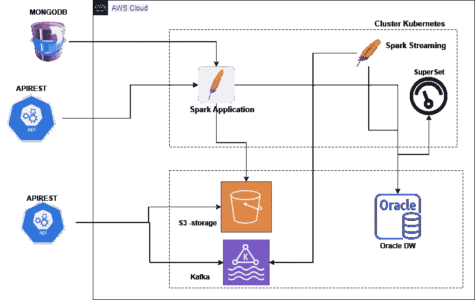

# 管道:Mongodb 到 Spark 3.0.1 和 Kubernetes

> 原文：<https://medium.com/analytics-vidhya/pipeline-mongodb-to-spark-3-0-1-with-kubernetes-e84234ba5e3e?source=collection_archive---------9----------------------->



完整的管道模拟(测试环境)

在本文中，我将只关注上面这个管道的一部分。我放上这张图片只是为了展示我的测试环境的全貌。但是，在第二张图中，有这篇文章的必要部分。


物品管道

我们的目标是展示如何在集群 Kubernetes 上用 spark 完成这个管道的第一部分。

我在标题里说我用的是 Spark 3.0.1。在这个版本中，我需要一些包来使用“mongodb spark 连接器”。我使用的是**mongo-spark-connector _ 2.12–3 . 0 . 1 . jar**连接器，然后我需要放入我的 spark 安装路径:“ **/usr/local/spark/jars** ”，这个和另外两个库: **bson-4.2.0.jar** 和**mongo-Java-driver-3 . 12 . 7 . jar**。maven 存储库中有这些包:

[https://mvnrepository.com/artifact/org.mongodb/bson/4.2.0](https://mvnrepository.com/artifact/org.mongodb/bson/4.2.0)；[https://mvn repository . com/artifact/org . MongoDB/mongo-Java-driver/3 . 12 . 7](https://mvnrepository.com/artifact/org.mongodb/mongo-java-driver/3.12.7)

现在，可以创建 spark 应用程序了:从 MongoDB 获取数据并将其发送到 S3 bucket。参见代码示例:

在另一个 spark 作业中，从 S3 获取数据并发送给 oracle:

还有一个细节:我创建了一个函数，因为在我的场景中，我有许多 spark 作业，并且我使用线程来并行运行不相关的作业。(根据另一篇文章)如果您将直接使用这段代码，您应该删除声明函数。

所以，现在我们想在集群 Kubernetes 中运行这个 spark 作业。请遵循以下步骤:

**步骤 1:** 在 spark 文档中，我们找到了根据我们的版本创建 docker 映像的命令。

```
./bin/docker-image-tool.sh**-r** <repo> **-t** my-tag **-p** ./kubernetes/dockerfiles/spark/bindings/python/Dockerfile build
```

**步骤 2:** 我们从上面的映像构建一个新的映像，其中 Dockerfile 运行 python requirements.txt 来创建 spark 作业代码，并将 mongo_spark_s3.py 复制到该映像。

好了，现在我假设你有一个集群 Kubernetes 在运行，如果没有，你可以用 kind 在云或者其他引擎中创建。

**第三步:**helm 中有一个 spark 操作，可以帮助我们更轻松地运行 spark 应用。更多信息:[Spark-on-k8s-operator | Kubernetes operator，用于管理 Kubernetes 上 Apache Spark 应用程序的生命周期。(Google cloud platform . github . io)](https://googlecloudplatform.github.io/spark-on-k8s-operator/)。我们只需要安装舵:`helm install incubator/sparkoperator --namespace spark-operator`

**步骤 4:** 创建我们的 yaml 文件来运行我们的 SparkApplication。

**第 5 步:**用下面的代码应用这个部署:**ku bectl apply-f spark-operator . YAML**，神奇的事情发生了。

我设置了 3 个实例，因此 kubernetes 将创建一个 spark 驱动程序和 3 个执行程序来运行这项工作。操作员将自动完成执行器盒，驾驶员将保持完成状态。然后，可以在驱动程序窗格中查看日志。

我跳过了一些安装，比如(helm 和 Kubernetes cluster ),并减少了一些步骤来简化这个过程。希望这段代码能帮到某个人。=)

**来源:**

[1]:[https://twitter.com/BradSheppard5](https://twitter.com/BradSheppard5):他在这个实施过程中帮了大忙。

[2]:[Wesley-Bos/spark 3.0-示例:基本 Spark 示例。](https://github.com/Wesley-Bos/spark3.0-examples)(github.com):伟大的提示。