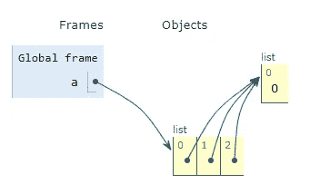
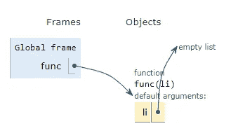
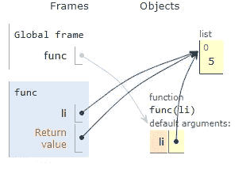
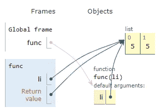

# Python 列表的陷阱

> 原文：<https://medium.com/analytics-vidhya/pitfalls-of-python-lists-67299d038884?source=collection_archive---------13----------------------->

列表是 python 中的一种数据结构，类似于其他编程语言的动态数组。列表是非常优秀和有用的数据结构，它提供了各种功能，如插入，追加，排序，删除，弹出等，这使我们的生活更容易。借助 python 中的 list，我们还可以轻松地创建复杂的数据结构，如优先级队列、堆栈等。

如果 python list 有很多额外的好处，那么它肯定会有一些缺点。在这篇短文中，我们将看到在使用 python list 时可能会遇到的一些问题及其解决方案。

**创建嵌套列表(2D 数组):**

在 python 中创建嵌套列表有多种方法。以下示例显示了在 python 中创建嵌套列表的最简单方法:

```
>>> a = [[]]*3
>>> a
[[], [], []]
```

正如你所看到的，我们刚刚在乘法的帮助下创建了 2D 列表。但是等等，让我们试着向列表中插入值，

```
>>> a[0].append(0)
```

预期产出:

```
>>> a
[[0], [], []]
```

实际产量:

```
>>> a[0].append(0)
>>> a
[[0], [0], [0]]
```

这里，值 0 被追加到列表“a”的每个内部列表中。现在的问题是，幕后发生了什么？

当我们使用乘法在列表中创建列表时，解释器创建对所有列表的公共引用。

```
>>> [id(x) for x in a]
[2382774602888, 2382774602888, 2382774602888]
```

正如你在上面看到的，列表‘a’的每个列表都有相同对象的引用。从下面的图片，你可以很容易地理解这个概念。



现在，让我们看看这个问题解决方案，

**解决方案 1:**

我们可以创建一个列表，并添加另一个列表，如下所示

```
>>> a = []
>>> a.append([])
>>> a.append([])
>>> a.append([])
>>> a
[[], [], []]
```

在这里，每次我们添加新的列表时，都会创建新的对象。

```
>>> [id(x) for x in a]
[1876972816904, 1876972816712, 1876972866504]
```

现在，如果我们把值追加到 a 的第一个列表，它不会改变其他列表。

```
>>> a[0].append(0)
>>> a
[[0], [], []]
```

**方案二:**

添加一个列表来制作嵌套列表需要很少的努力，我们可以使用列表理解来简化我们的工作。

```
>>> a = [[] for _ in range(3)]
>>> a
[[], [], []]
>>> a[0].append(0)
>>> a
[[0], [], []]
```

**列表作为默认参数:**

有时，我们在定义函数时设置默认参数。让我们看看将列表设置为默认参数会导致什么问题:

```
>>> def func(li = []):
 li.append(5)
 print(li)>>> func([1,4,2])
[1, 4, 2, 5]
>>> func([3,6,8])
[3, 6, 8, 5]
```

函数按预期工作，让我们尝试不传递参数调用函数:

```
>>> func()
[5]
>>> func()
[5, 5]
```

这里，输出是意外的，第二个函数调用返回两个值而不是一个值的列表。之所以会出现这种情况，是因为默认参数是在**函数定义中创建的。**

因此，每当我们调用不带参数的函数时，将使用相同的默认实参对象。

下面的可视化将帮助你更清楚地理解:

***功能定义:***



def func(li=[])

***第一次函数调用:***



函数()

***第二个函数调用:***



函数()

**解决方案:**

解决这个问题的方法是对默认参数只使用不可变类型:

```
>>> def func(li = None):
 if not li:
  li = []
 li.append(5)
 print(li)>>> func()
[5]
>>> func()
[5]
```

**结论:**

我们已经看到，当我们借助乘法和传递列表作为函数及其解决方案中的默认参数来创建嵌套列表时，python list 会返回意外的输出。