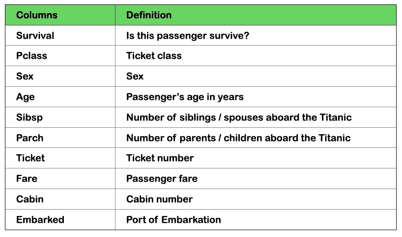
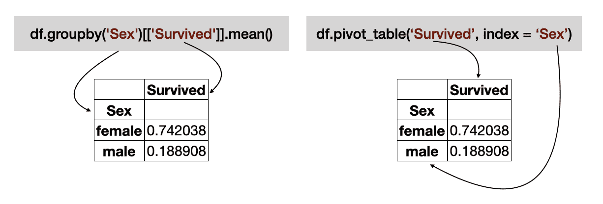
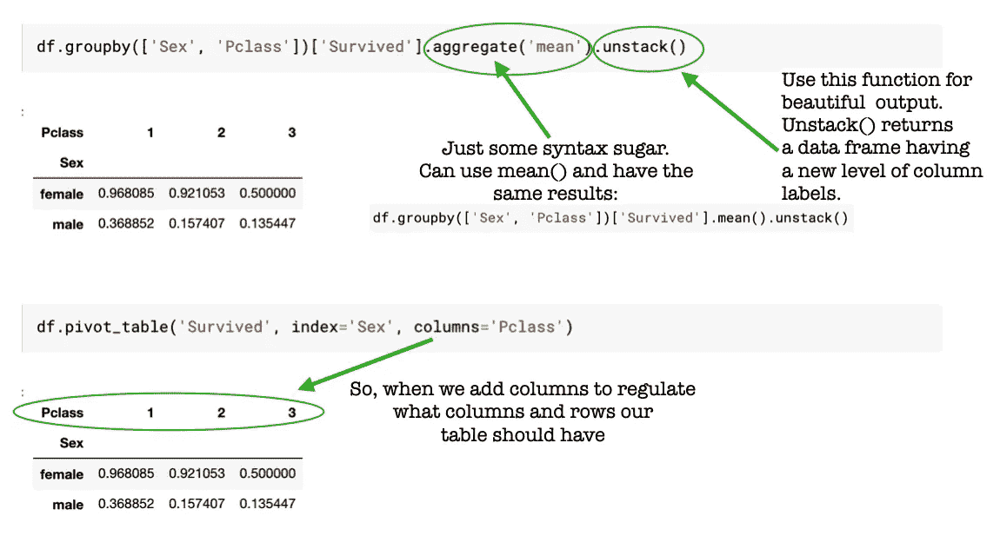
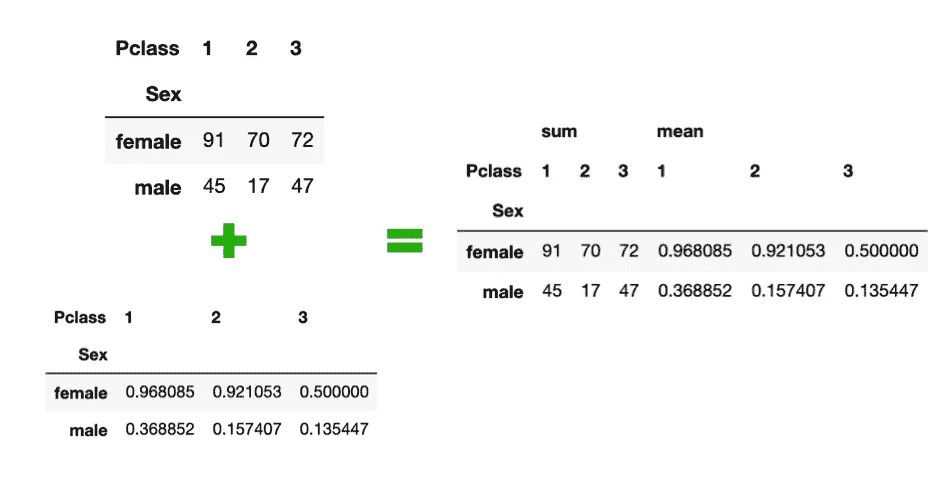
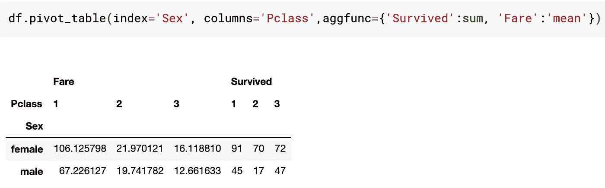
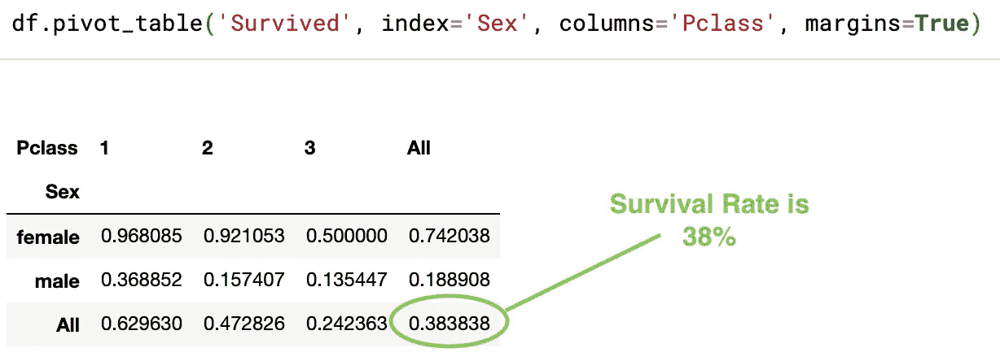

# 数据透视表:熊猫数据分析的实际应用。

> 原文：<https://medium.com/analytics-vidhya/pivot-table-practical-use-for-data-analyse-in-pandas-188e4a11ab4a?source=collection_archive---------13----------------------->

每个项目都会给数据科学家带来很多问题和挑战。当我们面对一个新的数据集时，我们不知道如何清晰地描述它，哪些特征相互关联，我们有多少离群值，以及更多的问题。我们从快速探索性数据分析(EDA)开始理解数据集，在那里我们应该总结数百行和列。对于这一步，最好有一个简单而强大的工具。
帮助我们节省时间和避免挫折的工具之一是 ***透视表*** 。这对于以查询速度对数据进行切片、筛选和分组非常有用。此外，它以视觉上吸引人的方式表示信息。在这篇博客中，我想展示你用熊猫的数据透视表做的工作。


一群熊猫。

## 数据透视表的最简单定义

数据透视表是汇总原始表中数据的统计表。这听起来像是简单的按功能分组，但有一个不同之处。

> 数据透视表将简单的列式数据作为输入，并将条目分组到一个二维表中，该表提供了数据的多维汇总。
> 
> —Jake Vander plas《Python 数据科学手册》中的定义

为了说明 pivot_table 如何工作，我使用了 Kaggle 的一个 [Titanic](https://www.kaggle.com/c/titanic) 数据集。这个数据集有足够的列用于分析实践，并且非常容易理解。



Titanic 数据集的列定义

让我们找出这个数据集的问题，帮助我们了解 pivot_table 实际上是如何工作的。

> 不同类型的群体存活率有多高？

## 1.数据透视表的简单示例

如果我们检查文档中的`[groupby](https://pandas.pydata.org/pandas-docs/stable/reference/api/pandas.DataFrame.groupby.html)`和`[pivot_table](https://pandas.pydata.org/pandas-docs/stable/reference/api/pandas.pivot_table.html)`，我们可以创建一个查询并比较语法。



代码示例

首先想到的是**以“性别”一栏来统计存活率**。我们可以看到，`groupby`和`pivot_table`给出了相同的结果。语法简单易读。数据透视表的行可以更改为:

```
df.pivot_table(‘Survived’, index=’Sex’, aggfunc =’mean’)
***# because default function for result is default numpy.mean()***
```

> *因此，对于这两个函数，我们可以使用所有统计函数，如 sum()、mean()、median()、min()、max()、quantile()等。*

但是，两个结果表都告诉我们，船上四分之三的女性幸存了下来！只有五分之一的雄性存活下来。

下一步，我们将深入研究数据。**如果这个存活率取决于票级？**



用两个变量分割数据帧。

我为`groupby`和`pivot_table`函数写了两行代码。我们可以看到它们给我们的结果是一样的，但是`pivot_table`更具可读性。

## 2.对数据透视表使用不同的聚合函数

我们可以对数据透视表使用不同的聚合函数。`aggfunc`关键字控制应该应用哪个功能。比如说，我们来统计一下幸存的人。

```
df.pivot_table('Survived', index = 'Sex', columns = 'Pclass', aggfunc = sum)
```

因此，我们有相同的数据框，但每个类中的单元格都填充了一定数量的幸存者。除了一个函数，我们还可以使用函数列表:

```
df.pivot_table(‘Survived’, index=’Sex’, columns=’Pclass’, aggfunc = [sum, ‘mean’])
```



使用聚合函数列表时我们会看到什么

聚合函数的更多魔力！



我们可以将结果列指定为将列映射到任何选项的字典。例如，我使用 sum 函数计算幸存人数，使用 mean 函数计算乘客票价。

## 3.数据透视表总计

`margins`关键字计算每个分组的总数。它自动给我们关于总数的信息，我们不需要创建额外的列或函数。



## 摘要

我试图通过简单的例子展示如何使用 pivot_table。你可以和我争论使用一些函数(比如 unstack)。但是它们提供了更好的视觉效果来将所有结果显示到数据框中。此外，我计划创建一个关于 SQL 表的 pivot 函数的博客。