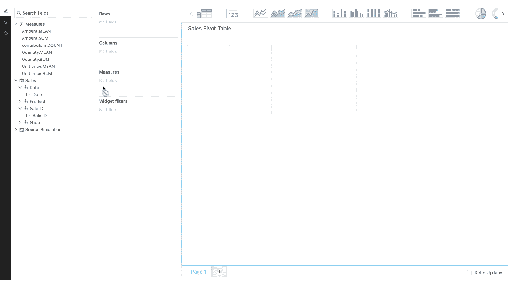
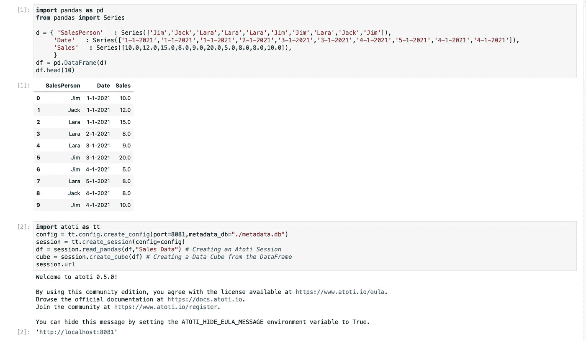
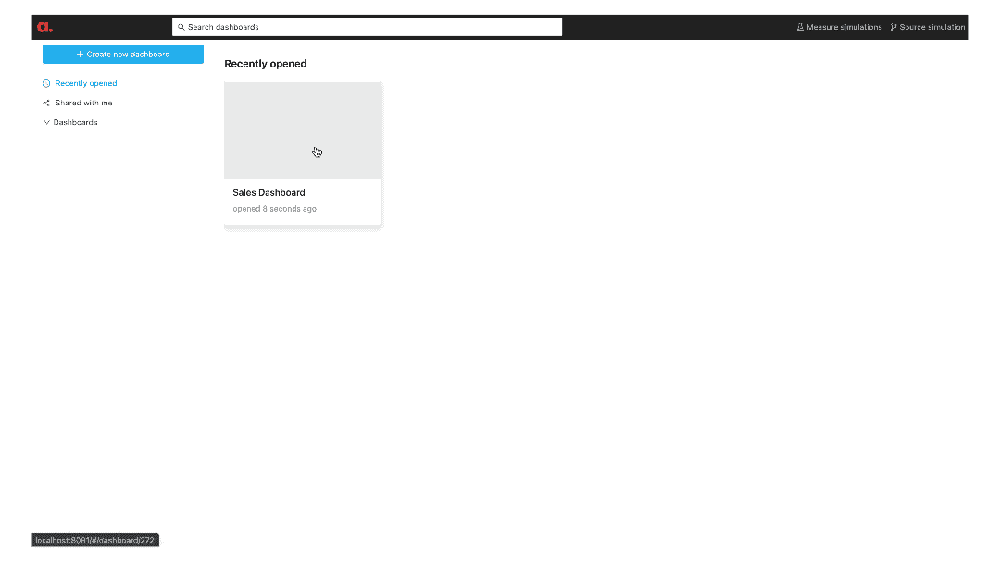
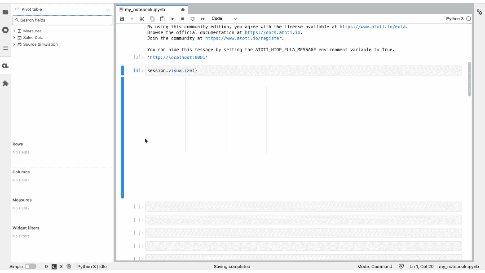
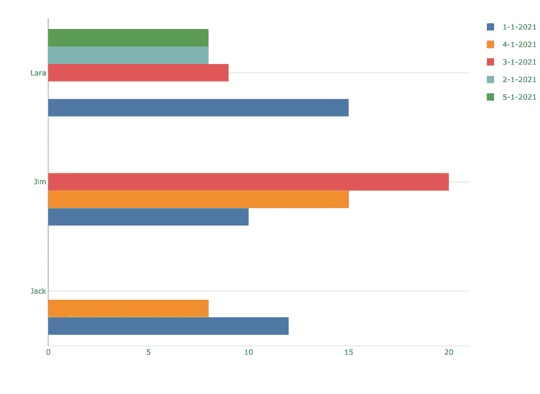
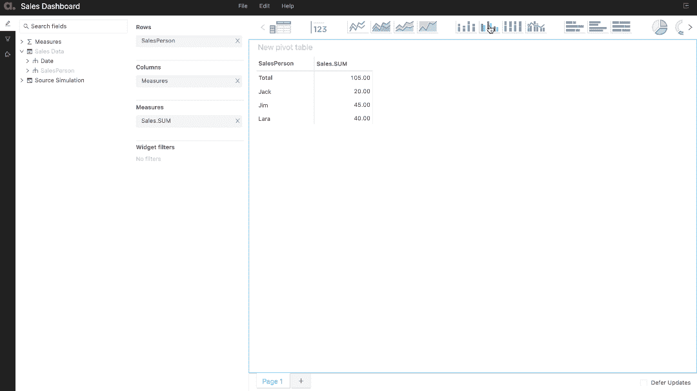
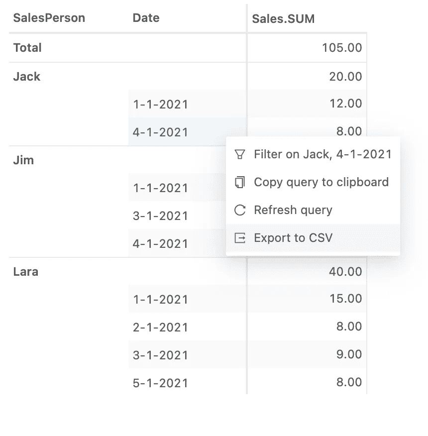
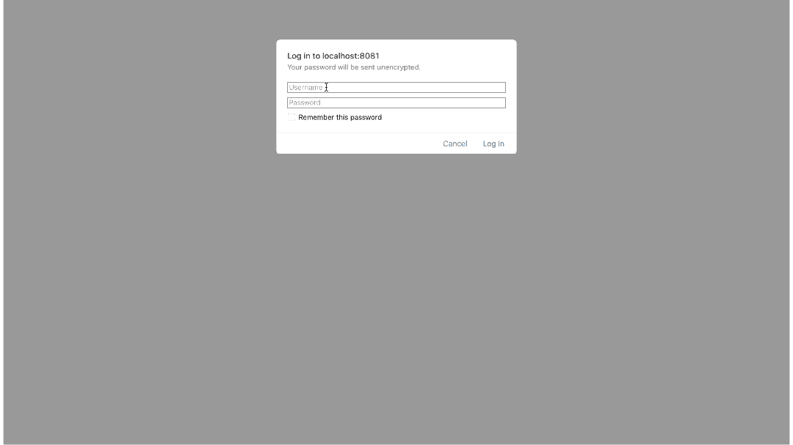

# atoti 简化了数据透视表

> 原文：<https://medium.com/analytics-vidhya/pivot-tables-made-simple-with-atoti-621b289e5f31?source=collection_archive---------7----------------------->

想要创建一个惊人的仪表板吗？或者只是想让你的演示更上一层楼？那么这个帖子就很适合你！

作为一个刚刚进入数据科学领域的人，我每天都在学习新的东西，这些东西似乎让我的生活变得更容易，让我对这个不断变化的领域感到惊叹，并热爱致力于帮助其中每个人的社区。

在我的一个自由职业项目中，我的客户告诉我，他们想要一个带有数据透视表的仪表板，并希望在一周内交货。现在，在我不到一年的经验下，我只听说过数据透视表是在数据分析阶段使用的函数，从未被带到前端。哦，我错了！

# 什么是数据透视表，它们有什么用途？

为了让像我这样的新兴分析师受益，**数据透视表是一个统计表格，它汇总了一个更广泛的表格中的数据。它们有助于揭示数据中的有用信息**。当您希望能够汇总和分析您的数据，但又不想错过看到每个贡献者的机会时，它们真的很有用。



数据透视表示例

回到我所面临的障碍，在那之前，我所有的项目只涉及使用 Jupyter 笔记本在后端执行我的分析，并生成报告提交，最有可能是 pdf 或 PPT。尽管我在 HTML 和 Django 方面有一些经验，但创建一个带有交互式数据透视表的全功能仪表板不是我能在一周内完成的事情。

面对这个棘手的问题，我做了任何其他数据科学家都会做的事情，在谷歌上搜索了我的问题。瞧啊！，我偶然发现了这个奇妙的工具**阿托蒂。**

# **了解阿托蒂并利用其力量**

[atoti](https://www.atoti.io) 是一款工具，旨在通过有意义的可视化和现实世界的影响，帮助任何处理数据的人更轻松地分析和分享他们的发现。更好的是，它可以与您的 python 笔记本电脑集成，并增强您的 Jupyter 环境！

**安装 atoti**

[atoti 可通过其 Jupyter Lab 扩展功能轻松安装](https://docs.atoti.io/latest/installation.html)—

```
pip install atoti[jupyterlab]
```

**使用 atoti**

鉴于我们现在已经将 atoti 作为 python 包安装，我们可以导入它并直接使用它。

```
import atoti as ttsession = tt.create_session()
```

**创建一个简单的数据透视表**

在这篇文章中，我使用一个虚拟的熊猫数据框架创建了一个数据透视表，并将其部署在一个仪表板中。 [atoti 也可以取 csv、parquet、numpy、spark、sql、kafka](https://docs.atoti.io/latest/search.html?q=read_&check_keywords=yes&area=default) 等其他数据源。



用于创建基本数据透视表的代码段

在这里，我创建了自己的简单数据框，其中包含销售人员的姓名、销售日期和销售额。现在使用 atoti，我已经创建了一个会话并部署了我的仪表板，可以通过打印的 url 访问它。



创建的仪表板

如您所见，我们用不到 20 行代码创建并部署了一个专业的仪表板。

**atoti 中的数据结构化**

atoti 的核心是*数据立方体*。数据立方体是数据的多维视图，帮助我们探索、聚集、过滤和比较。它被称为多维数据集，因为数据的每个属性都可以表示为多维数据集的一个维度。立方体的轴称为*层级*，特定坐标上的单个数字指示器称为*度量*。

我们可以从他们网页的[基础教程中更好的了解这一点。](https://docs.atoti.io/latest/tutorial/01-Basics.html)

**Jupyter 实验室的 atoti】**

对每个数据科学家来说，atoti 与 Jupyter 实验室的集成都是一个福音。在这里，我们可以将 Jupyter 笔记本中的数据立方体可视化为小部件，并将它们直接添加到仪表板中。

事实上，你可以给你的可视化一个标题 *`session.visualize("title ")`，*右键点击可视化，发布到 app。

这样，在仪表板上，您可以从 widgets 抽屉中访问可视化内容。



Jupyter 实验室中的部件

## 使用 atoti 的其他可视化

一般来说，我会花很多时间来设置漂亮的可视化效果，以展示给客户，因为这是作为一名数据科学家不可或缺的一部分。尽管使用 Seaborn 和 Matplotlib 并不十分困难，但不可否认它们非常耗时。阿托蒂也来救援了！

不到一分钟，我就直接从仪表板上创建了这个簇状条形图！阿托蒂使用 plotly 来制作图表



簇状条形图

只需点击几下鼠标，我们就可以将基础数据转换成任何可视化数据。



改变视觉化

**保存仪表板**

如果我们配置会话，使单元元数据存储在*中。db* 文件，那么我们可以直接保存仪表板的状态。这有助于在你的大型演示之前准备好你的图表/图像。您从 Jupyter 笔记本中导出的所有小部件也将被保存。

```
conf = tt.config.create_config(
    port=8081, metadata_db="./metadata.db"
)
session = tt.create_session(config=conf)
```

我经常使用的另一个惊人的特性是能够将当前状态的数据透视表直接导出到。CSV 文件供将来使用！



将数据透视表导出到 CSV

如果您保存了仪表板，您还可以使用它的 url 与您的同事共享它！

# 阿托蒂+

Atoti+是我试用过的 Atoti 的付费版本。与免费版本相比，它提供了一些额外的好处。其中我提到了我认为对用户最有用的两个特性。

**使用 Atoti+** 进行品牌推广

Aoti+允许用户对仪表板进行修饰性的修改。它使用户能够设置标志，图标，框架颜色，强调颜色等。如果像我一样，你正在为一个客户制作仪表板，而他们坚持要使用特定的颜色组合，这个功能就派上用场了。


Atoti+品牌

**设置用户角色和认证**

使用 Atoti+时，可以定义用户的角色并设置各自的约束。在我创建的示例仪表板中，我定义了一个用户和相关的角色。

```
user = tt.config.create_basic_user(
    "usersp", "usersp", roles=["ROLE_SALES1"]
)
basic = tt.config.create_basic_authentication(
    users=[user]
)
role = tt.config.create_role(
    name="ROLE_SALES1",
    restrictions={"SalesPerson": "Jim"},
)
config = tt.config.create_config(
    port=8081,
    metadata_db="./metadata.db",
    authentication=basic,
    roles=[role],
)
```

现在，当我们尝试访问控制面板时，我们会看到一个屏幕，要求输入密码，然后显示受登录凭据限制的数据，所有这些都使用单个端口！



使用 Atoti+的基于用户的登录

# 总之…

我相信 atoti 有潜力成为数据可视化和呈现的黄金标准。正如我在本文的引言中提到的，数据科学家的整个社区是由不遗余力地帮助他人的人们组成的，我想通过向人们介绍这个简单而强大的工具来发挥自己的作用，我相信它将减轻许多人的工作量！