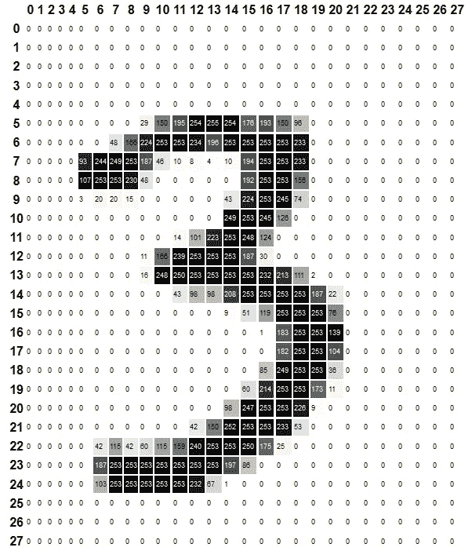
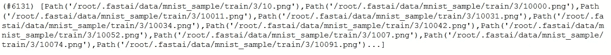
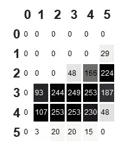

# 像素:计算机视觉的基础

> 原文：<https://medium.com/analytics-vidhya/pixels-the-foundation-of-computer-vision-89ef72f31cfa?source=collection_archive---------11----------------------->

## 使用 fast.ai 训练数字分类器



该图像是使用《fastai 和 PyTorch 程序员的深度学习》一书中提供的代码创建的

像素是计算机视觉的基础，MNIST 数据集被用作图像识别问题的 hello world 程序。MNIST 数据集包含由国家标准和技术研究所收集的手写数字图像。几乎每个深度学习图书馆都有这个数据集作为他们玩具数据集的一部分。fastai 还提供了 MNIST 数据集的样本。让我们在 fastai 提供的 MNIST 样本上试一试，创建一个分类为 3 或 7 的模型。如需完整代码，请查看 Github 链接:[https://Github . com/Adeelzafar/My-Version-of-Fastai-Course/blob/main/Pixel _ similarity . ipynb](https://github.com/Adeelzafar/My-Version-of-Fastai-Course/blob/main/Pixel_Similarity.ipynb)

# 步骤 1:导入必要的库

```
import pandas as pd
from fastbook import *
from fastai.vision import *
```

# 步骤 2:检索 MNIST 样本数据集

```
#Takes URL and compresses it
path = untar_data(URLs.MNIST_SAMPLE)
```

# 步骤 3:签出文件列表

```
path.ls()
```

ls 方法返回一个返回文件列表的对象。像 fastai 中的任何其他数据集一样，MNIST 样本有一个单独的训练和测试文件夹。现在让我们看看数据集中有多少个 3 和 7 的样本。

```
threes = (path/"train"/'3').ls().sorted()
threes
```



图像总数及其路径

# 步骤 4:可视化数据集中的图像

你可以做同样的事情来检查 7 的数量。这是一个手写数字 7 的图像。

```
#visualizing an image of 7
im7_path = sevens[1]
im7 = Image.open(im7_path)
im7
```


# 步骤 5:将图像转换成张量

图像是一串数字。下面的代码得到一个 PyTorch 张量，并使用渐变对这些值进行颜色编码。

```
tensor(im3)[4:10,4:10]
im3_t= tensor(im3)
df = pd.DataFrame(im3_t[4:10,4:10])
df.style.set_properties(**{'font-size': '6pt'}).background_gradient('Greys')
```



该图像是使用《fastai 和 PyTorch 程序员的深度学习》一书中提供的代码创建的

# 步骤 6:使用列表理解计算 3s 和 7s 的平均像素

```
#Getting average pixels of 3's and 7's
seven_tensors = [tensor(Image.open(o)) for o in sevens]
three_tensors = [tensor(Image.open(o)) for o in threes]
len(three_tensors), len(seven_tensors)#(6131, 6265)
```

# 步骤 7:将图像堆叠在一起

图像相互叠加时具有三维空间。这意味着我们有 6252 张 28*28 像素的图像。

```
stacked_sevens = torch.stack(seven_tensors).float()/255
stacked_threes = torch.stack(three_tensors).float()/255
stacked_sevens.shape
#torch.Size([6265, 28, 28])
```

# 第八步:计算平均值

```
#calculating mean of all 3s and 7s
mean3 = stacked_threes.mean(0)
mean7= stacked_sevens.mean(0)
show_image(mean7);
```


# 步骤 9:计算 L1 和 L2 的距离

为了测量像素相似性，我们将使用两种不同的方法，即 L1 和 L2 规范。L1 是平均绝对差，而 L2 是均方误差。这两个我们都要尝尝。

```
dist_3_abs = (stacked_threes[1] - mean3).abs().mean()
dist_3_sqr = ((stacked_threes[1] - mean3)**2).mean().sqrt()
dist_3_abs, dist_3_sqr
#(tensor(0.1114), tensor(0.2021))dist_7_abs = (stacked_threes[1] - mean7).abs().mean()
dist_7_sqr = ((stacked_threes[1] - mean7)**2).mean().sqrt()
dist_7_abs, dist_7_sqr
#(tensor(0.1586), tensor(0.3021))F.l1_loss(stacked_sevens[1].float(), mean7)
#tensor(0.1304)
F.mse_loss(stacked_sevens[1], mean7).sqrt()
#tensor(0.2585)
```

我们可以看到，我们的 7 和理想的 7 之间的 L1 和 L2 距离都小于理想的 3。这意味着像素相似性可以以合理的方式对数字进行分类。我们可以使用这个方法作为基础方法，并且可以用它来比较我们的复杂方法。

原来如此。用 fastai 训练一个数字分类器既简单又有趣。下次见…编码快乐…