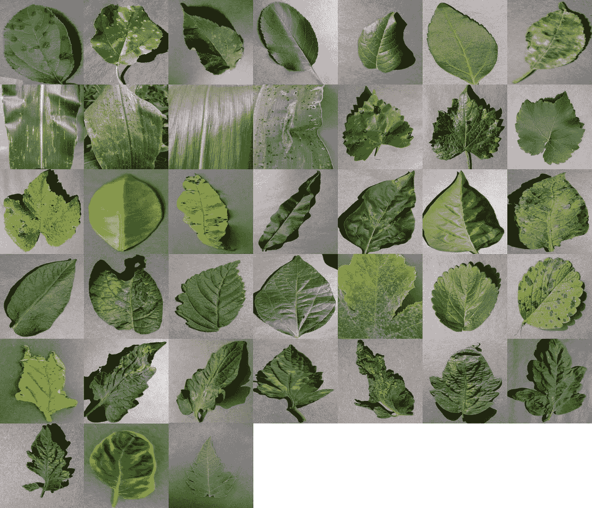
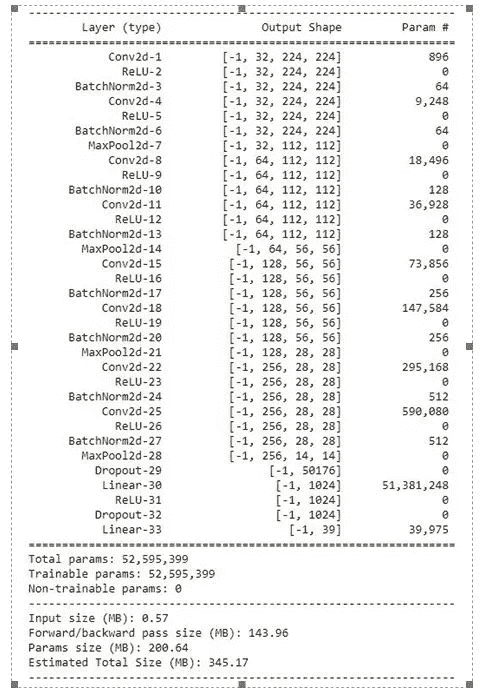
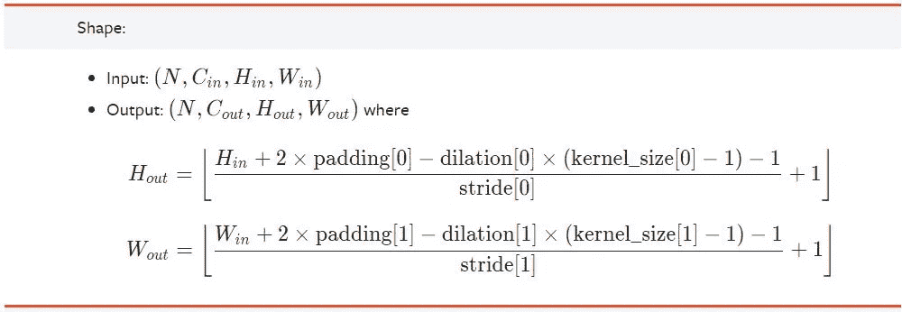

# 基于 PyTorch 卷积神经网络的植物病害检测

> 原文：<https://medium.com/analytics-vidhya/plant-disease-detection-using-convolutional-neural-networks-and-pytorch-87c00c54c88f?source=collection_archive---------2----------------------->

机器学习、深度学习、人工智能是未来。我们几乎在每个领域都使用这些技术。在农业领域，我们还可以将这项技术用于整地、添加肥料、播种、灌溉、杂草保护、收获、疾病预测等。

阅读全文博客 [**艾在农。**](http://analyticsvidhya.com/blog/2020/11/artificial-intelligence-in-agriculture-using-modern-day-ai-to-solve-traditional-farming-problems/#:~:text=Precision%20Farming%20and%20Predictive%20Analytics,be%20grown%2C%20optimum%20planting%2C%20pest)


学分:Unsplash

> **概述:**

我们正在使用深度学习来基于植物叶子的图像进行植物疾病检测。我们使用深度学习来完成这项任务，因为我们正在处理图像数据。深度学习有一个卷积神经网络，用于从植物的叶子中寻找特征。

> **先决条件:**

PyTorch

卷积神经网络

**从这里学习 py torch:**

(1)阿拉丁人 Youtube 播放列表

(2) [Python 工程师 Youtube 播放列表](https://www.youtube.com/watch?v=EMXfZB8FVUA&list=PLqnslRFeH2UrcDBWF5mfPGpqQDSta6VK4)

**从这里学习 CNN:**

(1) [由 Deeplizard 解释的卷积神经网络](https://www.youtube.com/watch?v=YRhxdVk_sIs)

(2) [用 CodeBasics 简单解释卷积神经网络](https://www.youtube.com/watch?v=zfiSAzpy9NM)

> **数据集:**

在这个数据集中，有 39 种不同种类的植物叶片和背景图像。该数据集包含 61，486 幅图像。我们使用了六种不同的扩充技术来增加数据集的大小。这些技术是图像翻转、伽马校正、噪声注入、PCA 颜色增强、旋转和缩放。

我们必须使用 CNN 模型来预测总共 39 个类别。

[**下载数据集。**](https://data.mendeley.com/datasets/tywbtsjrjv/1) ( *植物村数据集*)



**演职员表:**https://www.crowdai.org/challenges/1

> **代码实现:**

**导入依赖关系:**

```
# General
import numpy as np
import pandas as pd
import matplotlib.pyplot as plt# Torch
import torch
from torchvision import datasets, transforms # datsets  , transforms
from torch.utils.data.sampler import SubsetRandomSampler
import torch.nn as nn
import torch.nn.functional as F
from datetime import datetime
```

变换用于数据扩充，如裁剪图像、调整图像大小、将图像转换为张量、旋转图像等等。变换充当所有图像的过滤器。我们使用下面的代码来转换图像。

```
transform = transforms.Compose(
    [transforms.Resize(255), transforms.CenterCrop(224), transforms.ToTensor()]
)
```

datasets 类用于创建或导入数据集。在数据集方面，它有许多著名的数据集，如 MNIST，CIFAR-10，CIFAR-100，KMNIST 等。

点击查看所有数据集列表[。](https://pytorch.org/vision/stable/datasets.html)

我们使用数据集从图像中创建我们自己的数据集，为此我们从数据集使用 ImageFolder 方法。

我存储所有图像的文件夹名为“数据集”。我们还将变换应用于所有图像。

```
dataset = datasets.ImageFolder("Dataset", transform=transform)
```

**列车试运行:**

```
indices = list(range(len(dataset)))split = int(np.floor(0.85 * len(dataset)))  # train_sizevalidation = int(np.floor(0.70 * split))  # validationnp.random.shuffle(indices)train_indices, validation_indices, test_indices = (
    indices[:validation],
    indices[validation:split],
    indices[split:],
)
```

在上面的代码中，我们首先获取索引，然后将数据分为训练、测试和验证数据。总共 36584 个用于训练，15679 个用于验证，其余图像用于测试。

```
train_sampler = SubsetRandomSampler(train_indices)
validation_sampler = SubsetRandomSampler(validation_indices)
test_sampler = SubsetRandomSampler(test_indices)
```

SubsetRandomSampler 用于对我们的数据进行采样。在这里，我们创建一个 SubsetRandomSampler 对象，稍后我们将在训练数据加载器和测试数据加载器中使用此采样器。

```
batch_size = 64train_loader = torch.utils.data.DataLoader(
    dataset, batch_size=batch_size, sampler=train_sampler
)test_loader = torch.utils.data.DataLoader(
    dataset, batch_size=batch_size, sampler=test_sampler
)validation_loader = torch.utils.data.DataLoader(
    dataset, batch_size=batch_size, sampler=validation_sampler
)
```

正如我们所讨论的，我们将 train_sampler 用于 train-loader，反之亦然。

现在我们的数据集已经准备好进行训练和测试了！！

**模型创建:**

我们使用卷积神经网络来创建模型。我们创建模型层，如下图所示。我们还指定了 Conv 层和游泳池层的过滤器大小和每个层的形状。

形状=(通道，高度，宽度)



在 PyTorch 中，形状不是自动计算的，我们必须手动处理每一层的形状。在第一个全连接层，我们必须根据卷积层的形状提到输出大小。这种计算也被称为**卷积运算。**

卷积运算的等式如下:



在这个项目中，膨胀= 0。

关于型号代码，请查看我的 Github repo [这里](https://github.com/manthan89-py/Plant-Disease-Detection)

```
model = CNN(targets_size) # targets_size = 39
```

在这里，我们必须将图像分为 39 个类别，这就是为什么我们使用**分类交叉熵**作为损失和 adam 优化器。在模型中，我们使用 ReLU 作为激活，但对于最后一层，我们必须使用 **Softmax** 激活。在 PyTorch 中，我们有一个交叉熵损失，它是 softmax 和类别交叉熵损失的混合。

```
criterion = nn.CrossEntropyLoss()  
optimizer = torch.optim.Adam(model.parameters())
```

**批量梯度下降:**

```
def batch_gd(model, criterion, train_loader, test_laoder, epochs):
    train_losses = np.zeros(epochs)
    test_losses = np.zeros(epochs)for e in range(epochs):
        t0 = datetime.now()
        train_loss = []
        for inputs, targets in train_loader:
            inputs, targets = inputs.to(device), targets.to(device)optimizer.zero_grad()output = model(inputs)loss = criterion(output, targets)train_loss.append(loss.item())  # torch to numpy worldloss.backward()
            optimizer.step()train_loss = np.mean(train_loss)validation_loss = []for inputs, targets in validation_loader:inputs, targets = inputs.to(device), targets.to(device)output = model(inputs)loss = criterion(output, targets)validation_loss.append(loss.item())  # torch to numpy worldvalidation_loss = np.mean(validation_loss)train_losses[e] = train_loss
        validation_losses[e] = validation_lossdt = datetime.now() - t0print(
            f"Epoch : {e+1}/{epochs} Train_loss:{train_loss:.3f} Test_loss:{validation_loss:.3f} Duration:{dt}"
        )return train_losses, validation_losses
```

如你所见，上面的函数用于批量梯度下降。batch_gd()是所有学习发生的函数。

```
def accuracy(loader):
    n_correct = 0
    n_total = 0for inputs, targets in loader:
        inputs, targets = inputs.to(device), targets.to(device)outputs = model(inputs)_, predictions = torch.max(outputs, 1)n_correct += (predictions == targets).sum().item()
        n_total += targets.shape[0]acc = n_correct / n_total
    return acctrain_acc = accuracy(train_loader)
test_acc = accuracy(test_loader)
validation_acc = accuracy(validation_loader)
```

上述函数用于确定模型的准确性。理解代码非常简单。你可以在我的 [Github](https://github.com/manthan89-py/Plant-Disease-Detection) 查看完整代码。

通过使用当前的模型，我们获得了准确性

列车数据上 **87 %** ，验证数据上 **84** **%** ，测试数据上 **83** %。

为此，我们使用测试数据作为全新的数据。我们没有使用任何阶段的测试数据，这些数据仅用于最终测试。

> **模型工作:**

如果你知道 CNN 的工作，那么你就会明白我在这个项目中所做的事情。这一节是给那些不明白的人看的。基本上，首先我们将每张图片的大小调整为 224 x 224。之后，这个图像输入到卷积神经网络。我们饲料彩色图像，所以它有 3 个通道 RGB。第一 conv 层，我们应用 32 个滤波器大小或输出通道。这意味着 32 个不同的过滤器应用于图像，并试图找到特征，然后使用 32 个特征，我们创建了一个具有通道 32 的特征图。所以从 3 x 224 x 224 会变成 32 x 222 x 222。之后，我们应用 **ReLU** 激活函数来消除非线性，之后我们应用**批量标准化**来标准化神经元的权重。在此之后，我们将该图像馈送到最大池层，该层仅获取最相关的特征，因此我们得到形状为 32 x 112 x 112 的输出图像。之后，我们将此图像馈送到下一个**卷积层**，其过程与上面提到的相同。最后，我们展平最终的最大池层输出，并馈送到下一个线性层，该线性层也被称为**全连接层**，最后，作为最终层，我们预测 39 个类别。因此，作为模型输出，我们得到张量 1x39 大小。从张量中，我们得到张量中最大值的索引。那个特定的指数是我们的主要预测。这就是一切运作的方式...！！

希望你能理解…👍🏻😊

> **烧瓶网络 App :**

在创建了这个模型之后，我们在 flask 上创建了一个 web 应用程序，并将其部署在 heroku 云服务器上。

flask 框架的编码也可以在我的 github repo [这里](https://github.com/manthan89-py/Plant-Disease-Detection)找到。

[Plant-Disease-Detection-AI.Herokuapp.com](https://plant-disease-detection-ai.herokuapp.com)

> **代码:**

[](https://github.com/manthan89-py/Plant-Disease-Detection) [## man than 89-py/植物病害检测

### 基于叶片图像，我们试图使用卷积神经网络来预测植物疾病。PyTorch 实现…

github.com](https://github.com/manthan89-py/Plant-Disease-Detection) 

> **领英:**

 [## 印度古吉拉特邦苏拉特曼丹·比卡第亚-查罗特科技大学|…

### 查看 Manthan Bhikadiya 在世界上最大的职业社区 LinkedIn 上的个人资料。Manthan 有一份工作列在…

www.linkedin.com](https://www.linkedin.com/in/manthanbhikadiya) 

> **结论:**

这种模式在没有迁移学习的情况下非常有效。但是我会用迁移学习等很多方法来提高模型的准确性。

我希望你喜欢这个项目🙏。

> **更多博客和项目:**

***项目:***

[](https://github.com/manthan89-py) [## manthan89-py -概述

### 对 AI、深度学习、机器学习、计算机视觉、区块链、Flutter 感兴趣😇。做一些竞争性的…

github.com](https://github.com/manthan89-py) 

***博客:***

[](https://manthan-bhikadiya.medium.com/) [## 曼丹·比卡第亚·🖋-中等

### 机器学习、深度学习、人工智能是未来。我们几乎在每个领域都使用这些技术…

manthan-bhikadiya.medium.com](https://manthan-bhikadiya.medium.com/) 

> **最终注释:**

**感谢阅读！如果你喜欢这篇文章，请点击**👏**尽可能多次按下按钮。这将意味着很多，并鼓励我继续分享我的知识。如果你喜欢我的内容，请在 medium 上关注我，我会尽可能多地发布博客。**