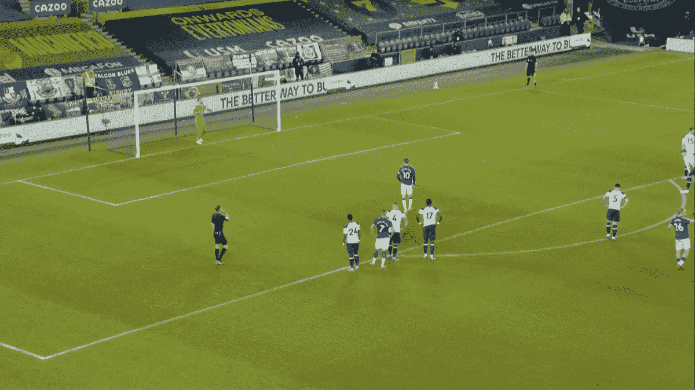
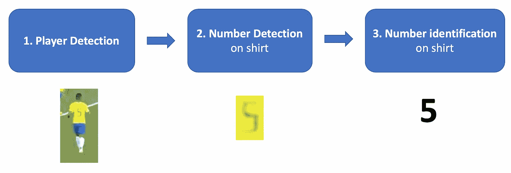
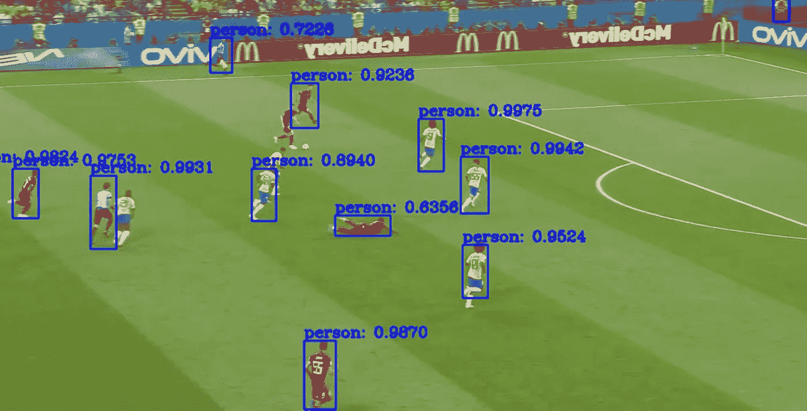
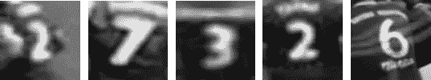
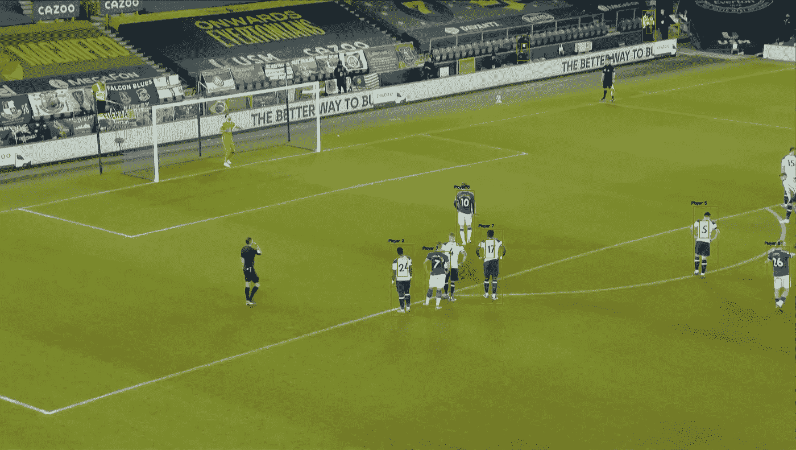
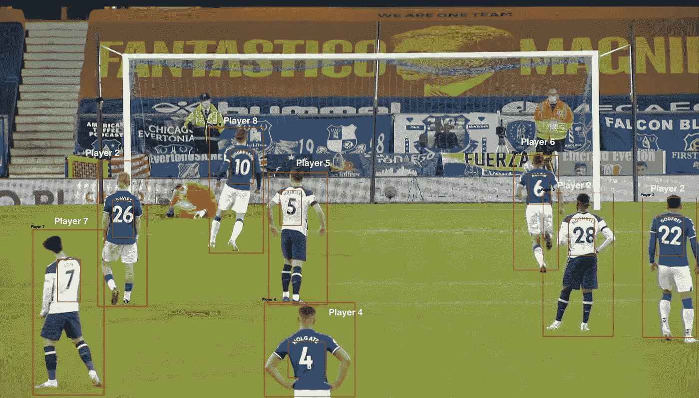
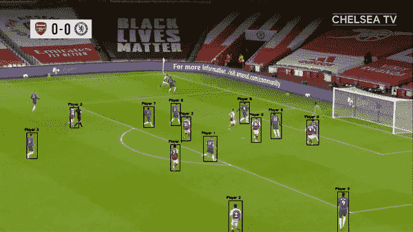

# 使用深度学习的玩家检测

> 原文：<https://medium.com/analytics-vidhya/player-detection-using-deep-learning-492122c3bf9?source=collection_archive---------2----------------------->

# 足球中的球员检测

在过去的几年里，人们对使用数据来改进足球队的游戏越来越感兴趣。足球数据的分析和研究可以对多个领域产生积极影响，如球员侦察、团队游戏(例如，球场控制和 xG 模型)、球员训练和表现等。

特别地，计算机视觉可以是从游戏/训练视频中提取相关信息的重要工具。

> 因此，在这篇文章中，我将着重于从比赛录像中检测足球运动员，然后尝试让 T2 识别他们球衣上的号码。

本帖呈现的代码可以在这里看到:[https://github . com/danielazevedo/Football-Analytics/tree/master/player _ detection](https://github.com/danielazevedo/Football-Analytics/tree/master/player_detection)



玩家检测的例子

# 玩家检测管道

为了检测和识别(通过球衣号码)视频中的球员，我建立了一个工作流程管道，包括 3 个步骤:

1.  **球员检测:**从图像中检测人物(足球运动员)
2.  **号码检测:**检测球员后，检测球员内球衣号码所在的区域
3.  **号码识别:**检测到衬衫号码后，识别衬衫上的号码。

从视觉上看，整个管道定义如下:



玩家检测管道

# 1.玩家检测

第一步最容易实现。幸运的是，已经有预先训练的深度学习模型，我们可以用来从图像中检测*个人*，在这种情况下，它将检测 ***足球运动员*** 。

在这种情况下，我使用了使用 **Darknet** 框架的预训练 **YOLO** 模型，该模型是用来自 COCO 数据集的数千张图像训练的。使用 python，有一个名为 DNN 的 OpenCv 模块，它包含了 YOLO/暗网。查看此[链接](https://pjreddie.com/darknet/yolo/)中关于如何使用 YOLO 进行物体检测的说明。

下面是加载和检测玩家的 Python 代码片段

```
# initialize minimum probability to eliminate weak predictions
p_min = 0.5
thres = 0.# 'VideoCapture' object and reading vicv2.mean(image, mask=mask)deo from a filevideo = cv2.VideoCapture('video_test.mp4')writer = None
h, w = None, None# Create labels into list
with open('coco.names') as f:
    labels = [line.strip() for line in f] # load network 
network = cv2.dnn.readNet('darknet/cfg/yolov3.weights', 'darknet/cfg/yolov3.cfg')# Getting only output layer names that we need from YOLO
ln = network.getLayerNames()
ln = [ln[i[0] - 1] for i in network.getUnconnectedOutLayers()] # Defining loop for catching frames
while True:
    ret, frame = video.read()
    if not ret:
        break # frame preprocessing for deep learning
    blob = cv2.dnn.blobFromImage(frame, 1 / 255.0, (416, 416), swapRB=True, crop=False) # perform a forward pass of the YOLO object detector, giving us our bounding boxes and associated probabilities. network.setInput(blob)
    output_from_network = network.forward(ln) #process bounding boxes in output_from_network
```

这里有一个例子。蓝框代表检测到的玩家各自的概率。



来自**巴西 vs 比利时**的图像帧

# 2.数字检测

第二步重点检测球员球衣上的号码。

为了这个任务，我使用一个数据集(你可以在这里找到更多信息)训练了一个深度学习模型，衬衫上贴有数字标签。通过缩放和灰度应用对图像进行预处理。



数据集的样本示例

该模型对应于预训练的 VGG 模型，在顶部训练一些层(*即*转移学习)。这是模型架构的一个片段。

```
# load the VGG16 network, ensuring the head FC layers are left offvgg = VGG16(weights="imagenet", include_top=False, input_tensor=Input(shape=(224, 224, 3)))# freeze all VGG layers so they will *not* be updated during the training process
vgg.trainable = True# flatten the max-pooling output of VGG
flatten = vgg.output
flatten = Flatten()(flatten)# construct a fully-connected layer header to output the predicted bounding box coordinatesbboxHead = Dense(128, activation="relu")(flatten)
bboxHead = Dense(64, activation="relu")(bboxHead)
bboxHead = Dense(32, activation="relu")(bboxHead)
bboxHead = Dense(4, activation="sigmoid")(bboxHead)# construct the model we will fine-tune for bounding box regressionmodel = Model(inputs=vgg.input, outputs=bboxHead)
```

这里有一个例子。红色方框代表检测到的玩家和检测到的号码。



图片来自**埃弗顿 vs 热刺**

# 3.号码识别

最后的步骤涉及到被检测号码的识别。为了这个任务，用数据扩充来训练 CNN 模型。模型架构如下。

```
classifier = Sequential()classifier.add(Conv2D(128, (3, 3), input_shape = (224, 224, 3), activation = 'relu'))classifier.add(MaxPooling2D(pool_size = (2, 2)))
classifier.add(Dropout(0.2))classifier.add(Conv2D(64, (3, 3), activation = 'relu'))
classifier.add(MaxPooling2D(pool_size = (2, 2)))classifier.add(Dropout(0.2))
classifier.add(Conv2D(32, (3, 3), activation = 'relu'))classifier.add(MaxPooling2D(pool_size = (2, 2)))
classifier.add(Dropout(0.2))classifier.add(Flatten())classifier.add(Dense(units = 128, activation = 'relu'))
classifier.add(Dense(units = 64, activation = 'relu'))
classifier.add(Dense(units = 64, activation = 'relu'))
classifier.add(Dense(units = 10, activation = 'softmax'))# Compiling the CNNclassifier.compile(optimizer = 'adam', loss = 'categorical_crossentropy', metrics = ['accuracy'])
```

这里有一个例子。除了球员和人数检测，我们还可以看到预测的人数。



号码识别示例

# 把所有的放在一起

通过连续应用这三个步骤，我们可以得到球员的实时预测，包括识别他们的球衣号码。

这是一个实时预测的例子。



实时预测

# 结束语

在这篇文章中，我介绍了一种检测球场上的足球运动员并识别他们球衣号码的管道。我把这个任务分为 3 个步骤:玩家检测，号码检测和号码识别。对于每一个，都训练了一个深度学习模型，根据最终目标采用不同的架构。

未来的一步将是计算球员在球场上的坐标。为了实现这一点，首先需要确定音高线。

希望你觉得这篇文章有趣！更多足球数据科学相关工作，请访问我的 repo:[https://github.com/danielazevedo/Football-Analytics](https://github.com/danielazevedo/Football-Analytics)。