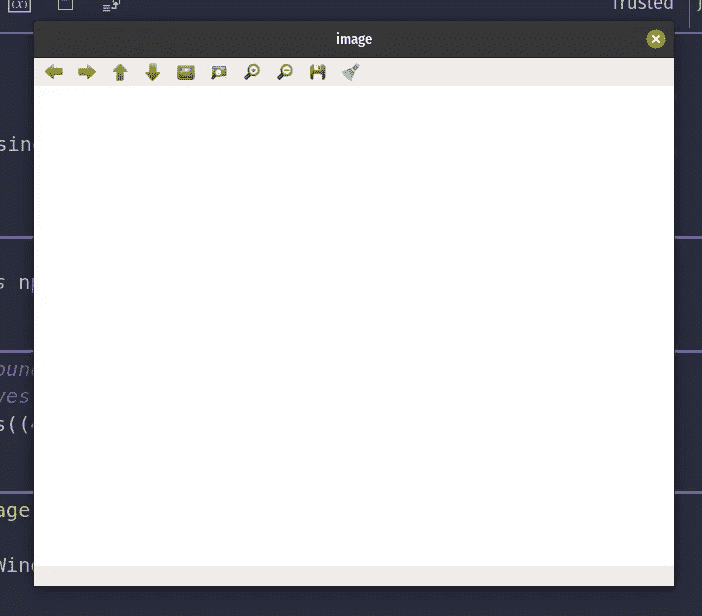
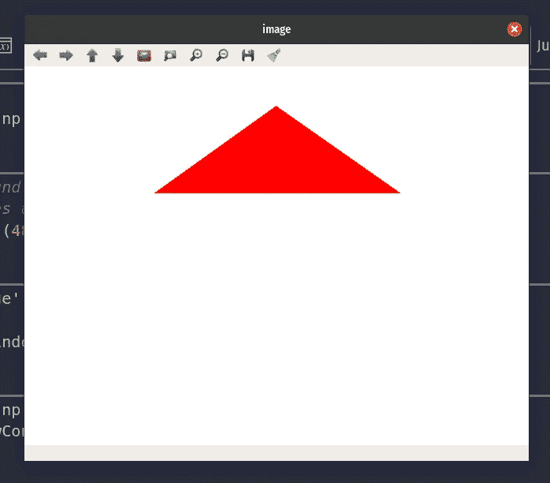
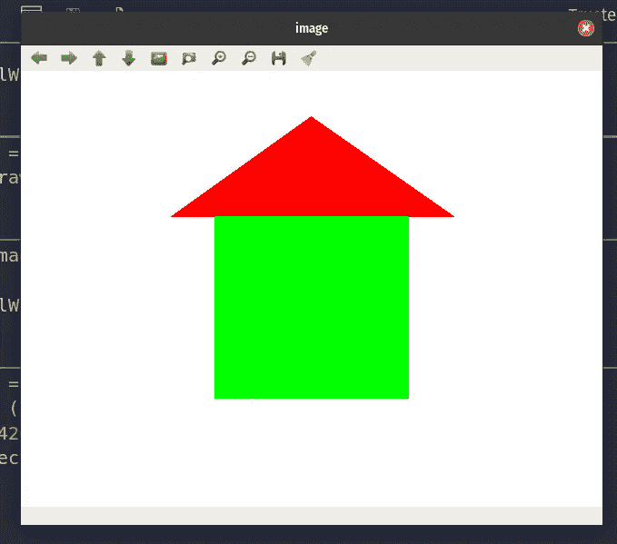
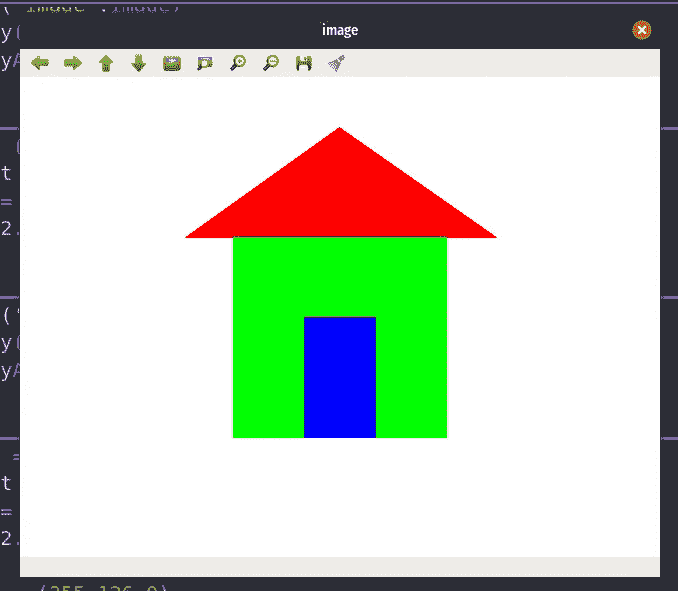
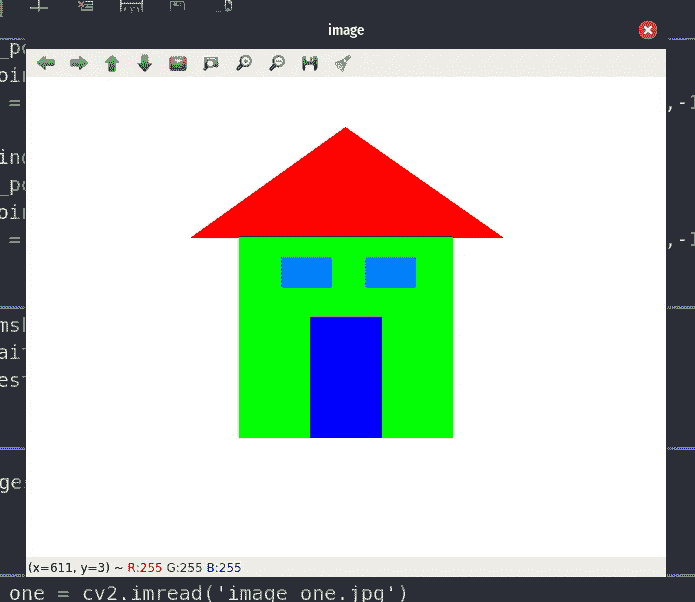
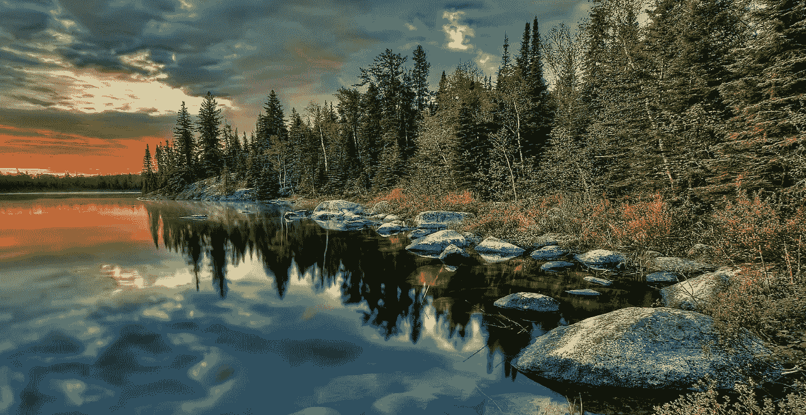
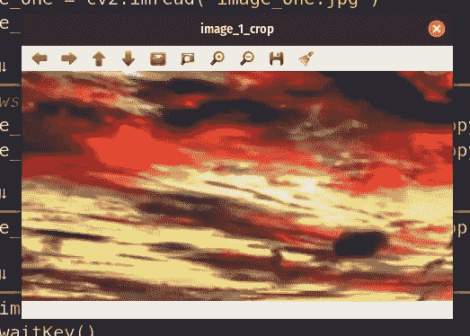
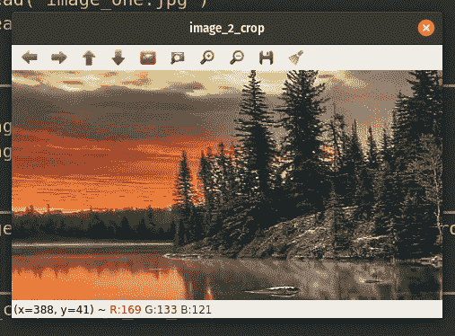
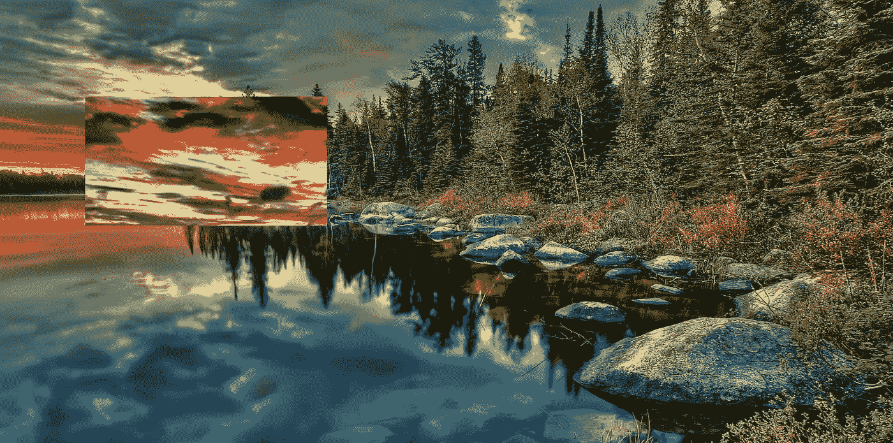
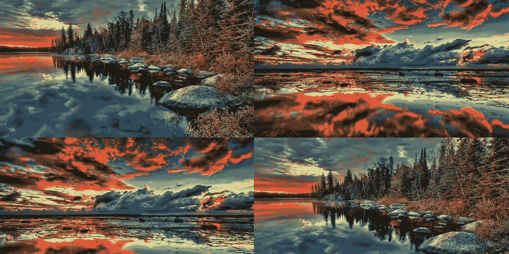

# 使用 OpenCV 播放图像

> 原文：<https://medium.com/analytics-vidhya/playing-with-images-using-opencv-5dca960d1b0b?source=collection_archive---------3----------------------->


格伦·卡斯滕斯-彼得斯在 [Unsplash](https://unsplash.com?utm_source=medium&utm_medium=referral) 上拍摄的照片

在这篇博客中，我们将介绍使用 OpenCV 进行图像处理的一些基础知识，包括绘制图像、裁剪图像、交换裁剪部分、连接两幅图像并创建一幅图像。

## 图像是如何制作和存储的？

图像由像素组成，并以 jpeg、tiff 或 raw 等格式存储，三个颜色通道(红色、绿色和蓝色)构成彩色图像。像素是一个微小的颜色方块，当把它们放在一起时，就形成了一幅图像。像素范围从 0 到 255。在 OpenCV 中使用图像时，它存储为像素数组，可以是二维数组(灰度)和三维数组(具有三个通道的简单灰度图像)。

让我们开始我们的议程。

## 画一幅图像

我们将绘制一个简单的白色背景的小屋图像。我们将首先使用 ***np.ones((480，640，3)) * 255*** 创建一个白色背景的图像，这将创建一个 ***480x640*** 的图像，具有 3 个颜色通道(蓝色、绿色和红色)，并用白色填充像素。

```
R,G,B = (255,255,255) creates white colour.
```



现在，我们将使用以下代码在白色背景上创建一个三角形:

```
# Some random co-ordinates for the triangle
triangle_pnts = np.array([(319,50),(165,160),(476,160)])# Create a contour with filled color in it
image = cv2.drawContours(image, [triangle_pnts],0,(0,0,255),-1)
```

***cv2 . draw contours()***用所需的颜色在给定的输入图像上为输入坐标创建轮廓，填充轮廓内的整个区域(-1)，第三个参数是我们需要绘制的轮廓的索引，我们传递了 0，因为我们用颜色填充整个身体，不需要轮廓。

这会在白色背景上产生一个红色三角形。



然后，我们将使用以下代码绘制一个矩形:

```
bgr_rectangle = (0,255,0)start_point = (213,160)end_point = (426,360)image = cv2.rectangle(image,start_point,end_point,bgr_rectangle,-1)
```

创建矩形时，我们只需要起点(左上角点)和终点(右下角点)以及 in -1 厚度，因为它用一种颜色填充矩形。这将导致绿色的矩形。



继续创建一扇门和两扇窗，我们将使用相同的***cv2 . rectangle()***。

使用下面的代码，实现了左边的图像。

```
bgr_door = (255,0,0)start_point = (284,240)end_point = (355,360)image = cv2.rectangle(image,start_point,end_point,bgr_door,-1)
```



使用下面的代码，获得了正确的图像。

```
bgr_window = (255,126,0)start_point = (255,180)end_point = (305,210)image = cv2.rectangle(image,start_point,end_point,bgr_window,-1)bgr_window = (255,126,0)start_point = (339,180)end_point = (389,210)image = cv2.rectangle(image,start_point,end_point,bgr_window,-1)
```

我们使用下面的代码来显示图像。

```
cv2.imshow('image',image)cv2.waitKey()cv2.destroyAllWindows()
```

***cv2.imshow(caption，image)*** 接受两个参数，其中包括图像窗口和图像数组的标题。

***cv2 . waitkey()***用于使窗口直到键盘中断，或者我们可以设置一个时间退出窗口。

***cv2 . destroyallwindows()***用于在等待结束后销毁所有窗口。

这三行用于在 python 中使用 OpenCV 时显示图像。

## 裁剪图像并交换裁剪的部分

我们将裁剪图像并交换它们。可以使用对阵列的切片操作来裁剪图像。

使用以下代码加载图像:

```
image_one = cv2.imread('image_one.jpg')image_two = cv2.imread('image_two.jpg')
```



图片 _ 一


图片 _ 二

我们将使用切片操作来裁剪图像。

```
image_one_crop = image_one[256:512,240:720].copy()image_two_crop = image_two[256:512,240:720].copy()
```



裁剪部分

Python 使用内存引用，而变量使用相同的值。因此，我们需要将元素复制到变量中。如果我们不使用 copy()，那么它将在交换时覆盖像素，并且只有一个图像将被裁剪部分替换。

现在，交换裁剪部分，然后使用下面的代码用交换的裁剪部分替换图像。

```
# swapping the cropped part
image_one_crop, image_two_crop = image_two_crop, image_one_crop
```

然后，我们将分配给原始图像的裁剪和交换部分。

```
image_one[256:512,240:720] = image_one_cropimage_two[256:512,240:720] = image_two_crop
```



## 连接两个图像并创建一个图像

为了对图像执行连接操作，我们只需要使用***NP . hs stack()***或***NP . vs stack()***来连接数组。

***NP . hs stack()***将帮助两个数组水平连接，***NP . vs stack()***用于垂直连接两个数组。

使用下面的代码，我们水平和垂直地连接了两幅图像。

```
image_join_1 = np.hstack([image_1,image_2])image_join_2 = np.hstack([image_2,image_1])image_join = np.vstack([image_join_1,image_join_2])
```

现在，图像是原始尺寸的 4 倍，那么我们需要使用通常用于缩小图像尺寸的 ***INTER_AREA*** 插值将图像尺寸调整到原始尺寸。

```
dims = (image_1.shape[1],image_1.shape[0])resized = cv2.resize(image_join,dims,interpolation=cv2.INTER_AREA)
```

现在图像终于被创建了。



是的，我们完成了我们的议程。给一个👏，如果你觉得有趣的话。

[](https://github.com/Launchpad5682/summer_training_21/tree/main/task_4) [## 启动平台 5682/summer_training_21

### 此时您不能执行该操作。您已使用另一个标签页或窗口登录。您已在另一个选项卡中注销，或者…

github.com](https://github.com/Launchpad5682/summer_training_21/tree/main/task_4)