# 玩熊猫图书馆

> 原文：<https://medium.com/analytics-vidhya/playing-with-pandas-library-31e09f43ed81?source=collection_archive---------10----------------------->

重塑、分组和透视数据的技术


弗兰基·查马基在 [Unsplash](https://unsplash.com?utm_source=medium&utm_medium=referral) 上拍摄的照片

Python 凭借其受欢迎程度和效率在短短十年内改变了世界。Python 提供了可靠的数据科学趋势，包括:

数据采集

数据清理

机器学习模型

数据可视化

Pandas 是 Python 中一个非常基础的内置库，占用了很多空间。这是一个易于使用的开源库，提供了高效率和许多用于 Python 编程数据分析的工具。

Pandas 是一个内存中非 SQL 类型的数据库，为基本的 SQL 结构、统计方法和绘图能力提供帮助。因为它是在 Cython 之上构建的，所以运行速度更快，并且访问机器内存的时间更少。

→Pandas 有一个非常先进的功能，可以对数据帧组执行一些操作。

→数据框:被标记的 2D 数据。它包含不同的列和行。

> 因此，在本文中，我们将快速浏览一些分组、整形和透视数据的方法。

→对于这一部分，我们将根据学生分数来表示我们的数据:

```
scores = pd.DataFrame({'name':['Bob','Selena','Michael','Daisy'],
'gender': ['Male','Female','Male','Female'],
'test1': [59, None, 79, 90],
'test2': [40,69,80,67],'mentor': ['Mike', 'Ellie', 'John', 'Ellie']})
```

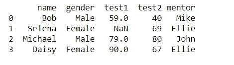

作者图片

# **使用分组还原的技巧**

的。groupby 函数是一个低级功能强大的工具，允许您按列对数据框进行分组，然后再将其合并到输出中。

例如，让我们计算每个导师的测试中值。首先，我们会打电话。分组然后执行。输出中值:

```
scores.groupby('mentor').median()
```

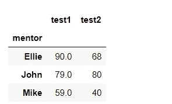

作者图片

当我们调用. GroupBy 时，会返回一个 groupby 实例。在本例中，该实体将具有相同 mentor 的所有行组合在一起。

分组是一个强大的工具，那么你也可以通过许多列来分组。只需按导师和性别分组，即可发现每位导师的性别中值:

```
scores.groupby(['mentor', 'gender']).median()
```

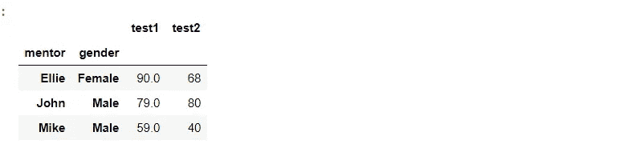

作者图片

**特别说明:**按多列分组的结果是层次索引，通常称为多级索引。

我们实现了。agg 技术，并向其传递一个函数列表，以便在我们需要 mentor 的最低和最高考试分数时调用:

```
scores.groupby(['mentor', 'gender']).agg([min, max])
```

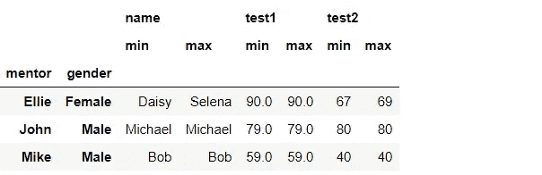

作者图片

groupby 对象包含几种将组值缩减为单个值的方法。它们是:

→ .全部，。任何，。数数，。大小，。idxmax，。idxmin，。分位数，。agg(函数)。应用(函数)。max，。意思是。最小值，。第 n 次，。最后，。中位数，。扫描电镜，。产品。总和，。标准，。定义变量

# **旋转数据**

我们可以使用数据透视表来概括某些 groupby 行为。我们可以使用下一个公式来计算导师得分的中位数:

```
scores.pivot_table(index='mentor',
values=['test1', 'test2'],aggfunc='median',margins=True)
```

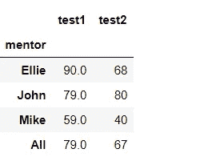

作者图片

如果我们希望按导师和性别进行组合，我们只需使用包含两者的索引参数列表:

```
scores.pivot_table(index=['mentor', 'gender'],
values=['test1', 'test2'],aggfunc='median')
```

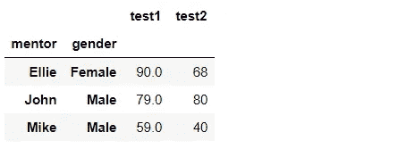

作者图片

如果我们希望应用多个函数，请使用函数列表。在这一部分，我们将检查每位导师的最少和最多研究结果:

```
scores.pivot_table(index='mentor',values=['test1', 'test2'],aggfunc=[min, max])
```

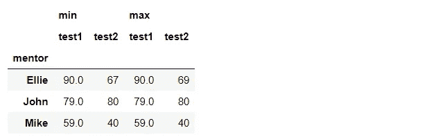

作者图片

我们可以观察到数据透视表和 group by 的操作非常相似。许多电子表格的普通用户喜欢数据透视表的声明性语言，而不熟悉数据透视表的程序员喜欢分组原则。

# 熔化数据

OLAP 有一个事实和维度的概念。事实是可测量和可报告的值。维度是表征事实环境的一组值。然后可以使用这些维度来分析数据。

这里使用的分数数据是宽格式的(也称为堆叠或记录)。与“长”格式(也称为整齐格式)相比，在“长”格式中，每一行都包含一个事实(可能有额外的变量来表示维度)。如果一个测试分数被认为是一个事实，这种宽形式似乎有一个以上的事实在一排，所以它是宽的。

我们可以使用熊猫的融化功能来处理数据，使其变长。因为我熟悉 OLAP 术语(事实和维度)，我将使用这些词来描述如何以及何时使用 melt。

分数数据框中的 test1 和 test2 列包含事实。我们希望开发一个新的数据框架，其中测试名称被分成单独的一列，实际上测试分数被分组在一列中。事实列的列表放在 value vars 参数中来实现这一点。我们应该在 id vars 参数中列出我们想要维护的任何维度。

这里以姓名和性别为维度，以考试成绩为事实:

```
pd.melt(scores, id_vars=['name', 'gender'],value_vars=['test1', 'test2'])
```

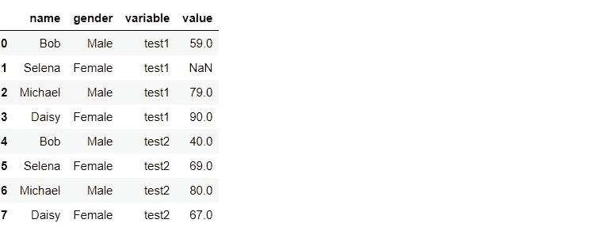

作者图片

如果我们要将事实的描述从变量修改为更具解释性的东西，我们可以使用 var name 参数。使用值名称参数重命名事实列(默认为值):

```
pd.melt(scores, id_vars=['name', 'gender'],value_vars=['test1', 'test2'], var_name='test', value_name='score')
```

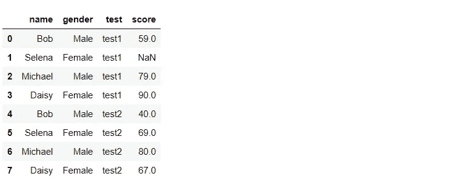

作者图片

## 再次转换为宽

我们可以使用数据透视表从长样式切换到宽样式。往相反的方向走就有点复杂了:

```
long_df = pd.melt(scores, id_vars=['name', 'gender'],value_vars=['test1', 'test2'],var_name='test', value_name='score')
```

我们首先透视，使用维度作为索引参数，事实列名称作为列参数，事实列作为值参数:

```
wide_df = long_df.pivot_table(index=['name', 'gender'],columns=['test'],values=['score'])
wide_df
```

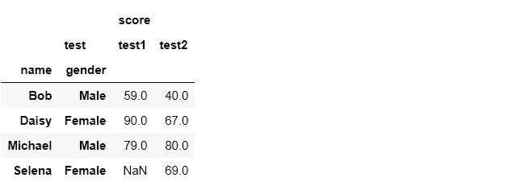

作者图片

这会产生分层的列标签(或多级)以及分层的索引。使用。重置索引过程以展平索引。它将从原始索引创建一列(如果索引是分层的，则创建多列):

```
wide_df = wide_df.reset_index()
wide_df
```

的。从列属性中获取级别值的技术可用于展平嵌套的列。这可能更困难，因为如果级别 1 为空，我们希望将级别 0 的值集成到级别 1 列中。为了完成这项任务，我将利用列表中的条件表达式来理解:

```
cols = wide_df.columns
cols.get_level_values(0)
#Output: Index(['name', 'age', 'score', 'score'], dtype='object')
cols.get_level_values(1)
#Output: Index(['', '', 'test1', 'test2'], dtype='object', name='test')
l1 = cols.get_level_values(1)
l0 = cols.get_level_values(0)
names = [x[1] if x[1] else x[0] for x in zip(l0, l1)]
names
```

现在，将列名更改为新名称:

```
wide_df.columns = names
wide_df
```

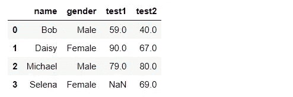

作者图片

# 堆叠和拆分

“堆叠”然后“拆分”数据的能力是操纵数据的另一种方式。当您已经拥有多级索引时，这一点尤其有用，如果您利用 index 参数传入一个列表，就可以从数据透视表中获得这些索引。

拆分接受多级索引数据集，并提取索引的最内层，使其成为列的最内层。堆叠在另一个方向起作用。请参见下图以供参考:

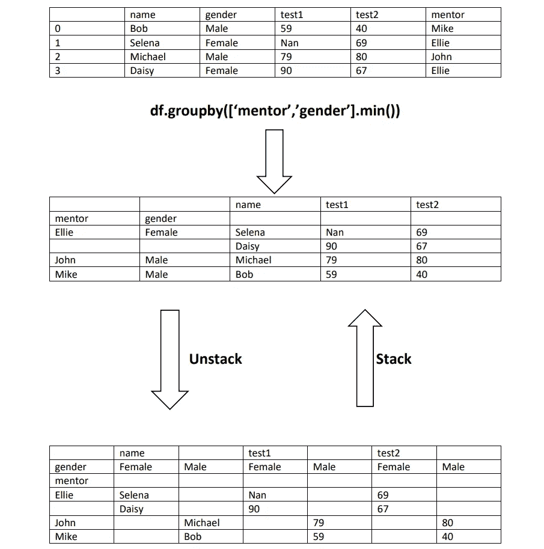

作者图片

# 结论

从本文中，您确实可以使用任何工具来重新排列您的数据。与需要手动迭代信息的高要求解决方案相比，它速度更快，需要的代码更少。然而，可能需要一些时间来弄清楚如何转换原始数据。尝试这些技巧，并寻找其他人的例子，看看他们是如何在公众中运用这些技巧的。