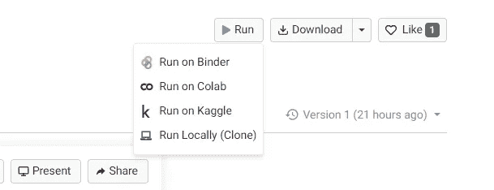

# 使用 Plotly 绘制漂亮的交互式图形

> 原文：<https://medium.com/analytics-vidhya/plot-beautiful-and-interactive-graphs-using-plotly-64ee1951a038?source=collection_archive---------4----------------------->

## 使用 Plotly 将您的数据可视化技能提升到一个新的水平

由[摩根·豪斯](https://unsplash.com/@morganhousel?utm_source=medium&utm_medium=referral)在 [Unsplash](https://unsplash.com?utm_source=medium&utm_medium=referral) 上拍摄的照片

# 介绍

大家好，在这个博客中，我们将学习绘图的用途，以及如何使用一个非常好的工具 Plotly 来绘制它们。我们将了解这个工具如何使绘制图表变得非常简单和有趣。我们将为折线图、条形图、直方图和许多其他类型的图形编写代码。这个博客包含了很多代码片段。因此，为了充分利用这个博客，我强烈建议我们打开我们的 Jupyter 笔记本，跟随我们开始绘制图表。

另一个选择是点击这里的[链接查看 Jupyter 笔记本。如果你点击这个链接，你将被重定向到木星的网站。Jovian 是一个学习数据科学和协作的绝佳平台。在右上角，您会看到一个运行按钮。点击运行按钮，选择你认为合适的选项。我个人最喜欢的是 Colab。单击该选项后，笔记本将在各自的平台中打开。之后，你可以在阅读这篇博客的时候自己运行这个笔记本。](https://jovian.ai/sanketchavan5595/plotly-incredible-python-library-to-plot-interactive-graphs)

**我们为什么需要图表？**

图表是数据的可视化表示。仅仅通过查看图表，我们就可以理解数据中的模式，这是用表格或文本表示很难理解的。图表以一种对大多数人来说非常容易理解的方式显示信息。在数据分析中，图表用于了解变量/列之间的关系，以深入了解数据。图表有不同的形式，但用途却不尽相同。图形的类型取决于所传输的数据类型。

Plotly 是一个用于绘制图形的免费开源库。它用于创建可以在 Jupyter 笔记本中显示的数据可视化。它提供了各种图形选项，从折线图到三维图表。它也可以离线工作。

要安装 plotly，请在您的终端或 jupyter 笔记本的代码单元中运行以下命令

`pip install plotly`

我们还需要另一个 Python 库 pandas 来将示例数据集读入 jupyter 笔记本。要安装 pandas，请运行以下命令

`pip install pandas`

查看这里使用的 Jupyter 笔记本

 [## sanketchavan 5595/plotly-incredible-python-library-to-plot-interactive-graphs

### 在 plotly-incredible-python-library-to-plot-interactive-graphs 笔记本上与 sanketchavan5595 合作。

jovian.ai](https://jovian.ai/sanketchavan5595/plotly-incredible-python-library-to-plot-interactive-graphs) 

**理论够了，让我们跳入编码吧！！**

# 进口

# 曲线图

线形图用来绘制随时间变化的数据。如果你想以周、月或年为基础来规划你的开销，折线图是你最好的选择。它是许多领域中常见的一种基本图表类型。

我们将导入`stocks`，这是 plotly 附带的一个数据集，用于演示折线图。让我们导入数据集。

在 plotly 中绘制所有图形的方法彼此非常相似。我们将首先创建一个简单的情节，然后美化它。这是怎么做的。

现在，这个图看起来可能很简单，但是如果您在 jupyter 笔记本中执行代码单元，输出图将非常具有交互性。当你将鼠标悬停在线上时，你将能够看到日期和价格等信息。

# 条形图

我们都知道条形图是什么。尽管如此，我们还是来看看基本定义。

条形图或条形图是一种图表或图形，它用高度或长度与其表示的值成比例的矩形条来表示分类数据。条形图可以垂直或水平绘制。垂直条形图有时被称为柱形图。

条形图显示离散类别之间的比较。图表的一个轴显示正在比较的特定类别，另一个轴代表测量值。一些条形图以多个一组的形式显示条形图，显示多个测量变量的值。

为了绘制条形图，我们将使用`gapminder`数据集。在这个数据集中，每一行代表给定年份的一个国家。我们可以像导入`stocks`一样导入数据集。

让我们现在绘制图表。

堆积条形图(或堆积条形图)是一种使用条形图来显示数据类别之间的比较的图表，但具有分解和比较整体各部分的能力。图表中的每个条形代表一个整体，条形中的段代表该整体的不同部分或类别。上面介绍中链接的 Jupyter 笔记本中给出了堆积条形图的示例。

# 散点图

**散点图**(也称为散点图、散点图、散点图、散点图或散点图)是一种使用笛卡尔坐标显示一组数据的典型两个变量的值的图或数学图。如果点被编码(颜色/形状/大小),则可显示一个附加变量。数据显示为点的集合，每个点的一个变量的值决定水平轴上的位置，另一个变量的值决定垂直轴上的位置。

我们将使用著名的 iris 数据集来绘制散点图。这是我们如何绘制它。

# 圆形分格统计图表

饼图(或圆形图)是一个圆形的统计图形，分成若干片来说明数字比例。在饼图中，每个切片的弧长(及其中心角和面积)与它所代表的数量成正比

饼状图非常有用。它们在视觉上比其他类型的图表更简单。但是，我们可以显示的切片数量是有限的。

为了绘制饼图，我们将使用前面使用的数据集。

绘制此图后，如果我们单击图例中的标签，对应于该标签的饼图部分将被忽略。这样，我们可以控制要查看哪些类数据。

# 柱状图

直方图是数字数据分布的近似表示。直方图在外观上类似于条形图，它通过获取许多数据点并将它们分组到逻辑范围或条块中，将数据系列压缩成一个易于解释的图像。

为了绘制直方图，我们将创建一个自定义范围的值并绘制它们。

我们可以使用`update_layout()`函数美化直方图。点击[此处](https://jovian.ai/sanketchavan5595/plotly-incredible-python-library-to-plot-interactive-graphs/v/1#C40)查看如何操作。

# 箱形图

盒须图也称为盒状图，显示一组数据的五个数字汇总。五位数汇总是最小值、第一个四分位数、中值、第三个四分位数和最大值。箱线图可以水平或垂直绘制。箱形图的名字来源于中间的盒子和它们的图。

盒须图总结了一组在区间尺度上测量的数据。它常用于解释性数据分析。这种类型的图形用于显示分布的形状、中心值及其可变性。此外，它们可以显示数据中存在的异常值。

我们将使用`tips`数据集绘制箱线图

# 小提琴情节

小提琴图与盒须图的作用相似。它显示了数量数据在一个(或多个)分类变量的几个级别上的分布，以便对这些分布进行比较。与箱线图不同，在箱线图中，所有图的组成部分都对应于实际数据点，violin 图的特点是对基础分布的核密度估计。

我们将再次使用`tips`数据集绘制小提琴图。

我们可以在这里找到更复杂的小提琴情节[的例子](https://jovian.ai/sanketchavan5595/plotly-incredible-python-library-to-plot-interactive-graphs/v/1#C60)。

# 密度热图

热图(又名热图)将跨两个轴变量的感兴趣的主要变量的值描绘为彩色方块的网格。像条形图或直方图一样，轴变量被划分成多个范围，每个单元格的颜色表示相应单元格范围内主变量的值

使用的数据集:`flights`来自 seaborn 库

以下是如何绘制它。

# 结论

这就把我们带到了这篇博客的结尾。我们在这里学到了很多。

1.  什么是图表，为什么要使用它们
2.  图的类型及其用途。
3.  如何使用 Plotly 绘制它们。

但是，仍然有许多东西需要学习和探索。

我们可以在 EDA 项目、ML 项目中使用上面的图表，或者简单地了解我们在预算、健身等方面的表现。

# 参考

在制作这个博客时使用了以下参考资料。我强烈建议你去看看。

*   【https://youtu.be/GGL6U0k8WYA 
*   [https://plotly.com/python/plotly-express/](https://plotly.com/python/plotly-express/)

您可以使用以下链接在 LinkedIn 上与我联系:

*   [https://www.linkedin.com/in/sanket-chavan5595/](https://www.linkedin.com/in/sanket-chavan5595/)

> 非常感谢！！！