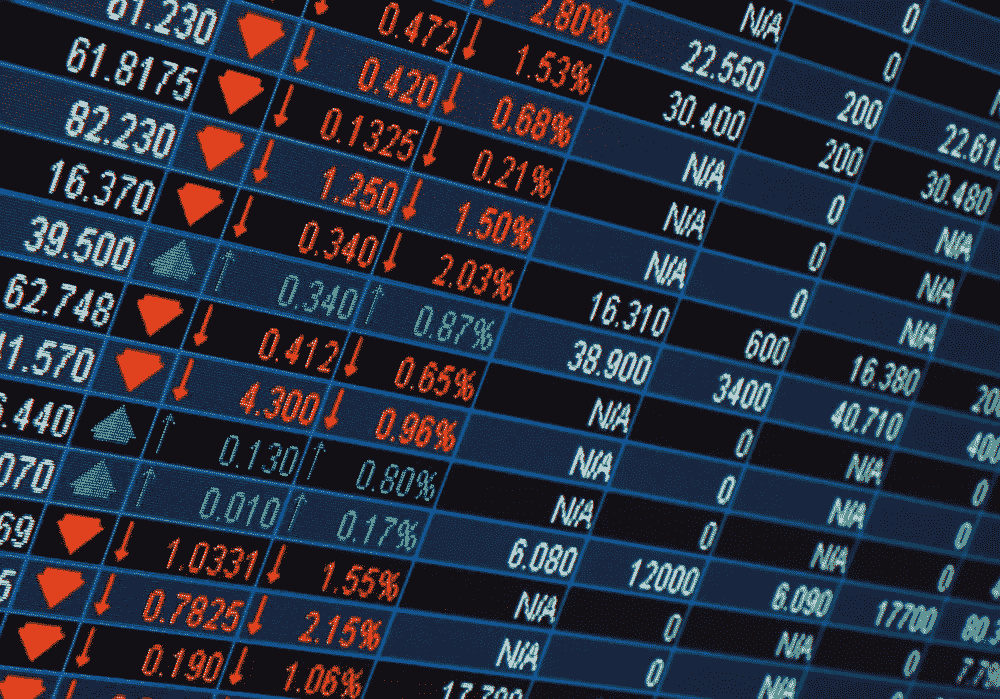
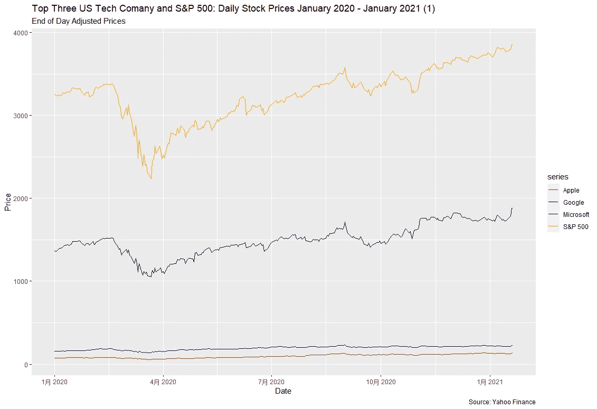
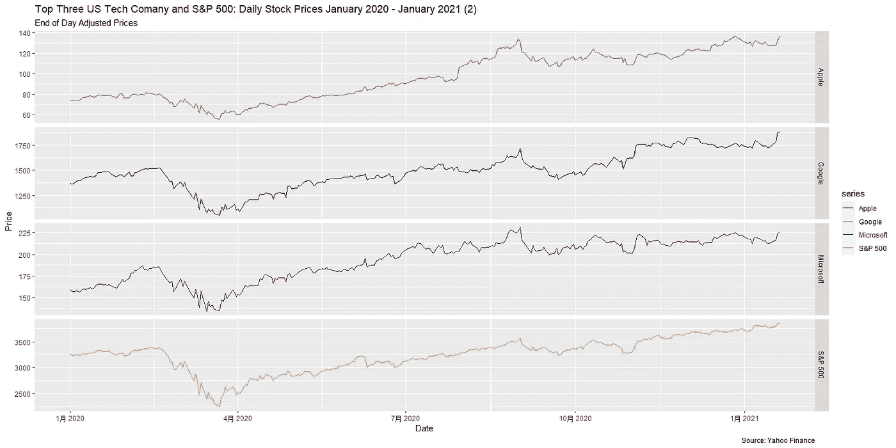

# 用 R 绘制股票价格

> 原文：<https://medium.com/analytics-vidhya/plot-stock-prices-with-r-6bdbaebc8ec1?source=collection_archive---------1----------------------->



[http://www.financialtipsor.com/](http://www.financialtipsor.com/)

*Github:*[https://github.com/qyaan/stock-price-2020-big-tech](https://github.com/qyaan/stock-price-2020-big-tech)

文章旨在用 r 绘制 2020 年三大科技公司(苹果、谷歌、微软)和 S&P500 的股价走势

分析分为三个部分。

*   **准备环境**
*   **获取数据**
*   **剧情**

1.  ***准备环境***

软件包“quantmod”经常用于财务分析，软件包“ggplot2”用于绘图。

```
install.packages("quantmod")
install.packages("broom"))library(quantmod)
library(ggplot2)
library(magrittr)
library(broom)
```

**②*。*获取数据**

*a .时间范围*

在从 yahoo finance 加载数据之前，需要首先定义时间范围。

```
start = as.Date("2020-01-01") 
end = as.Date("2021-01-22")
```

b .获取股票价格

通过使用函数“getSymbols ”,可以检索到所需的股票价格。有三个参数需要定义:tickers、sources 和 time range。

在这种情况下，需要的 tickers 是“AAPL”(苹果)、“GOOGL”(谷歌)、“MSFT”(微软)、“^GSPC"(S&P500).来源是雅虎财经。

```
getSymbols(c("AAPL", "GOOGL", "MSFT","^GSPC"), src = "yahoo", from = start, to = end)
```

将检索到的股票价格组织为一个数据框架。

```
stocks = as.xts(data.frame(A = AAPL[, "AAPL.Adjusted"], 
B = GOOGL[, "GOOGL.Adjusted"], C = MSFT[, "MSFT.Adjusted"], 
E = GSPC[,"GSPC.Adjusted"]))names(stocks) = c("Apple", "Google", "Microsoft","S&P 500")
index(stocks) = as.Date(index(stocks))
```

3. ***剧情***

*a .第一个情节*

第一个图是没有图层的图表。这个想法是为了了解三大科技的发展如何影响标准普尔 500 的发展。

但第一张图表的问题是，微软和苹果的走势看不清楚，因为它们的股价远低于标准普尔 500 和谷歌。因此，在 3b)下方创建了第二个图表，以单独查看变动情况。

```
stocks_series = tidy(stocks) %>% 

  ggplot(aes(x=index,y=value, color=series)) +
  labs(title = "Top Three US Tech Comany and S&P 500: Daily Stock Prices January 2020 - January 2021 (1)",

       subtitle = "End of Day Adjusted Prices",
       caption = " Source: Yahoo Finance") +

  xlab("Date") + ylab("Price") +
  scale_color_manual(values = c("Red", "Black", "DarkBlue","Orange"))+
  geom_line()stocks_series
```



*b .第二个情节*

第二个图是一个有刻面的图表。而这一次，个股价格的走势就清晰多了。

```
stocks_series2 = tidy(stocks) %>% 

  ggplot(aes(x=index,y=value, color=series)) + 
  geom_line() +
  facet_grid(series~.,scales = "free") + 
  labs(title = "Top Three US Tech Comany and S&P 500: Daily Stock Prices January 2020 - January 2021 (2)",

                                              subtitle = "End of Day Adjusted Prices",
                                              caption = " Source: Yahoo Finance") +

  xlab("Date") + ylab("Price") +
  scale_color_manual(values = c("Red", "Black", "DarkBlue","Orange"))stocks_series2
```

