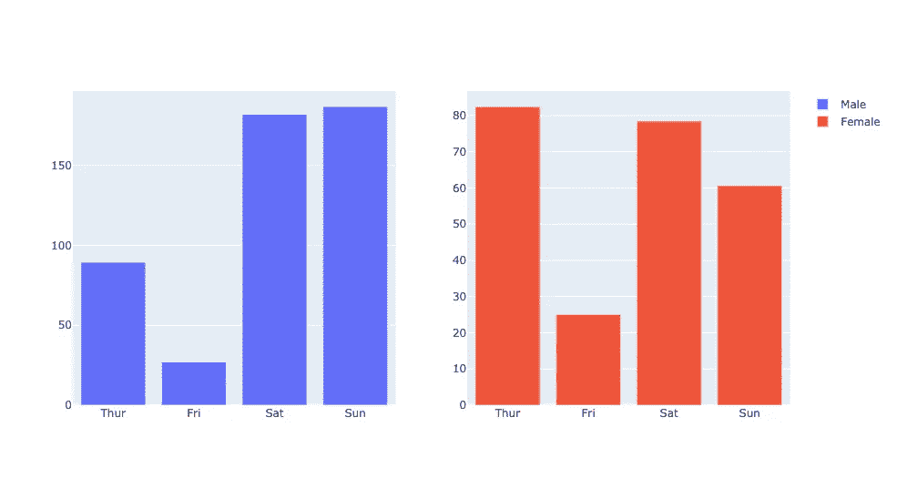
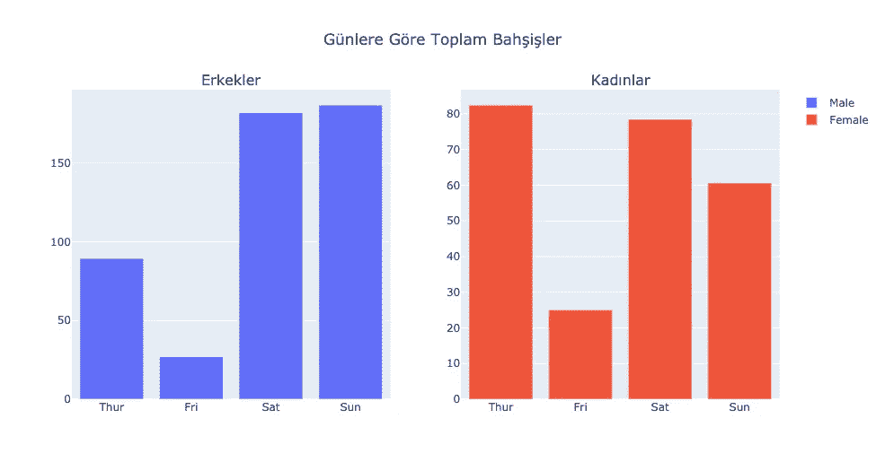
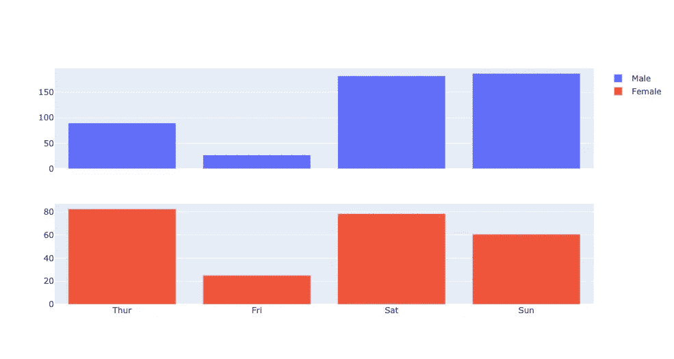
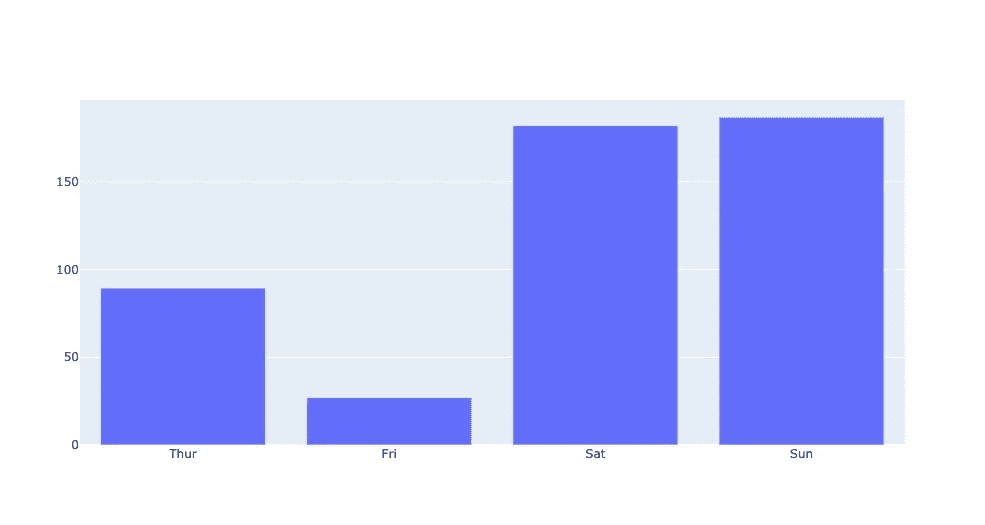
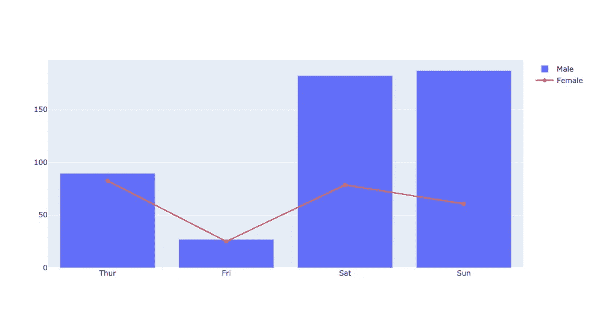

# 情节曲折的次要情节和情节层次

> 原文：<https://medium.com/analytics-vidhya/plotly-subplots-plot-layering-2c31434da1bb?source=collection_archive---------2----------------------->

大家好，在这个故事中，我们将尝试涵盖支线剧情和情节层次。在我们开始之前，首先我需要解释一下我的情况。我正在努力学习英语，所以请不要对我的英语评头论足😅让我们试着涵盖支线剧情和剧情层次感。

# 有哪些支线剧情

我们可以说，排列在网格中的迷你图。我们

*   可以显示来自同一数据集的不同图
*   可以显示数据集不同子集的相同图

## 怎么会使用支线剧情

我们需要从**下导入**make _ 支线剧情**.支线剧情**。**请不要忘记，在写这篇文章的时候，make_subplots 不支持 plotly.express.** 所以我们不能在 plotly.express 剧情中使用 make_subplots。

我们将使用这段代码将库导入到项目中。

```
from plotly.subplots import make_subplots
```

在本文中，我们将使用这些库，并且我们将使用 seaborn 下的**提示**数据集。

```
import pandas as pd # creating and manipulating dataframes
import seaborn as sns # accessing to dataset
import plotly.graph_objects as go # we can not use express plots
from plotly.subplots import make_subplots # creating subplots
```

## 让我们创建第一个支线剧情

我将创建条形图。因此，我将数据分组。

```
df = sns.load_dataset('tips')
grouped_df = df.groupby(['sex', 'day'], as_index=False).sum()
grouped_df.head()
```

现在我需要创建解析的网格。在这个例子中，我将创建 1x2(列 x 行)网格。我是用 make_subplots 函数来做的。

```
fig = make_subplots(rows=1, cols=2)
```

之后它会返回一个图形对象给我。我们从普罗特利那里知道了这件事。我们将使用 add_trace 函数在图形对象上添加我们的绘图。**请不要忘记，我们需要给出我们创建的图形将出现的具体列和行号。**

```
# add the 1st graph by specifying which row and column it will come to
fig.add_trace(go.Bar(x=grouped_df[grouped_df['sex'] == 'Male']['day'], y=grouped_df[grouped_df['sex'] == 'Male']['tip'], name='Male'),row=1, col=1)# add the 2nd graph
fig.add_trace(go.Bar(x=grouped_df[grouped_df['sex'] == 'Female']['day'], y=grouped_df[grouped_df['sex'] == 'Female']['tip'], name='Female'), row=1, col=2)
```



在执行我们编写的代码后，我们会看到这个图

# 让我们为我们的情节做些补充

## 设定每个支线剧情的标题

在这一部分，我们将设置每个支线剧情的标题。我们需要在 make_subplots 函数中使用 **subplot_titles** 参数。这个参数接受一个包含子情节标题的列表。请不要忘记，标题必须在此列表中排队。0 索引将是第一个图表的标题。

我将使用相同的轨迹和数据集。

```
grouped_df = df.groupby(['sex', 'day'], as_index=False).sum()fig = make_subplots(rows=1,
                    cols=2,
                    subplot_titles=[
                        'Erkekler',  # 1\. subplot title
                        'Kadınlar'  # 2\. subplot title
]) fig.add_trace(go.Bar(x=grouped_df[grouped_df['sex'] == 'Male']['day'], y=grouped_df[grouped_df['sex'] == 'Male']['tip'], name='Male'),row=1, col=1) fig.add_trace(go.Bar(x=grouped_df[grouped_df['sex'] == 'Female']['day'], y=grouped_df[grouped_df['sex'] == 'Female']['tip'], name='Female'), row=1, col=2) fig.update_layout(title='Günlere Göre Toplam Bahşişler', title_x=0.5)
```

那么上面发生了什么？首先，我们创建了一个经过解析的网格。但与之前不同的是，我们给了 **subplot_titles** 参数。因此，我们的图表拥有自己的标题。请记住，标题参数是 update_layout 中不是来自 sub_plots 的参数。它来自 Plotly 图。所以这个参数只影响主网格。



## 共享每个图形的 X 轴

我们可以共享每个图的 x 轴或 y 轴。在这个例子中，我们将对 x 轴这样做。我们需要在 make_subplots 函数中使用 **shared_xaxes=True** 参数。如果想要共享 y 轴，我们可以使用 **shared_yaxis=True** 参数。同样，我们将使用相同的数据集，但我们的数字创建风格不会像以前一样。我们将为每个类别使用 for 循环，在本例中网格将为 2 x 1。

```
grouped_df = df.groupby(['sex', 'day'], as_index=False).sum()fig = make_subplots(rows=len(grouped_df['sex'].unique()), cols=1, shared_xaxes=True)
```

我们创建了一个子情节网格，其中的行数是根据每个唯一的类别长度来计算的。因此，我们将为每个唯一值创建一个新行。

```
row = 1
for trace in grouped_df['sex'].unique():
    fig.add_trace(go.Bar(x=grouped_df[grouped_df['sex'] == trace['day'], y=grouped_df[grouped_df['sex'] == trace]['tip'], name=trace), row=row, col=1)
    row += 1
```

我们使用行号创建了一个行变量来对齐图形。我们将它的值设置为 1。因为支线剧情中的索引不像列表中的索引。从 1 开始。之后，我们为每个唯一的性别值添加了一个跟踪，并设置了它们的行号和列号。如图所示，我们共享每个图形的 x 轴。



每个图形共享 x 轴的图形

# 情节分层

我们可以说，对于情节分层，它是通过在同一个图形中反复创建图形来实现的。我们不需要解析网格。为此，我们将再次使用 **add_trace** 函数。我们将使用相同的数据集和分组数据帧。

```
grouped_df = df.groupby(['sex', 'day'], as_index=False)a.sum()fig = go.Figure() # create empty figurefig.add_trace(go.Bar(x=grouped_df[grouped_df['sex']=='Male']['day'], y=grouped_df[grouped_df['sex']=='Male']['tip'],name='Male'))
```

首先，我们创建了一个空的数字。之后，我们添加了一个条形图。如果执行它，我们会看到这个输出。



现在我们假设，我们想在这个条形图上添加一个折线图。我会再次使用同样的手法，**添加 _ 痕迹**。

```
fig.add_trace(go.Scatter(x=grouped_df[grouped_df['sex']=='Female']['day'], y=grouped_df[grouped_df['sex']=='Female']['tip'],mode='lines+markers',name='Female'))fig.show()
```

现在如果执行这段代码，我们会看到这个输出。所以我们把我们的情节分层。



你可以从[我的 GitHub repo](https://github.com/mebaysan/VeriBilimi/blob/master/Python/3-)KesifciVeriAnaliziVeVeriGorsellestirme/Plotly-Dash-Examples/Plotly-Subplots/Plotly-Subplots.ipynb) 获取代码。我希望它会有帮助。亲切的问候。