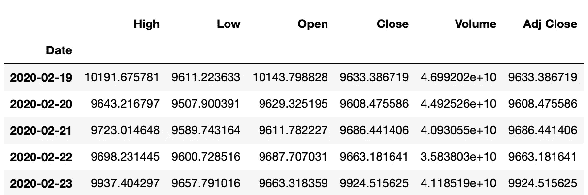
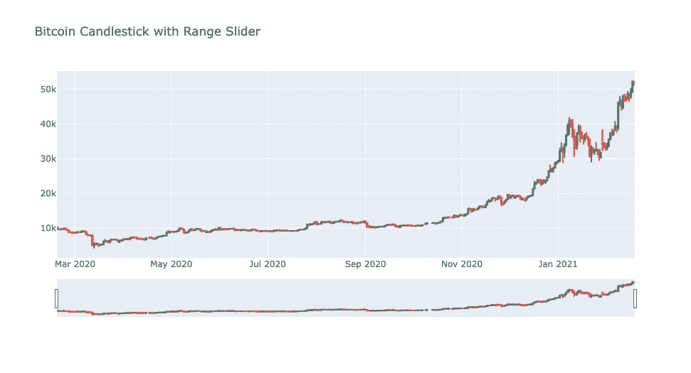
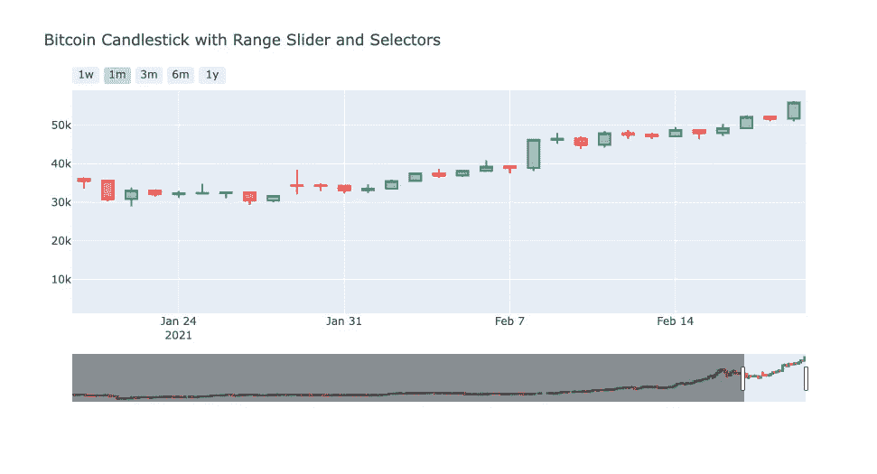

# 使用 Python 绘制比特币烛台

> 原文：<https://medium.com/analytics-vidhya/plotting-bitcoin-candlestick-using-python-5a307e02d30?source=collection_archive---------8----------------------->

如何获取比特币历史价格并使用 Python 绘制烛台？


[由 vectorjuice / Freepik 设计](http://www.freepik.com)

过去几个月，比特币价格大幅上涨，从 10.000 美元左右涨到 50.000 美元左右的历史高点。随着价格的上涨，人们对这种加密货币的兴趣也增加了，正如我们在下图中从[谷歌趋势](https://trends.google.com/trends)(过去 12 个月)的数据中看到的。

数据来源:[谷歌趋势](https://www.google.com/trends)

如果你是这些人中的一员，并且对操作比特币(或其他加密货币)感兴趣，你应该使用的一个重要图形是烛台，主要是如果你对交易(买卖以获利)感兴趣。

> 蜡烛图是技术分析中使用的一种价格图表，显示特定时期内证券的最高价、最低价、开盘价和收盘价。它起源于日本米商和贸易商跟踪市场价格和每日势头。它反映了投资者情绪对价格的影响，并被技术分析师用来决定何时进入和退出交易。

这个项目的目标是展示如何使用 Python 轻松绘制比特币价格的蜡烛图。我们将使用 Pandas DataReader 库获得历史价格数据，并使用 Plotly 库绘制图表。您还可以使用这里介绍的方法来绘制任何加密货币、股票或 ETF 的图表。

**本项目并不意味着推荐买卖比特币。**

如果你对这个项目的全部代码感兴趣，请查看我的 [GitHub](https://github.com/hugoplm/bitcoin-candlestick/blob/main/Bitcoin_Candlestick.ipynb) 。

## 1.使用 Pandas DataReader 获取比特币历史数据

为了获得比特币的历史数据，我们将使用 Pandas DataReader 库。

为了使本文更简单，我不会在这里详细介绍这个库，但是如果你想了解更多关于 Pandas-DataReader 的信息，我建议你看一下[文档](https://pandas-datareader.readthedocs.io/en/latest/index.html)。此外，由于我们正在处理数据框，我建议你看一下熊猫[文档](https://pandas.pydata.org/pandas-docs/stable/reference/api/pandas.DataFrame.html)，以防你不知道。

第一步是导入库。

```
import pandas as pd
import pandas_datareader.data as pdr
import datetime as dt
```

现在，我们可以运行下面的代码来获取数据。我们需要提供以下参数:

*   开始日期和结束日期:获取数据的期间。在这种情况下，我们将使用库 [datetime](https://docs.python.org/3/library/datetime.html) 并提供日、月和年。我们会得到过去 12 个月的数据，从 2020 年 2 月 19 日到 2021 年 2 月 18 日。
*   数据来源:我们将使用“雅虎”作为我们的数据来源。
*   股票代码:由于我们想要绘制比特币价格，我们的股票代码是“BTC-美元”(以美元计算的比特币价格)。

```
start = datetime.datetime(2020,2,19)
end = datetime.datetime(2021,2,18)
df = pdr.DataReader('BTC-USD','yahoo',start,end)
```



包含过去 12 个月比特币历史数据的数据框。

数据框包含以下各列:

*   *日期:*参考的日子。每行代表一天。
*   *高点:*参考日比特币的最高价格。
*   *低:*参考日比特币的最低价格。
*   *开盘价:*比特币在基准日的开盘价。
*   *收盘:*比特币在基准日的收盘价。
*   *成交量:*参考日比特币成交的成交量。
*   *调整收盘:*参考日比特币调整后的收盘价格。

现在我们有了数据，让我们进入下一部分，绘制我们的蜡烛图。

## 2.使用 Plotly 绘制比特币烛台

Plotly 是一个用于数据可视化的开源库，允许轻松绘制不同类型的图表并在线发布。在这个项目中，我们将看到如何在 Jupyter 笔记本中绘制离线图形。如果你想在网上发布你的图表并分享它们，或者如果你想了解更多关于这个库的信息，我推荐你看一下[文档](http://plotly documentation python pdf)。你还可以看到所有可以绘制的图表类型。

第一步是导入库。我们需要导入 *graph_objs* 方法，它负责创建图形本身。此外，由于我们想在笔记本中绘制图表，我们需要导入*离线*方法。

```
import plotly.offline as py
import plotly.graph_objs as go
```

下一步是运行下面的代码来显示笔记本中的绘图。

```
py.init_notebook_mode(connected=True)
```

为了创建图表，我们需要使用来自 *graph_objs* 的方法*烛台*和我们的数据*。*需要提供 x 轴数据即我们的*日期*栏，y 轴数据即开盘价、最高价、最低价和收盘价，分别是我们的*开盘价*、*高*、*低*和*收盘*栏。我们需要将所有这些信息放入一个列表中，并将其赋给一个变量，在本例中为“data”。

```
data = [go.Candlestick(x=df.index,
                       open=df.Open,
                       high=df.High,
                       low=df.Low,
                       close=df.Close)]
```

现在，我们可以定义我们的布局，这将允许我们定制情节和插入一些功能。在这种情况下，我们将为图表设置一个标题，并在 x 轴上插入一个日期范围滑块。

```
layout = go.Layout(title='Bitcoin Candlestick with Range Slider',
                   xaxis={'rangeslider':{'visible':True}})
```

然后，我们可以最终创建我们的数字，并绘制我们的图表。

```
fig = go.Figure(data=data,layout=layout)py.iplot(fig,filename='bitcoin_candlestick')
```



比特币烛台，带范围滑块。

## 3.向烛台图添加选择器

除了范围滑块之外，我们还可以向绘图添加另一个特性:范围选择器，它提供了在图表中选择已定义范围的按钮。在这个例子中，创建了一些按钮来显示过去一周(1w)、过去一个月(1m)、过去三个月(3m)、过去六个月(6m)和过去一年(1y)的值。

我们可以在下图中看到选择按钮“1m”后的结果:



带有范围滑块和选择器的比特币烛台，显示过去 1 个月(1m)。

要添加选择器，我们需要为布局中的参数 *xaxis* 在字典中添加一个新值。下面你可以看到过去 1 个月来添加按钮的代码。如果你对整个代码感兴趣，请在我的 [GitHub](https://github.com/hugoplm/bitcoin-candlestick/blob/main/Bitcoin_Candlestick.ipynb) 上查看这个项目的笔记本。

```
xaxis = {'rangeselector':{'buttons':[{'count':1,
                                      'label':'1m',
                                      'step':'month',
                                      'stepmode':backward'}]}}
```

# 结论

在这个项目中，我介绍了如何获得比特币历史价格数据，并使用 Plotly 库绘制烛台。您可以使用这里提供的相同代码来绘制其他加密货币和股票的烛台图，您只需要在下载数据时设置所需的跑马灯。此外，如果您需要更新的数据，您可以实现一个例程来每天(甚至一天中的某些时间，这取决于您的数据源)获取数据并绘制烛台。

感谢您花时间阅读本文。我希望你喜欢学习如何轻松地使用 Plotly 绘制烛台。如果您对此有任何问题或反馈，请随时通过 [LinkedIn](https://www.linkedin.com/in/hugoplm/) 联系我。

## 参考资料:

[1]:海耶斯，亚当。(2020 年 7 月 29 日)。烛台定义。从 https://www.investopedia.com/terms/c/candlestick.asp[取回](https://www.investopedia.com/terms/c/candlestick.asp)