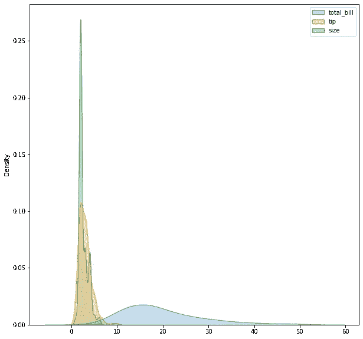
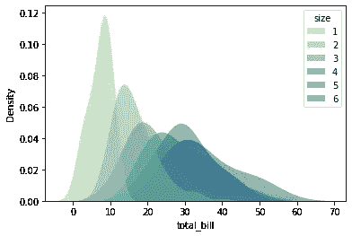
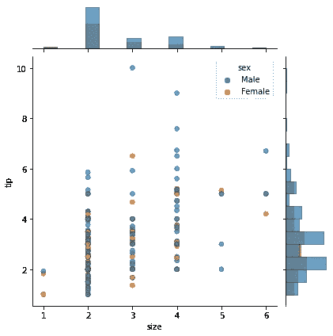

# 用 Seaborn 绘图:第 1 部分

> 原文：<https://medium.com/analytics-vidhya/plotting-with-seaborn-part-1-dc6adb50b1ac?source=collection_archive---------10----------------------->


Seaborn 是一个用 Python 制作统计图形的库。它建立在 matplotlib 之上，并与 pandas 数据结构紧密集成。

Seaborn 帮助您探索和理解您的数据。它的绘图功能对包含整个数据集的数据帧和数组进行操作，并在内部执行必要的语义映射和统计聚合，以生成信息丰富的绘图。其面向数据集的声明式 API 让您专注于绘图中不同元素的含义，而不是如何绘制它们的细节。

`seaborn.**get_dataset_names**`()

报告可用的示例数据集，对报告问题很有用。

`seaborn.**load_dataset**` ( *name* ， *cache=True* ， *data_home=None* ， ***kws* )

从在线存储库中加载一个示例数据集。此函数提供了对少量示例数据集的快速访问，这些数据集对于记录 seaborn 非常有用。

我们将使用“提示”数据集。

```
d = sns.load_dataset(“tips”)
```

# Kdeplot

```
fig,ax = plt.subplots(figsize =(10,10))
sns.kdeplot(data=d,fill=True)
```



现在，我们绘制了一个 kdeplot，其中包含的被赋予填充颜色以使其可读。

我们可以进行色调映射，

```
sns.kdeplot(data=d, x=”total_bill”, hue=”sex”)
```


我们可以叠加分布，

```
sns.kdeplot(data=d, x="total_bill", hue="sex",multiple="stack")
```


我们可以修改外观，

```
sns.kdeplot(
data=d, x=”total_bill”, hue=”size”,
fill=True, common_norm=False, palette=”crest”,
alpha=.5, linewidth=0,)
```



# 接合图

用二元图和一元图画一个二元图。这个函数为`JointGrid`类提供了一个方便的接口，有几种固定的绘图类型。

```
seaborn.jointplot(***, *x=None*, *y=None*, *data=None*, *kind='scatter'*, *color=None*, *height=6*, *ratio=5*, *space=0.2*, *dropna=False*, *xlim=None*, *ylim=None*, *marginal_ticks=False*, *joint_kws=None*, *marginal_kws=None*, *hue=None*, *palette=None*, *hue_order=None*, *hue_norm=None*, ***kwargs)*
```

现在开始绘图，

```
sns.jointplot(data=d)
```


现在使用色调映射，

```
sns.jointplot(data=d,x=”size”,y=”tip”,hue=”sex”)
```


```
sns.jointplot(data=d,x=”total_bill”,y=”tip”,hue=”sex”)
```


通过`kind`参数可以使用几种不同的绘图方法，

```
sns.jointplot(data=d,x=”total_bill”,y=”tip”,kind=”reg”)
```


```
sns.jointplot(data=d,x="total_bill",y="tip",kind="hist")
```


```
sns.jointplot(data=d,x="total_bill",y="tip",kind="hex")
```


现在用马克笔，

```
sns.jointplot(data=d,x=”total_bill”,y=”tip”,marker=”*”,hue=”time”)
```


# **JointGrid**

用于绘制带有边际单变量图的双变量图的网格。

最简单的绘图方法，`JointGrid.plot()`接受一对函数

```
g = sns.JointGrid(data=d, x="size", y="tip",hue="sex")g.plot(sns.scatterplot, sns.histplot, alpha=.7, edgecolor=".2", linewidth=.5)
```



现在我们可以创建一个函数来创建关节网格。

```
def jointer(x,y,z):
    g = sns.JointGrid(data=d, x=x, y=y,hue=z)
    return g
```

现在我们可以使用函数和绘图。

```
g = jointer("tip","total_bill","day")
g.plot_joint(sns.scatterplot, s=100, alpha=.5)
g.plot_marginals(sns.histplot, kde=True)
```

