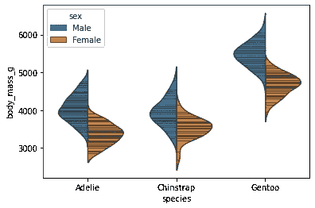
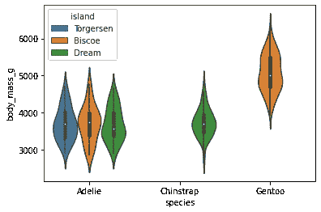

# 用 Seaborn 绘图:第 2 部分

> 原文：<https://medium.com/analytics-vidhya/plotting-with-seaborn-part-2-9c4b68457f92?source=collection_archive---------23----------------------->


在第一部分中，我们使用了“提示”数据集，现在我们将使用“企鹅”数据集。

现在让我们加载数据集。

```
d = sns.load_dataset(“penguins”)
d.columns
>> Index(['species', 'island', 'bill_length_mm', 'bill_depth_mm',        'flipper_length_mm', 'body_mass_g', 'sex'],dtype='object')
```

# **小提琴手**

画出箱线图和核密度估计的组合。

小提琴图与盒须图的作用相似。它显示了数量数据在一个(或多个)分类变量的几个级别上的分布，以便对这些分布进行比较。与箱线图不同，在箱线图中，所有图的组成部分都对应于实际数据点，violin 图的特点是对基础分布的核密度估计。

**竖琴剧情，**

```
sns.violinplot(data=d,x=”species”,y = “bill_depth_mm”)
```


```
sns.violinplot(data=d,x=”species”,y = “body_mass_g”)
```


拆分小提琴来比较色调变量，

```
sns.violinplot(data=d,x=”species”,y=“body_mass_g”,hue=”sex”,split=True)
```


现在四分位数是水平线，

```
sns.violinplot(data=d,x="species",y = "body_mass_g",hue="sex",split=True,inner="quartile")
```


要用小提琴内部的木棒显示每个观察结果:

```
sns.violinplot(data=d,x="species",y = "body_mass_g",hue="sex",split=True,inner="stick")
```



```
sns.violinplot(data=d,x=”species”,y = “body_mass_g”,hue=”island”)
```



我们使用`catplot**().**`将 violinplot()和 FaceGrid()结合起来，这允许在附加的分类变量中进行分组。使用`[**catplot()**](https://seaborn.pydata.org/generated/seaborn.catplot.html#seaborn.catplot)`比直接使用`[**FacetGrid**](https://seaborn.pydata.org/generated/seaborn.FacetGrid.html#seaborn.FacetGrid)`更安全，因为它确保了变量的同步。

```
p = sns.catplot(
data = d,x = "species",
y = "flipper_length_mm",hue = "sex",col = "island",
kind = "violin")
```


# 条形图

条形图用每个矩形的高度表示数值变量的集中趋势估计值，并使用误差线提供该估计值周围不确定性的一些指示。条形图在量化轴范围内包含 0，当 0 是量化变量的有意义值，并且您想要与之进行比较时，它们是很好的选择。

条形图仅显示平均值(或其他估计值)，但在许多情况下，显示分类变量每个级别的值的分布可能会提供更多信息。在这种情况下，其他方法，如盒子或小提琴情节可能更合适。

```
sns.barplot(data=d,x="species",y="body_mass_g")
```


```
sns.barplot(data=d,x="species",y="flipper_length_mm")
```


```
sns.barplot(data=d,x=”island”,y=”body_mass_g”)
```


通过两个变量嵌套分组的竖线:

```
sns.barplot(data=d,x="island",y="body_mass_g",hue = "sex")
```


作为集中趋势估计值的中位数:

```
**from** **numpy** **import** median
sns.barplot(data=d,x="species",y="flipper_length_mm",estimator=median)
```


观察值的标准偏差，而不是置信区间:

```
sns.barplot(data=d,x="species",y="flipper_length_mm",ci="sd")
```


谢谢大家！