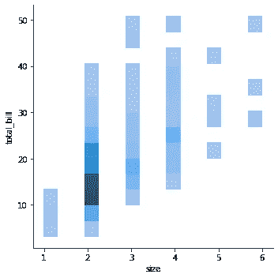

# 用 seaborn 绘图-第 3 部分

> 原文：<https://medium.com/analytics-vidhya/plotting-with-seaborn-part-3-32857ca6fee?source=collection_archive---------6----------------------->


# 显示

该功能提供了几种可视化单变量或双变量数据分布的方法，包括通过语义映射和跨多个子图分面定义的数据子集。`kind`参数选择要使用的方法:

```
histplot**()** (with kind="hist"; the default)kdeplot**()** (with kind="kde")ecdfplot**()** (with kind="ecdf"; univariate-only)
```

正在加载数据集。

```
d = sns.load_dataset("tips")
```

默认图是直方图。

```
sns.displot(data=d, x = "total_bill")
```


我们可以使用 kind 参数来选择不同的表示。

```
sns.displot(data=d, x = “total_bill”,kind=”kde”)
```


在直方图模式下，也可以添加 KDE 曲线

```
sns.displot(data=d, x = "total_bill",kde=True)
```


要绘制二元图，请指定`x`和`y`

```
sns.displot(data=d,x="size",y="total_bill")
```



```
sns.displot(data=d,x="size",y="total_bill",kind="kde")
```


用边缘“地毯”显示个人观察结果:

```
sns.displot(data=d,x="size",y="total_bill",kind="kde",rug=True)
```


使用`hue`映射，可以为数据子集单独绘制每种图

```
sns.displot(data=d,x="total_bill",kind="kde",hue="sex")
```


```
sns.displot(data=d,x="total_bill",kind="kde",hue="day")
```


```
sns.displot(data=d,x="total_bill",kind="kde",hue="day",
multiple="stack")
```


```
sns.displot(data=d,x="total_bill",hue="day",multiple="stack")
```


这个图形是使用`FacetGrid`构建的，这意味着你也可以显示不同支线剧情的子集

```
sns.displot(data=d, x="total_bill", hue="smoker", col="sex", kind="kde")
```


# **ecdfplot**

ECDF 表示低于数据集中每个唯一值的观察值的比例或计数。与直方图或密度图相比，它的优点是每个观察结果都是直接可视化的，这意味着不需要调整宁滨或平滑参数。它还有助于在多个分布之间进行直接比较。一个缺点是，图的外观和分布的基本属性(如其中心趋势、方差和任何双峰的存在)之间的关系可能不直观。

沿 x 轴绘制一元分布图:

```
sns.ecdfplot(data=d, x="total_bill")
```


可以绘制来自具有色调映射的长格式数据集的多个直方图。

```
sns.ecdfplot(data=d, x="total_bill",hue="day")
```


```
sns.ecdfplot(data=d, x=”total_bill”,hue=”size”)
```


默认的分布统计数据被归一化以显示比例，但您也可以显示绝对计数:

```
sns.ecdfplot(data=d, x="total_bill",hue="size",stat="count")
```


也可以绘制经验互补图:

```
sns.ecdfplot(data=d,x="total_bill",hue="size",
stat="count",complementary=True)
```

