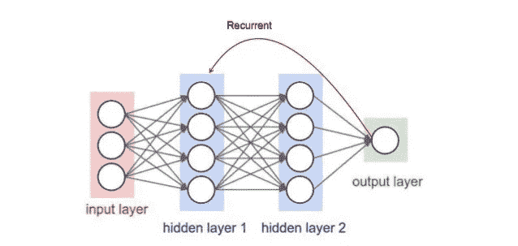
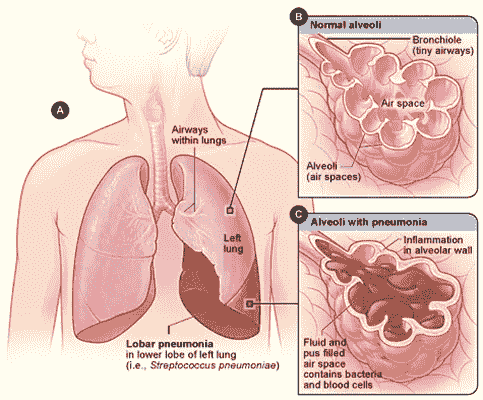
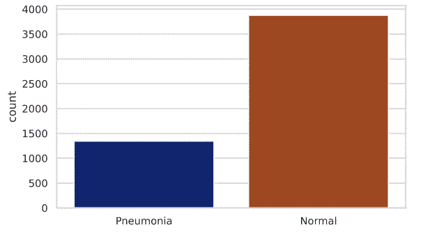
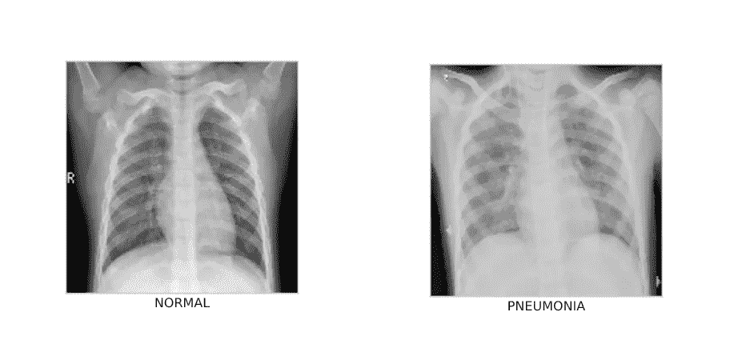
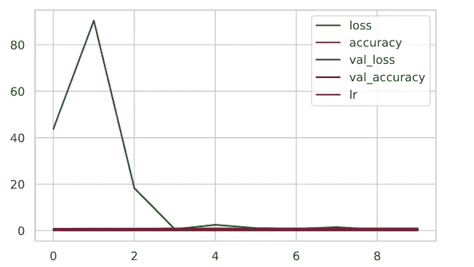
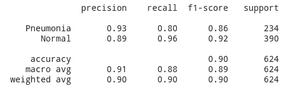

# 深度学习的肺炎检测

> 原文：<https://medium.com/analytics-vidhya/pneumonia-detection-with-deep-learning-1b3dffbfd81e?source=collection_archive---------18----------------------->

## 医疗保健中的深度学习

随着人工智能领域的进步，它越来越多地应用于最多样化的知识领域，在健康领域也是如此。

目前，人工智能在 medicina 的几种情况下得到应用，其中包括:

*   提高诊断准确性
*   对患者临床状况的警告
*   疾病治疗
*   确定特定主题的相关研究
*   症状的识别和吸收

## **深度学习**

被称为**深度学习**的技术无疑是该领域应用最广泛的技术之一，其操作基于**人工神经网络**，旨在复制人脑的行为以吸收捕获的信息。

人工神经网络的行为基于神经元的行为，其层以分层的方式排列，因此信息从一层到另一层，将信息引导到输出层。下图说明了这一过程

## **肺炎:是什么？**

肺炎的特征是肺部炎症，主要影响肺泡。导致肺炎的主要因素有:

*   吸入有毒产品
*   病毒或细菌感染

它们可以被归类为风险因素，即可以增加患病几率的因素，吸烟、使用空调、患有哮喘、慢性阻塞性肺病(COPD)、糖尿病、纤维化的人也可以被包括在内。

任何人都有可能患上这种疾病，但在老年人和 5 岁以下儿童中发病率较高。值得一提的是，根据世卫组织(世界卫生组织)的说法，肺炎是 5 岁以下儿童死亡的主要原因之一。 [**此处阅读**](https://www.who.int/news-room/fact-sheets/detail/children-reducing-mortality#:~:text=Leading%20causes%20of%20death%20in,safe%20water%20and%20food%20and) **。**

症状可能因病因而异，但通常常见的是高烧(37.5°C 以上)、胸痛、有分泌物的咳嗽和气短。

诊断基于临床检查，例如:

*   胸部 x 光
*   血细胞计数
*   血培养

值得注意的是，胸部 x 光检查除了有助于诊断外，还有助于评估疾病的严重程度和患者对治疗的反应。

**治疗**可能因病原体而异。在**细菌性肺炎**中，通常使用抗生素进行治疗，而对于**病毒性肺炎**，使用药物治疗以缓解症状，也可以使用抗病毒药物。

## 获取数据

我们将要处理的*数据集*由三个文件夹(训练、测试、有效)组成，这三个文件夹又细分为*正常*和*肺炎，*总共有 5863 张 JPEG 格式的图像。

*数据集*最初发布在门德利数据链接网站上，并在 [kaggle](https://www.kaggle.com/paultimothymooney/chest-xray-pneumonia) 上重新发布。然而，为了方便起见，我在这里放了一个[下载](https://drive.google.com/file/d/1jOgztRukLrc-kzMkkTa6T2fK4jTIsBnj/view)的直接链接。

## 导入库并进行初始设置

第一步，我们将导入开发过程中使用的所有库。

在这一步中，我们还将添加一个小配置来改善项目中图像和图形的可视化。

下载完图像*数据集*后，你会注意到它会被压缩，添加到驱动器后，我们会将 *colab* 连接到 Google drive 并解压缩*数据集。*

## 组织目录

在导入和解压文件后，你会有 3 个文件夹，如前所述，有训练、测试和验证的图像，但是现在我们已经在`dataset_train`、`dataset_test`、`dataset_valid`中组织了我们的目录，还添加了图像标签。

您可以看到，在`cv2.imread()`函数的图像尺寸中，我们放置了 150x150 像素，这样做的原因是我们将配置我们的神经网络来接收这些尺寸的图像。

## 分离数据集

众所周知，我们必须在 X 和 Y 方向上分离数据集，在 X 方向上，我们将加载图像，在 Y 方向上，我们将加载各个图像的标签。

**注意:**你必须为训练、测试和验证这 3 个数据集做这件事。

## 数据探索和图像预处理

将数据分为 X 和 Y 后，我们可以开始数据探索和图像预处理，在这些步骤中，我们将逐一解释子步骤。

1.  **检查数据集是否平衡**

当我们处理深度学习时，我们必须始终意识到数据集是平衡的。

显而易见，未患肺炎的人数少于患肺炎的人数，以这种方式处理数据会对我们模型的性能产生重大影响。

因此，让我们看看我们将用于训练神经网络的 dataset_train 是如何分布的。

我们绘制的图表显示，*数据集*不平衡，因此我们必须执行**数据扩充**过程，这将在后面解释。

2.**查看样本图像**

让我们看一个健康肺的图像和一个肺炎肺的图像。

如你所见，它们之间的差别非常微妙。

3.**归一化像素**

在这一步中，我们将使每个像素的值，正如已经提到的在范围[0，255]内，停留在范围[0，1]内，本质上我们希望将像素的值转换为浮点类型。为此，只需将所有像素除以最大可能值，在本例中为 255。

为了执行该步骤，创建了一个**λ函数**，即`f_norm`，以简化该过程，因为必须对 3 个数据集进行归一化。

电池获得的输出为:

*形状 x_train: (5216，150，150)
形状 x_valid: (16，150，150)
形状 x_test: (624，150，150)*

我们将在下一步中使用这些信息。

4.**调整图像大小**

TensorFlow 需要一个具有 4 维的列表，根据我们的输出，可以注意到训练、验证和测试数据集正在返回一个具有 3 维的列表。

TensorFlow 期望的列表具有(m，h，w，c)的形式，其中:

*   m =图像数量
*   h =图像的高度
*   w =图像的宽度
*   c =通道数量

为了将其转换成所需的格式，我们将使用 reshape 函数并添加剩余的值，从前面获得的输出可以看出，该值是 **c** (通道数)的值。

由于图像是灰度级的，通道数为 1。

输出:

*形状 x_train: (5216，150，150，1)
形状 x_valid: (16，150，150，1)
形状 x_test: (624，150，150，1)*

我们现在有了一个 4 个预期维度的列表。

5.**将 X 和 Y 转换成数组**

这一步对于稍后训练我们的*数据集*是必要的。

6.**数据扩充**

这个阶段很重要，因为正如已经解释过的，我们的*数据集*在有肺炎和没有肺炎的图像之间有很大的差异。

这个过程使我们从现有的图像中获得更多的数据，因为它应用了**平移**、**旋转**和**反转**变换，并且现有图像中的这些微小变化，我们的神经网络将它们视为新图像。

现在，我们将使用训练图像来训练我们的 *data_gen* 。为此，我们将使用`fit`方法，并将我们的训练*数据集*作为参数传递。

至此，我们结束了数据探索和图像预处理阶段。下一步是开发我们的模型。

## 创建模型

## 模型的解释

`Conv2d()`层是一个**卷积层**，，其目的是在图像中搜索图案，例如形状和边界，也就是说，它在整个图像中应用过滤器，以获得下一层的重要信息。

`MaxPool2D()`层的目的是通过图像的像素内核，在我们的例子中***2x 2****在这个区域内，它将返回最高的像素值，所以这个层简化了它获得的信息。观察图像*

**

*`BatchNormalization()`层旨在标准化前一层的输出，为此，它在其整个输入中应用变换，以便输出接近 0。*

*使用`Dropout()`层，我们寻求减少*过度拟合*。`Flatten()`层对前一层的输出进行分级，以在单列中显示信息。最后，我们有`Dense()`层，它负责使所有通过前面层的信息通过一个激活函数。*

## ***编译模型***

*`model.summary()`行为我们提供了模型的概要，显示了所有的层，以及各自的参数。*

## *应用 ReduceLROnPlateau*

*有时，模型学习停滞，当我们使用这个函数时，它监控一个量，在这种情况下，我们要求她监控我们的模型的准确性，当这个值停滞超过 2 个周期(耐心=2)时，它通过降低它的学习率来惩罚模型，避免模型的平稳期。*

## *训练神经网络*

*在这个过程中，我意识到，通过 10 个赛季的训练，我们将会取得一个好的结果，但也可以尝试其他的价值观。*

*最后，让我们来评估我们的模型，让我们先画一张图，显示模型在季节中的演变。*

**

## *检查准确性*

*最初，我们将让模型预测 x_test 的值。在第二，我们要求返回健康肺和肺炎肺图像的正确答案的准确性，我们注意到我们的模型实现了检测肺炎的 93%准确性和检测健康肺图像的 89%准确性。*

*它将返回给我们:*

**

## *将模型应用于单个图像*

*我们也可以用单个图像来测试我们的模型，只需从测试目录中选取任何图像，用存在疾病的图像和不存在疾病的图像进行测试。*

***注意**:要做到这一点，请注意我们必须应用图像预处理的所有变换。*

*在 *img* 变量中，我们放入一幅显示肺炎的图像，在应用必要的变换后我们得到我们的输出，如果它接近 1，就意味着我们的模型识别出它为肺部感染了疾病，如果它是一个接近 0 的数字，则模型识别出它为肺部没有存在疾病。用上面的电池获得的输出是:*

*[[0.9930381]]*

*所以，我们的模型是正确的！*

*最后我们到达文章的结尾，如果你想访问完整的代码，它在我的 github 上，只需点击[这里](https://github.com/rafaelgrecco/Data-Science/blob/main/Detec%C3%A7%C3%A3o_de_Pneumonia_com_Deep_Learning.ipynb)。*