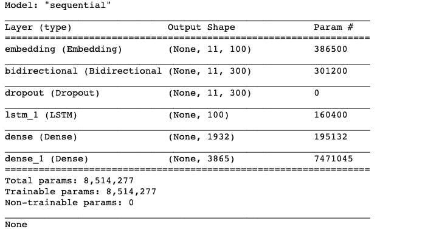
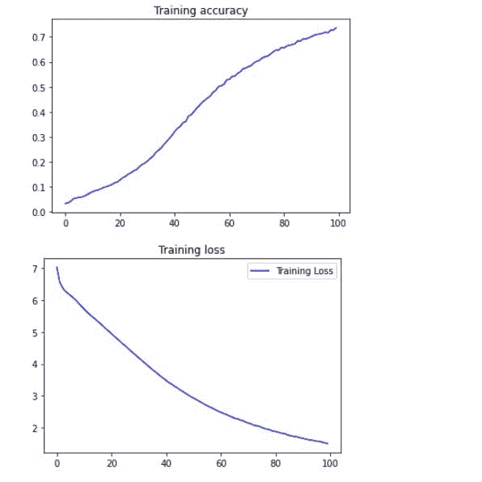
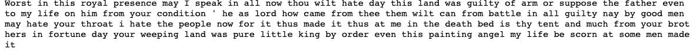

# LSTM 诗歌生成器

> 原文：<https://medium.com/analytics-vidhya/poem-generator-with-lstm-29135483d588?source=collection_archive---------15----------------------->

文本生成是机器学习的诸多突破之一。这一突破在歌曲创作、诗歌、短篇小说甚至小说的创作艺术领域派上了用场。我决定通过建立和训练一个神经网络来引导我内心的莎士比亚，该网络通过使用 LSTM 从种子文本中预测下一组单词来生成诗歌。LSTMs 是文本生成的首选模型，由于 RNNs 消失和爆炸梯度问题，它优于 RNNs。

# 数据:

我从莎士比亚小说的对话组合中获取数据，跨越 2500 行代码，并将文件保存为 txt 文件。接下来是对文件进行标记化，并使用标记列表创建输入序列。我填充了这些序列并创建了预测器和标签。

# 模型构建:

我用 Keras 建立了神经网络。我添加了一个嵌入层，双向 LSTM，20%的下降，一个 LSTM 和两个密集层组成的 ReLu 和 softmax 激活。我还添加了正则化，以防止过度拟合。我使用分类交叉熵、Adam 优化器和“准确性”指标编译了模型的损失。该模型的概要如下所示。

# 培训:

我使用 100 个历元训练模型，得到的损失为 1.5040，准确度为 0.7364。我用 matplotlib.pyplot 绘制了模型的精度和损耗，如下图所示。

# 世代:

最后，我输入了一个种子文本，这将是这首诗的来源，并将接下来的单词设置为 100。生成的诗的输出的可视化。

# 结论:

尽管这首诗的某些部分听起来毫无意义，但该模型可以调整以获得更高的准确性，并预测更有意义的诗歌。这款车型的回购可以在[这里](https://github.com/Nwosu-Ihueze/poem_generator)和我的[林肯丁简介](https://www.linkedin.com/in/rosemary-nwosu-ihueze/)找到建议和修正。