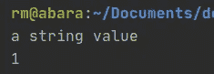
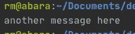
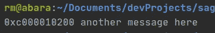
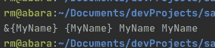
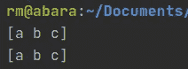
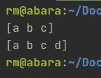
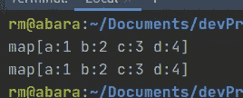
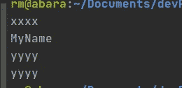
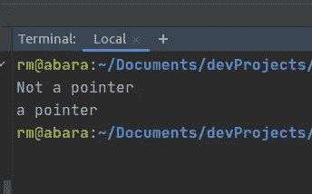

# 戈兰语的指针

> 原文：<https://medium.com/analytics-vidhya/pointers-in-golang-1a679b464849?source=collection_archive---------1----------------------->

指针是一个非常基本但非常强大的工具，但在编程时，它常常被误解并认为是一个困难或令人沮丧的概念。创建指针是为了帮助在代码中传递数据，而不必创建变量的副本，因此不会使用额外的内存。

有些语言回避这个概念，有些语言部分地接受它，但是在 Go 中我们有了它们应该有的指针:̶a̶n̶̶i̶n̶s̶t̶r̶u̶m̶e̶n̶t̶̶o̶f̶̶t̶o̶r̶t̶u̶r̶̶e 是优化性能的伟大工具。

指针是一个变量，它引用内存中某个存储值的位置，所以你取一个变量，把它放在内存中，然后不是读取实际的值，你只是得到那个值所在的地址；当您在代码中传递它时，由于它只是一个“数字”，所以移动它比实际值更便宜，实际值可能比地址长得多(这在文章的最后将很重要)。

让我们从一些代码开始:

```
package main

import (
   "fmt"
)

func main(){
   myString := "a string value"
   fmt.Println(myString)

   myInteger := 1
   fmt.Println(myInteger)
}
```

我们定义了两个变量并打印出来，还没有奇怪的行为



暂时没有指针

如果我们将一个变量发送给一个函数，那么语言将创建该参数的副本，并在函数中使用它，如下所示:

```
func myFunction(s string){
   fmt.Println(s)
}func main() {
   myOtherString := "another message here"
   myFunction(myOtherString)
}
```



当你这样做的时候， *myFunction，*接收一个字符串，它将把这个字符串赋给变量“s”，然后把它打印在屏幕上，Go(和大多数语言)将创建一个最初发送的值的副本，并在函数内部使用它，一旦函数到达末尾，垃圾收集器将获取这些变量并处理掉它们。

现在让我们使用一个指针来实现相同的行为:

```
func myFunctionWithPointers(s *string){
   fmt.Println(s, *s)
}func main() {
   myOtherString := "another message here"
   myFunctionWithPointers(&myOtherString)
}
```

这次我们用一些奇怪的字符来装饰变量:

main():与号(&)会告诉 Go，这个变量将会是一个指向这个变量的指针，Go 会查看这个变量，找出数据类型，并找出它在内存中的位置，一旦它有了那个地址，它就会把内存中的地址发送给函数。

在 myFunctionWithPointers 上:星号/星号(*)，将告诉 Go:我们将接收一个数据类型为 string 的指针，注意指针需要类型、指向 int 的指针、指向 string 的指针、指向 slice 的指针等等，这一点非常重要。一旦参数的数据类型被定义，我们将在函数体中打印它几次，首先我们将“s”作为一个指向字符串的指针，然后我们将在它前面添加一个开始，这将告诉 Go 获取该指针，然后获取存储在该位置的实际值:



0xc000010200 是内存地址，您的会有所不同

我们第一次使用变量“s”时，它是一个指针，所以我们得到了地址，第二次我们“解引用”了它，取地址，然后取那个位置的值。

现在让我们尝试使用一个结构:

```
type myStructure struct {
   Name string
}

func main() {
   structure := myStructure{Name: "MyName"}
   structureFunction(&structure)
}

func structureFunction(e *myStructure){
   fmt.Println(e, *e, e.Name, (e).Name)
}
```

这会打印出以下内容:



首先，我们打印出结构值，但前缀是&符号，这意味着它是一个指向包含这些内容的结构的指针。

当我们使用星号时，我们告诉它获取值，因此我们得到了 *{MyName}* ，这是格式化的结构值。

当你访问一个指向一个结构的指针的字段时，Go 会为你处理这个解引用，你会得到一个值，就好像它是一个结构而不是一个指向结构的指针。

最后一种用法是将结构放在括号内，这是为了指定解引用，在这种情况下这是多余的，因为 Go 会像上面看到的那样处理它。

如果我们想更新函数中的变量:

```
func main() {
   sliceValues := []string{"a","b", "c"}
   appendToSlice(sliceValues)
   fmt.Println(sliceValues)
}

func appendToSlice(c []string){
   fmt.Println(c)
   c = append(c, "d")
}
```



不使用指针将导致不更新函数上下文之外的变量。

现在让我们到处添加指针:

```
func main() {
   sliceValues := []string{"a","b", "c"}
   appendToSliceWithPointer(&sliceValues)
   fmt.Println(sliceValues)
}

func appendToSliceWithPointer(c *[]string){
   fmt.Println(*c)
   *c = append(*c, "d")
}
```

当调用函数时，这次我们将使用指针符号，当在函数中接收参数时，当我们打印值时，我们将告诉它遵从它，这样我们就可以获得切片的实际值，而不是内存位置，可能看起来令人困惑的部分是当我们追加到我们的切片时，因为追加需要一个切片，所以我们必须取消引用“c”， 添加“d”的值，然后 append 的返回值，将必须存储为“c”的值，而不是指针(我们将试图在预期的内存位置存储一个片)。



这一次，操作的寿命超过了函数的作用域

好的，这看起来很简单，但是当我们尝试绘制地图时会发生什么呢

```
func main() {
   myMap := map[string]int{
      "a": 1,
      "b": 2,
      "c": 3,
   }
   maps(myMap)
   fmt.Println(myMap)
}

func maps(c map[string]int){
   c["d"] = 4
   fmt.Println(c)
}
```



在这个例子中，对地图的更改表现不同，它在函数内部被更新，并成为原始地图的实际值，而不仅仅是副本，这是因为地图实际上是指针，所以我们真的不需要对地图做任何事情(少了一件需要担心的事情)。

猜猜看，函数也是指针:

```
func main() {
   f := &myFunc
}

func myFunc(){

}
```

所以这是行不通的，因为 myFunc 已经是一个指针了(2 个了，还有几个……)

由于指针实际上是一种数据类型，函数接收器将获得类似的行为:

```
type myStructure struct {
   Name string
}

func (ms myStructure) noPointer(){
   ms.Name = "xxxx"
   fmt.Println(ms.Name)
}

func (ms *myStructure) withPointer(){
   ms.Name = "yyyy"
   fmt.Println(ms.Name)
}

func main() {
   theStructure := myStructure{Name: "MyName"}
   theStructure.noPointer()
   fmt.Println(theStructure.Name)

   theStructure.withPointer()
   fmt.Println(theStructure.Name)
}
```



当接收器用作结构时，该值在该功能之外不受影响。

当接收器作为指针处理时，该值的行为将与我们现在预期的一样。

但是，如果您尝试直接调用该方法:

```
func (ms myStructure) noPointer(){
   fmt.Println("Not a pointer")
}

func (ms *myStructure) withPointer(){
   fmt.Println("a pointer")
}

func main() {
   myStructure{}.noPointer()
   myStructure{}.withPointer()
}
```

第二个函数“withPointer”不会运行，“withPointer”是一个链接到“指向 myStructure 的指针”数据类型的接收器，myStructure{}是 myStructure 的一个实例；我们可以通过实例化该结构，然后添加一个指向它的指针来解决这个问题:

```
type myStructure struct {
   Name string
}

func (ms myStructure) noPointer(){
   fmt.Println("Not a pointer")
}

func (ms *myStructure) withPointer(){
   fmt.Println("a pointer")
}

func main() {
   myStructure{}.noPointer()
   ms := &myStructure{}
   ms.withPointer()
}
```



好多了

这就是你开始使用指针所需要的全部内容:)

这就引出了一个问题:那么我什么时候使用指针呢？总是吗？


不知何故，这成了我最喜欢的迷因

指针可以让我们在正确传递值时节省一些内存，因为这听起来是最优的，那么我们应该总是这样做，这样我们就总是节省内存。

除非…从没人记得的文章开头提示反派…

….Go 的收垃圾的走进来…

当你传递指向函数的指针，并且该函数的作用域结束时，垃圾收集器不知道它是否应该杀死该变量(看看这篇文章以获得更详细的解释:[https://blog . gopheracademy . com/advent-2018/avoid-GC-overhead-large-heaps/](https://blog.gopheracademy.com/advent-2018/avoid-gc-overhead-large-heaps/))，然后我们最终得到的原始数据比我们希望的要多。

这会对我们产生如此大的影响以至于指针变得毫无意义吗？不尽然，GC 移除它所花费的时间会稍长一些，但在大多数情况下，它仍然是可管理的/不明显的，如果你正在考虑压缩最后一点性能，那么你将有可能尝试并优化你的指针使用，否则它将属于糟糕应用的微优化范畴。