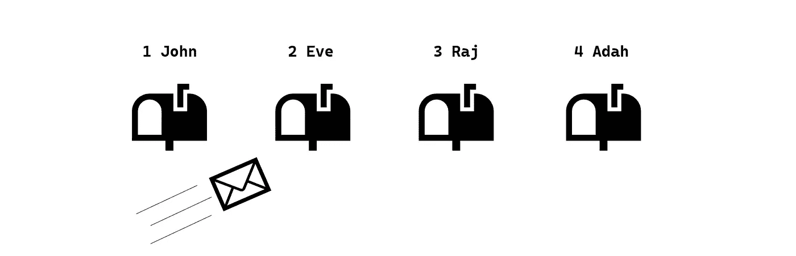

# 指针变得简单(终于……)

> 原文：<https://medium.com/analytics-vidhya/pointers-made-simple-finally-ea402684723a?source=collection_archive---------22----------------------->

## 对于程序员来说，这是一个臭名昭著、必要且简洁的主题


安德烈·梅特列夫在 [Unsplash](https://unsplash.com?utm_source=medium&utm_medium=referral) 上拍摄的照片

## 介绍

除了学生贷款和基本的社会接触，没有什么比指针的概念更让程序员害怕了。尤其是指针的引入(在大学里经常出现)对于初学者来说会非常吓人。我个人非常清楚地记得我付出了多少努力才最终达到“啊！现在我明白了！”我大学第一年的时刻。这就是为什么这篇文章将帮助你跳过那些躲在笔记本电脑后面的惊恐之夜，直接更好地理解这个主题。

为了实现这一点，本文将首先通过一个带有插图的例子在概念层面上解释指针。此后，将添加代码(在 C++中)以使用指针解决该示例。这不仅展示了指针是如何工作的，也展示了它们为什么如此重要。

## 概念层次的指针

想象一个有四个不同邮箱的邮局。每个邮箱都有一个地址，一个名字(属于所有者)和一些投递的信件。目前这四个邮箱分别属于约翰、夏娃、拉杰和阿达。

如果有人想给伊芙寄信，那个人必须知道她的地址，然后把信放进她的邮箱。Eve 随后可以访问该邮箱并取回信件。够简单吧？



这和指针本质上是同一个概念！只有用指针，地址通常被表示为十六进制数，而邮箱是对象，这使得整个事情看起来比实际上更吓人。因此，在本文中，我们将使用这个例子来使指针不那么抽象，更容易理解。

## 翻译成代码级别的指针

如果我们想编码上面显示的例子，我们首先需要制作邮箱。在 C++中，这意味着我们需要创建一个具有所有必要属性的对象(可以是类，也可以是结构)。重申一下，每个邮箱都有一个所有者、一个地址和一批已投递的信件。

```
**struct** postbox
{
  **std::string** owner = "";
  **std::vector<std::string>** letters;
};
```

这段代码片段创建了这个邮箱。所有者的名字被保存为一个字符串，字母集合被保存在一个向量中。对于不熟悉向量的人；它们本质上是长度可变的数组。这很方便，因为我们不知道每个邮箱有多少封信。

然而，前面描述的邮箱有三个属性，而这个邮箱只有两个。这是因为地址不是我们添加到邮箱中的变量，而是我们指向的变量！这就是指针有用的地方。

指针本质上是包含内存地址的变量。在 C++中声明一个指针需要一个`*`，而一个内存地址用一个`&`来表示。这种语法可能会使整个事情看起来非常模糊，但概念(如前所述)并没有真正改变。

```
**struct** postbox *****eve_address, eve;
eve_address = **&**eve;
```

这段代码创建了一个带有地址的邮箱。邮箱的名字是`eve`，指向她的邮箱地址的指针的名字是`eve_address`。我们可以将`eve_address`的指针指向她的邮箱，方法是给它邮箱的内存地址值，因为如前所述，指针只不过是一个包含内存地址的变量。

该存储器地址可以通过使用`&`来访问。这就是我们在代码片段的第二行所做的。通过给指针 eve 的地址值，我们现在可以直接进入她的邮箱了！为了了解这看起来像什么，试着通过标准输出来输出`eve_address`,这有很多十六进制术语！

## 在实践中应用指针

但是我们如何使用这个(内存)地址呢？这到底意味着什么？回到邮箱的比喻，地址是存储内容的位置。这个定义也适用于计算机内存地址。

因此，这个地址的应用是我们可以用它来访问邮箱的属性。换句话说，如果我们知道地址，我们可以给它寄信。就像真实世界一样！

```
eve_address**->**owner = "eve";
eve_address**->**letters.push_back("hey eve! how you doin?");
```

为此，使用`->`操作符。这个操作符，有些人称之为箭头，提供了对存储在特定内存地址的属性的访问。因此，如果我们想改变所有者的名字，我们使用`**->**owner =`，如果我们想给向量添加一个字母，我们使用`**->**letters.push_back()`。

既然信已经寄到了正确的地址，伊芙就可以通过指针指向的邮箱来取信了。毕竟，不管你是发件人还是收件人，地址都是一样的。向量的第一个字母是数字零，所以使用`std::cout << eve.letters[0];`来访问它。看来伊芙交了很多朋友…

## 最后的话

指针是一个臭名昭著的话题。这篇文章希望展示的是，即使使用了所有的语法术语，这个概念也是非常简单和直观的。重要的是要记住，即使指针的应用变得更加复杂，本文中展示的原则仍然适用。所以，如果你曾经被困在使用指针，似乎没有出路？写出你的代码并使用简单的隐喻，这真的很有帮助。

如果您想继续试验代码并了解更多，请随意。本文中使用的完整源代码在下面的要点中给出。谢谢你看我的文章！