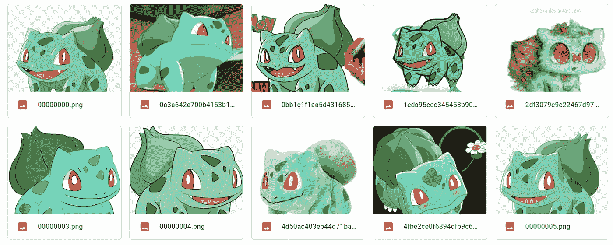
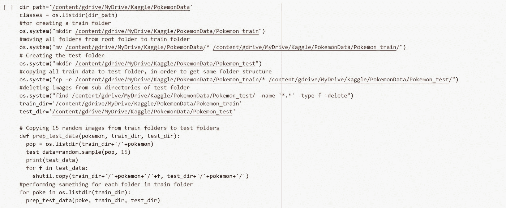
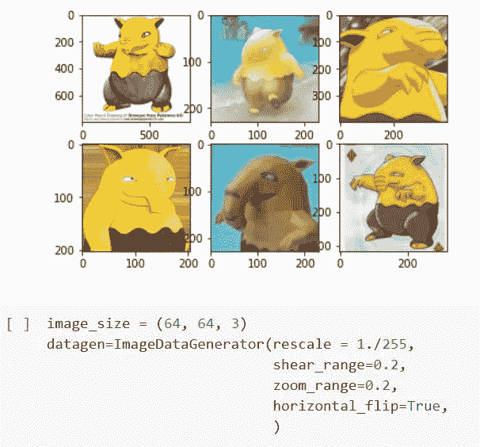
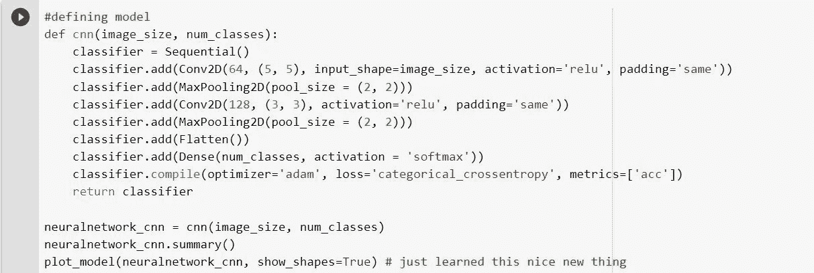
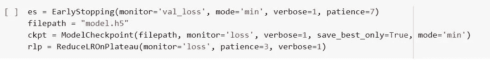
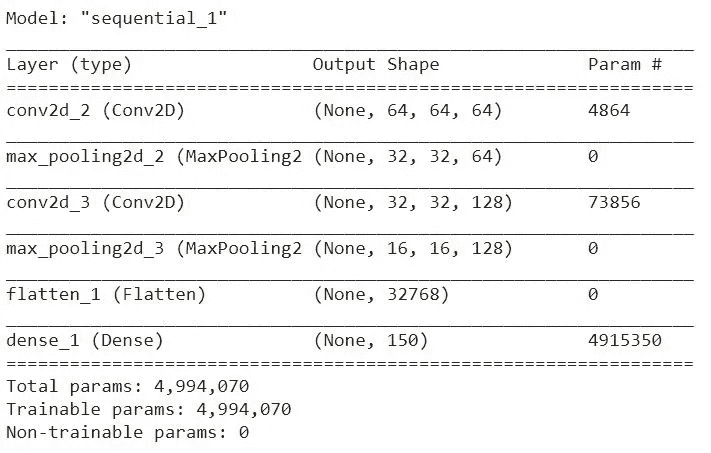
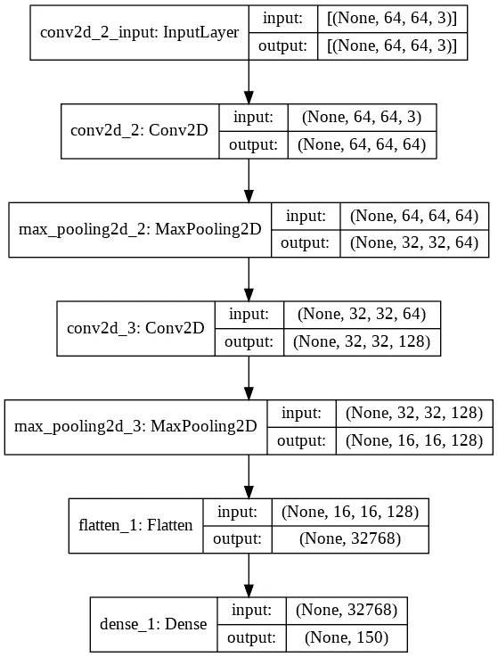
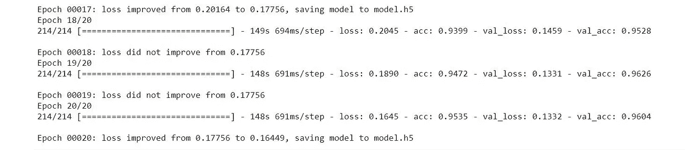
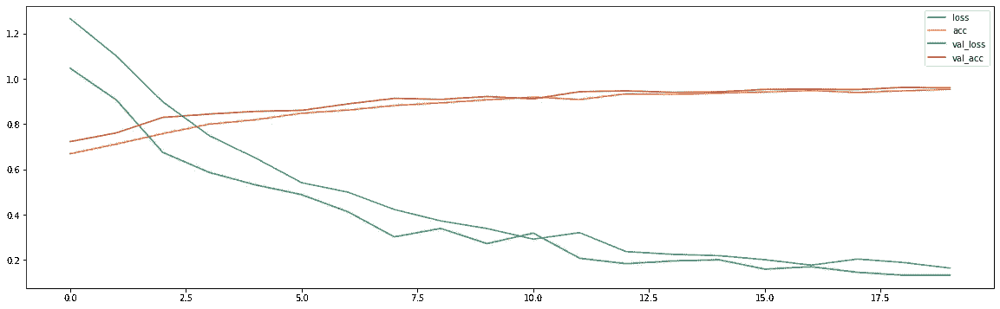

# 使用 CNN 进行神奇宝贝分类

> 原文：<https://medium.com/analytics-vidhya/pok%C3%A9mon-classification-974a10621381?source=collection_archive---------6----------------------->

本研究的目的是使用卷积神经网络模型对口袋妖怪的图像进行分类。

在该模型中，第一代神奇宝贝的经过良好处理的图像被输入到卷积神经网络模型，该模型在验证集上实现了 96%的良好精度。

实现是[这里的](https://colab.research.google.com/drive/1a5FPyRIa8XREa9EmeXGv5rga5djUmmhJ?usp=sharing)。

**关于数据集**

该数据集由 Kaggle 上的[兰斯张](https://www.kaggle.com/lantian773030/pokemonclassification)提供。该数据集由第一代的所有 150 个神奇宝贝组成。在这个数据集中，每个神奇宝贝类别大约有 25-50 张图片。提供的大多数图像都非常详细，并且有正确的标签，这反过来导致了我们的模型如此出色的性能。此外，这些图像的分辨率不是非常高，因此这个数据集对于简单的深度学习项目来说几乎是理想的。

**数据集预处理**

根据这个数据集的作者张(Lance Zhang)的解释，他不得不在这个夏天做一个神奇宝贝的分类项目。作者没有找到可行的数据集，因此决定自己创建一个。作者仔细检查了每一张图片，裁剪掉错误标注的图片，提高了图片的质量。这产生了定义良好且经过处理的数据集。

直接来自原始数据集的样本图像

有 150 种神奇宝贝，由超高质量的图像组成。在这个数据集中，几乎所有的神奇宝贝图像都是由图像中心的神奇宝贝组成的。

因为数据集是以简单目录的形式直接提供的，所以我必须将它分成两部分(训练集和测试集)。当然，训练集被进一步分为训练集和验证集。

首先，使用 Kaggle API 将数据集从 Kaggle 导入 Colab。这一过程节省了大量互联网和时间，因为它允许用户立即导入和使用任何大小的数据集，而无需浪费互联网来下载数据集。我从这篇文章中得到帮助，将数据集导入到我的 colab 文件中。

在下图中，我描述了创建训练、验证和测试集的整个过程。

为了更好的执行，单独运行每个代码

**图像处理**

根据该术语的技术定义，图像处理是通过使用复杂算法对图像进行的技术分析。这里，我们使用图像作为输入，输出作为有用的信息返回。

这些数据集的图像处理中使用的参数是:

*   image_size(高度，宽度)为(64，64)。诸如(512，512)的非常大的图像尺寸会导致非常长的训练时间。同样，较小的图像大小(如(8，8))会导致图像的细节非常少，最终会对模型的性能产生负面影响。然而，这并不意味着我们不应该使用小尺寸或非常大的尺寸。这取决于数据集，如果数据集是像颜色一样的图像，那么图像大小就无关紧要了，因为小图像也会像大图像一样显示红色。但是，对于像啮齿动物这样的图像来说，情况正好相反。
*   batch_size()是一个超参数，它简单地定义了在更新内部模型参数之前要处理的样本数。这里，我们将 batch_size 取为“32”，这表示在我们总共“7000”个图像中，我们的内部模型参数将在 32 个样本中的每一个样本之后更新。
*   class_mode()，这里我用 class _mode 作为“分类”。它决定了返回的标签数组的类型，在“类别”的情况下，它将是 2D 一键编码标签。在“无”的情况下，将不会返回任何标签，即生成器将只生成成批的图像数据，这对与 model.predict_generator()一起使用很有用。
*   color_mode()，顾名思义，这个参数只是用来决定用户愿意在他的模型中使用哪种 color_mode。这因数据集而异。例如，在 x 光图像的情况下，我们不喜欢“rgb”。

图像处理参数(上图所示为预处理前的图像)

**定义模型**

对于神奇宝贝图像分类，我们定义了一个具有七层的卷积神经网络模型。这里，2 层具有 ReLU(整流线性单元),最后一层具有“Softmax”激活功能。

定义模型

softmax 函数通常用作预测多项式概率分布的神经网络模型的输出层中的激活函数。也就是说，softmax 用作多类分类问题的激活函数，因为在这种情况下，我们有多类神奇宝贝。此外，softmax 非常有用，因为它将分数转换为归一化的概率分布，该分布可以在以后显示给用户，或者可以用作其他系统的输入。因此，通常附加一个 softmax 函数作为神经网络的最后一层。

现在，根据分类，使用分类交叉熵损失函数编译模型。“Adam”被用作优化器，也是因为它能够根据情况自行调整模型的学习速率。

**回调**

我们在定义模型时使用了各种回调。回调只是一个可以在训练的不同阶段执行动作的对象(例如，在一个时期的开始或结束时，在单个批次之前或之后，等等)。我们在模型中使用了以下回调函数:

*   提前停止:用于在受监控的指标停止改善时停止训练。
*   降低平稳状态下的 LR:用于在指标停止改善时降低学习率。
*   模型检查点:用于以一定的频率保存 Keras 模型或模型权重。

复试

**模型总结**

模型摘要

**模型可视化**

使用 plot_model()实现模型可视化

**推论**

该模型在验证集和测试集上分别达到了 96%和 95%的极高准确率。

准确性指标

**图表**

损失、准确度、验证损失和验证准确度之间的图表。

*   “损失”代表培训损失
*   “acc”代表训练准确度
*   “val_loss”代表验证准确性
*   “val_acc”代表验证准确度

损失和准确性之间的图表