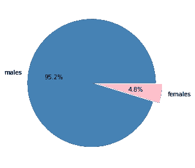

# 美国的警察枪击事件——一个简单的数据分析。

> 原文：<https://medium.com/analytics-vidhya/police-shootings-in-the-us-a-simple-data-analysis-bbf5be1feeaa?source=collection_archive---------8----------------------->

警察暴力近年来一直是一个热门话题，抗议活动在不同国家涌现，各种社交媒体平台上出现了各种标签。许多显示警察对个人过度使用武力的视频已经成为趋势，并经常在社交媒体上引起愤怒。在许多情况下，这些残酷的场景以受害者的死亡而告终。这就是为什么我热衷于探索在 [Kaggle](https://www.kaggle.com/ahsen1330/us-police-shootings) 上发现的警察枪击数据集，看看从中能学到什么。

该数据集记录了 2015 年至 2020 年间美国警察实施的枪击事件。它包含了被警察射杀的人的名单，有日期，跨越不同的城市。它也有受害者的年龄、性别、种族、是否携带武器等细节。

我研究了数据集的最后 3000 行，其中包括 2017 年至 2020 年发生的致命枪击事件。我使用 Python 数据科学库进行分析。调查结果如下。

这是 [Github](https://github.com/aisha-rm/Kadatemy/blob/main/DDATA%20ANALYSIS%20Assignment%20for%20reporting.ipynb) 上完整数据分析的链接。

# **综合统计**

大多数受害者是年轻人，年龄在 30-40 岁之间，其中男性约占 95%。只有大约 5%的受害者是女性。从绝对数字来看，更多的白人遭到致命枪击(1498 人死亡)，其次是黑人(798 人死亡)和西班牙裔(565 人死亡)。然而，根据该国的人口构成将这些数字标准化后显示，黑人遭受致命警察枪击的次数几乎是其他任何群体的三倍。2020 年，大约 10 万名白人中有 0.1 人被警察枪杀，而 10 万名黑人中只有 0.25 人被枪杀。

大约 96%的受害者遭到枪击，而 4 %的受害者同时遭到枪击和泰瑟枪袭击。在某些情况下，这些人持有武器。枪支是最常见的武器，其次是利器。总共 3000 人中有 200 人没有武器，而 4 人有炸药。

2017 年至 2019 年，枪击案数量继续保持高位(每年超过 800 起)，变化不大，然后在 2020 年下降了一半。这种下降不太可能与人体摄像头的使用有关，因为人体摄像头的使用实际上在 2020 年有所下降，在前 3 年的上升非常小。这些致命事件中有很大一部分没有人体摄像头记录。

# 前进...

很高兴终于看到从 2020 年起警察开枪的数量下降了。我想知道抗议活动或路人记录事件是否对此产生了影响，当然，锁定是否使一些人免于超过 Covid 19。我很想分析 2021 年底的数据，看看这种下降趋势是否会持续下去。

感谢您阅读我的第一份报告！！我希望你喜欢它。请分享你的想法来帮助我改进。