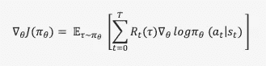
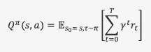

# RL 中的政策和价值功能:强化和 SARSA

> 原文：<https://medium.com/analytics-vidhya/policy-and-value-functions-in-rl-reinforce-and-sarsa-f4418dbfc193?source=collection_archive---------3----------------------->

[艾迪尔·华](https://unsplash.com/@aideal?utm_source=medium&utm_medium=referral)在 [Unsplash](https://unsplash.com?utm_source=medium&utm_medium=referral) 上的照片

## 介绍

在强化学习(RL)中，有两种重要的功能类型决定了主体在其环境中的行为。可以使用策略函数或值函数来控制代理的动作。基于策略的 RL 系统使用状态/动作概率来规划其对环境的动作，而基于奖励的 RL 系统使用奖励函数来确定其在环境中的动作。我们将从概念上讨论这两种算法类型，并通过一些简单的数学方法来计算这些算法——即分别为 REINFORCE 和 SARSA。注意:这些概念可以在 Laura Graesser 和 Wah Loon Keng 的*“Python 中深度强化学习理论和实践的基础”*中进行全面的回顾。

## 强化算法

在强化学习(RL)中，代理通过一个*策略函数与其环境交互。**策略功能*指示代理将在其环境中做什么。在我们的例子中，策略(piθ)将状态映射到动作概率。在理解策略函数时要引入的第一个元素是目标函数。一个目标函数告诉我们 RL 系统的 ***目标*** ，比如获得可能的最高分或者赢得比赛。在这个 RL 系统中，目标函数是:

本质上，使用梯度上升的目标函数的最大化为我们提供了如下的政策梯度:

政策梯度是一种机制，通过这种机制，梯度产生的行动概率被改变。尽管数学很复杂，但要理解方程相对于θ的微分(微积分)将为我们提供*代理*到达其 ***目标*** 的“路径”。

## SARSA 算法

接下来，我们将讨论 RL 中的值函数，它可以写成:

价值函数试图(使用梯度上升)最大化一个 RL 系统的*回报*，以便代理基于回报选择其行动。RL 中处理操纵值函数或 Q 函数的分支称为 Q 学习。

有几个概念是 Q 函数的结果。首先，𝛾(伽玛)项决定了系统学习的速度。第二，*探索与开发*权衡以及𝜺(*ε)-贪婪*算法。

## 伽马项

请注意，在 q 函数中有一个𝛾项，也称为贴现因子。它是报酬的乘数。如果𝛾很小，那么 RL 系统只关心不久的将来的步骤，而一个大的𝛾会使 RL 系统关心最终目标或未来的更多步骤。小𝛾导致更快的学习。对于许多应用程序来说，0.99𝛾是一个很好的默认值。

## 探索与开发的权衡&𝜺(ε)贪婪算法

因为我们最大化了决定 RL 系统行为的 Q 函数，所以我们说这个算法是*“贪婪的”*𝜺(epsilon)是决定*函数有多贪婪的一个因素。奖励函数由(1 - 𝜺)确定，因此如果𝜺高(值=1.0)，函数变得不太确定，因为奖励都等于 0，RL 系统随机选择，使其“探索”低𝜺奖励函数在决策中高度敏感，导致“剥削”*

## 结论

可以使用策略(pi)或基于值的算法(分别为加强和 SARSA)来控制 RL 系统。策略算法利用它们的**目标**函数来决定行为，而基于值的算法利用**奖励**函数来决定行为。Q-learning 已经应用于需要优化配置的计算机系统。它可以应用于新闻推荐系统，其中有一个动态的方法来满足用户的口味(它采用实时用户偏好，并使用 Q-learning 进行更改)。Q-learning 可用于最大化交通灯控制，以学习交通拥堵时间并相应地确定灯。在更复杂的任务中，基于策略的算法往往工作得更好，因为它学习随机策略，而 Q-learning 涉及更连续的样本空间。随机策略如何胜过 Q 学习的一个例子是在石头/布/剪刀中。如果一个玩家每次都玩石头，Q 学习方法就不起作用，因为它的回报会告诉系统每次输出相同的结果，而随机策略可以改变输出。

可以使用这些政策的组合，研究似乎指向那个方向。我希望这个 RL 算法的简单介绍能对这个主题有所启发。祝你今天开心！玩的开心！