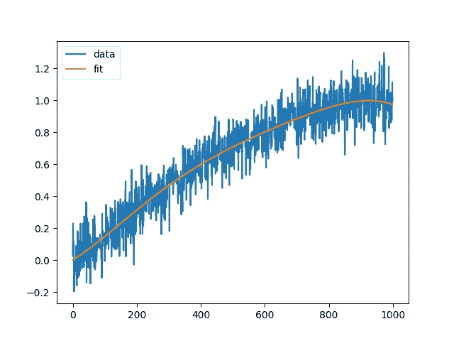

# Python 中的多项式拟合仅使用一行代码

> 原文：<https://medium.com/analytics-vidhya/polynomial-fitting-in-python-using-just-one-line-of-code-f1638a4b3678?source=collection_archive---------0----------------------->

当我们想要确定或模拟两组数据之间的关系时，曲线拟合是一个强大的工具，它是通过在整个范围内找到最佳拟合函数或曲线来实现的。然后，该函数可用于在给定范围内对数据进行插值，或外推该范围之外的可能值。

曲线拟合最常见的形式是线性回归，在这种情况下，我们找到最能描述一个变量与另一个变量之间关系的直线，并使用该直线进行预测。然而，我们都知道大多数数据不是线性关系，多项式是一种更好的拟合方式。

多项式拟合遵循与线性拟合相同的概念，但在这里，我们使用 n 次多项式来描述数据之间的关系。然而，两者都使用最小二乘法来确定最佳拟合函数。

在 python 中，最常见的曲线拟合方法是使用 Scipy 中的曲线拟合函数。

```
from scipy.optimize import curve_fit
```

这是一个很好的方法，因为该方法可以用于拟合所有函数，而不仅仅是多项式，并且您需要更改的唯一代码是您想要在数据中拟合的函数的代码。

然而，当您想要找到最适合您的数据的最佳程度时，至少在多项式拟合中会出现一个问题。是的，你仍然可以为此写一个函数，但是这实际上使编码部分变得复杂，给你更少的时间去做实际的分析。

好在 numpy 内置了 fitting 函数，只需调用 [numpy.polyfit](https://numpy.org/doc/stable/reference/generated/numpy.polyfit.html) 即可调用。

下面是一个示例代码，使用它来代替 python 中常用的曲线拟合方法。



上面的代码显示了如何将五次多项式拟合到正弦波的上升部分。使用这种方法，您可以轻松地循环不同的 n 次多项式，以查看最适合您的数据的多项式。

实际装配发生在

```
poly = np.polyfit(x, sine, deg=5)
```

此方法返回最佳拟合多项式的系数，从最高阶开始到常数。

功能:

```
np.polyval(poly, x)
```

然后可用于使用找到的系数计算多项式的独立变量 x。