# 多项式 Regression〰️

> 原文：<https://medium.com/analytics-vidhya/polynomial-regression-%EF%B8%8F-e0e20bfbe9d5?source=collection_archive---------12----------------------->

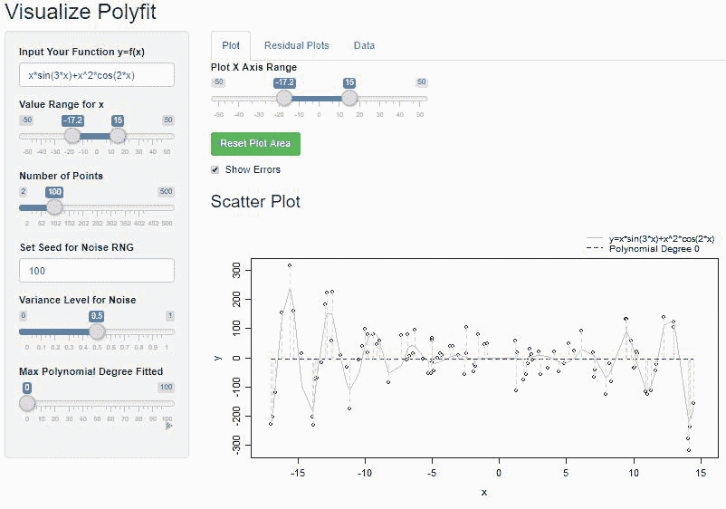

[http://stevenlio.shinyapps.io/polyfit](http://stevenlio.shinyapps.io/polyfit)

# **简介**

我是线性代数的信徒，总是着迷于它强大的应用。线性回归是我学到的线性代数的第一个应用。简单来说，线性回归就是通过最小化数据与回归函数之间的距离，来概化一个标量变量(因变量~ *y* )与一个或多个解释变量(自变量~ *x* )之间的线性关系的过程。*又称简单线性回归中的最佳拟合线*。

# **问题**

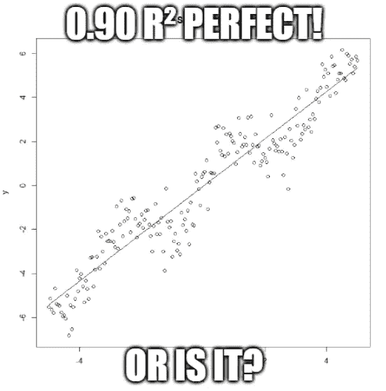

但是…世界🌎是一个有趣的地方，纯粹的线性关系很少存在，事情喜欢以某种方式相互关联。因此，成功应用线性回归的线性关系和多重共线性假设在大多数情况下都会被违反。 *R，MSE* (均方误差)经常被引用作为回归模型好坏的指标。但是这些指标和数据建模中的许多其他指标一样，并不完美。(看你——相关性，ROC，p 值等。)

这里有一个著名的例证——[**安斯康贝的四重奏**](https://en.wikipedia.org/wiki/Anscombe%27s_quartet) 。

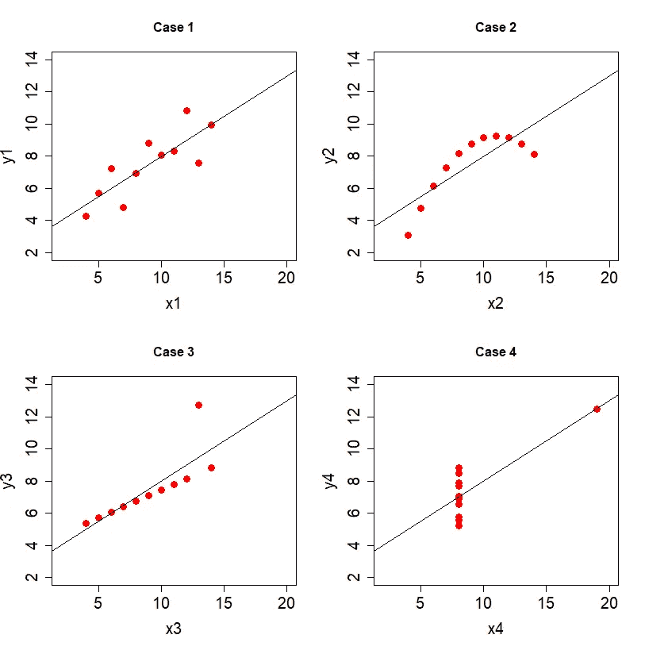

这四组数据看起来非常不同，但所有的描述性统计数据都是相同的，并且“最佳拟合线”的行为也完全相同。这里 *x* 与 *y* 的相关性为 *0.816* ，回归线为**y = 3.0+0.5x****R*为 *0.67* 。但细看剧情，很明显除了**案例 1** “最佳拟合”的直线对其他案例有意义吗？*

*   ***情况 1:***x1*和 *y1* 之间的简单线性关系可能是最好的假设，可以很容易地建模。*
*   ***案例二:**数据看起来像一个倒抛物线的一部分，因此 *x2* 和 *y2* 肯定不是线性关系。*
*   ***案例三:**似乎有一个*异常值充当了一个非常 [***高杠杆* *点***](https://en.wikipedia.org/wiki/Leverage_(statistics))*到回归线。即，线的斜率对这一点非常敏感，但是简单地排除这个 ***异常值*** 将产生完美的线。***
*   ****案例 4:** 另一种类型的 a [***高杠杆点***](https://en.wikipedia.org/wiki/Leverage_(statistics)) ，与**案例 3** 不同，排除此点不会产生完美的线条，因为 *y4* 具有不同的值，而 *x4* 仍保持在 *8* 。即 *x4* 和 *y4* 之间几乎没有关系**

**总的来说，**案例 3** 和 **4** 在决定线性回归是否是建模这些数据的好选择之前，需要更好地理解数据。但是对于**情况 2** ，一条“直线”可能还是可以的。**

**当数据不像*对数变换*那样线性时，有许多简单的[技巧](https://en.wikipedia.org/wiki/Data_transformation_(statistics))可以应用于数据。但是在处理**非线性数据**时，大多数情况可以归纳在**曲线拟合**的主题下。当数据没有随机噪声时，寻找最佳拟合曲线的问题就变成了 [**插值**](https://en.wikipedia.org/wiki/Interpolation) 的问题。**

# ****想法****

****曲线拟合**是构建一条曲线的过程——一个对一系列数据点具有最佳拟合的数学函数。曲线拟合常用于 ***插值*** ，从一个未知函数中抽取随机样本，并寻找通过每个样本点的最佳曲线。**

**此外，在工程中，在 ***信号处理*** 或 ***平滑*** 中，引入了一些随机噪声，或者数据是由一些底层函数生成的，其中构造了一个更简单的“ ***平滑*** ”函数，它可以近似拟合数据，并理解所记录信号的趋势或特征。**

**这是一个多项式函数，其形式为:**

**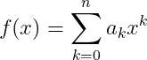**

**系数**为常数，***n*** 表示多项式的最高次。****

****当 k=0(常数)时:****

**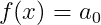**

****当 k=1 时(a *直线*就像 *y = mx + b* ):****

**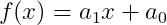**

****当 k=2 时(二次多项式又称*抛物线*或*四次函数* ):****

**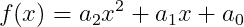**

****那么当 k=n ( *n* 次多项式):****

**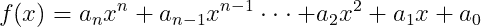**

**你可能会问，这有什么关系，让我们看看下面的例子。让我们从函数中生成随机点:**

**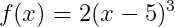******

**人们怎么可能找到一条“线性”线来拟合这条曲线呢？这里的小数学称为 [***多项式展开***](https://en.wikipedia.org/wiki/Polynomial_expansion#:~:text=Expansion%20of%20a%20polynomial%20expression,sum%20of%20(repeated)%20products.) :**

**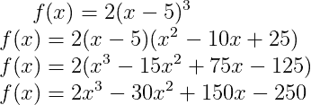**

**我们可以看到这是一个 3 次多项式，因为最高次数项是 3。但一旦你仔细观察，这看起来不正是一条有 3 个独立变量的回归线吗？**

**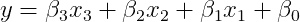**

**既然这样**

**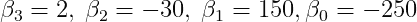**

**这里我们可以看到每个自变量( *x* )对应每个多项式次数项 *xᵏ* 。**

**考虑到这一点，那么我们也许可以通过计算 *x，x，x* …，基于样本点的 *x* 坐标创建新的独立变量。并添加到线性回归模型，而不是 1 个独立变量，我们现在有 3 个。**

**当我们不知道数据的基本功能时，我们可以慢慢地添加更高次的项，并重新评估拟合，但这几乎与猜测和假设数据来自多项式一样好。此外，多项式的次数没有限制，因此我们将花费无限的时间来测试每一个多项式，次数越高，多项式的表现就越激进，这会导致数据过度拟合(稍后解释)。**

# ****在实践中****

**为了说明这一点，我使用 R Shiny 构建了这个可视化工具。让我们尝试使用 0 次多项式(即常数)来拟合曲线:**

**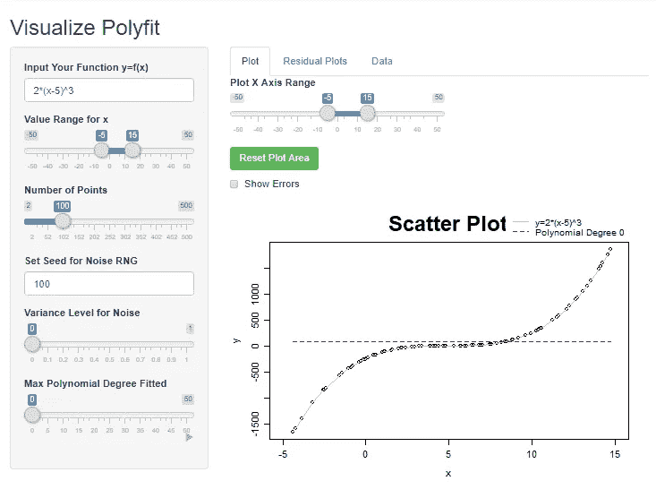**

*   ****度-0 ( *y=a* )****

**不出所料，拟合数据的最佳直线是 ***y=78.4*** ，它实质上是样本点的平均值。由于原始数据的对称性，常数线对于多项式的零点附近的值匹配得很好，但是对于两个尾端很差。**

****

*   ****度-1 ( *y=mx+b* )****

**啊！线性回归会尽力用一条直线来拟合这个非线性数据。如果最高次项的前导系数是“大”的，那么 3 次多项式可以像直线一样工作。但不幸的是，在这种情况下没有。**

**回归线为
***y = 104.8 x-484.8*****

**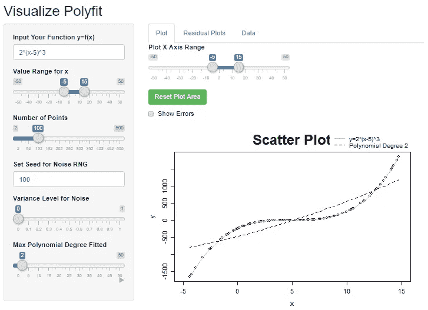**

*   ****度-2 ( *y=ax +bx+c* )****

**嗯……看起来是一条稍微弯曲的线。抛物线由***y = 2.08 x+81.8 x-477.324***和 1 次项的系数( *81.8* )远大于 ***x*** 项的系数( *2.08* )。即 ***x*** 变化时，1 次项比 ***x*** 更有权重，产生一个很宽的抛物线。**

**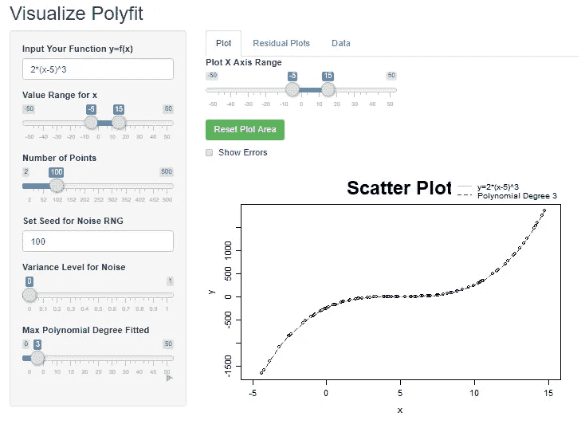**

*   ****度-3(y =*ax**+bx+CX+d*)****

**不足为奇，当我们拟合一个 3 次多项式时，它将完美地拟合数据。3 次多项式是***y = 2x-30x+150 x–250***这是我们展开 ***y=2(x-5)*** 时所预期的。显然，我们通常不会知道底层函数。**

**你很幸运，那是一个多项式！正弦，余弦，对数，eˣ，你的例子太完美了！**

**令人惊讶的是，一个 n 次多项式可以很好地逼近这些函数。试想一下，正弦曲线只是一串正负抛物线或者一个很高次的多项式！**

**但是现在要小心，如果操作得当，这种方法可以很好地拟合您的数据，但是最佳拟合曲线只不过是拟合或插值数据。在某些情况下，做出预测或弄清楚变量之间的真实关系是很糟糕的。**

**例如，如果您正在处理具有未知周期行为的数据，如一天中的温度变化或海啸等。，我们更感兴趣的是知道周期和最大振幅。**当超出训练数据特别用于周期性数据的周期时，拟合多项式不会给出正确的预测。****

**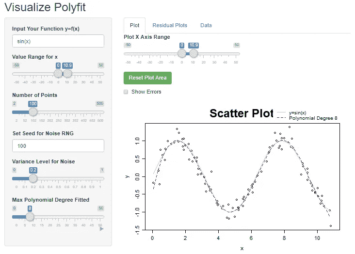**

**但是谁说我们不能用所有已知函数组成的“变量”来拟合一条“线性”线？喜欢**

**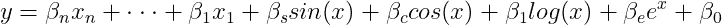**

**这实际上被称为自变量( *x* )的线性变换。引入线性变换的自变量，改善 *x* 和 *y* 之间的线性关系。**

**这导致许多其他曲线拟合技术，如使用级数展开，如具有确定项数的 [*傅立叶级数*](https://en.wikipedia.org/wiki/Fourier_series) *、* [*泰勒级数*](https://en.wikipedia.org/wiki/Taylor_series) 。**

**为了好玩，让我们看看多项式如何拟合更复杂的曲线。**

**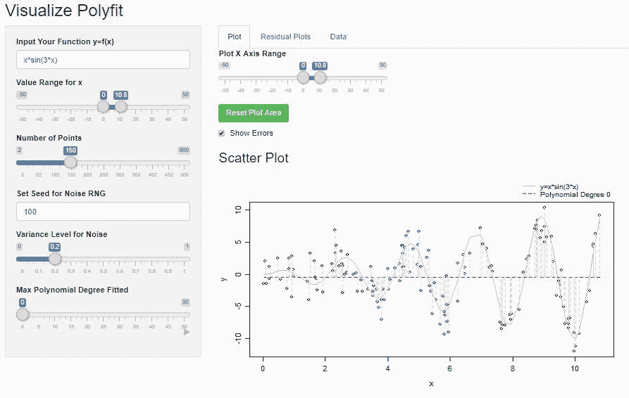**

**以上是函数 *x sin(3x)* 使用 0 次到 50 次多项式范围的曲线拟合过程。您可以看到它逼近训练数据的速度有多快。在多项式中增加更高次的项，弯曲的数量也增加，因此给出足够高次的多项式，它可以模拟正弦曲线的周期模式。但是如上所述，它只能用于拟合给定的训练数据，而不能提供有效的预测。**

# ****弊端****

*   ****性能:****

**为了使用 n 次多项式进行曲线拟合，您需要计算从 0 次到 n 次的输入数据向量(即，给定输入向量 *x* ，您将需要计算 *x⁰,x ,…,xⁿ* 。)因此，根据您的数据和 n 次多项式，训练数据可能会很快变大，其中的值可能会很大。(例如 5 ⁰ = 9.5367432e+13)**

**对于数据插值(低方差)，有更简单的方法使用多项式进行曲线拟合，而无需求解大型矩阵的逆矩阵。(如 [*内维尔算法*](https://en.wikipedia.org/wiki/Neville%27s_algorithm#:~:text=In%20mathematics%2C%20Neville's%20algorithm%20is,Neville's%20algorithm%20evaluates%20this%20polynomial.) )。但是当你有不完善的数据时(由于样本差异)，也可以使用其他先进的 ML 方法。**

*   ****过拟合:****

**就其提供的“弯曲”数量而言，高次多项式确实提供了更多的“灵活性”。比如:**

**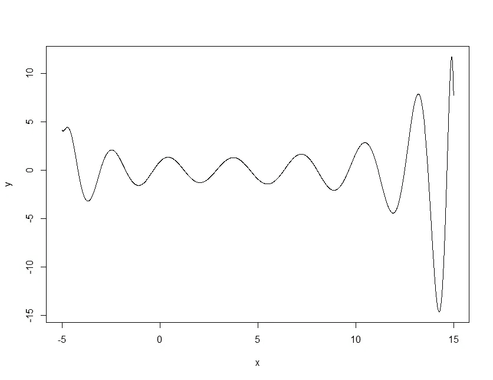**

**这是一个 20 次多项式，用于拟合 *x sin(3x)* 。多项式的这个性质让我们可以在定义的范围内近似正弦波。**

**这也会导致过度拟合。这里有另一个例子来说明这一点:**

**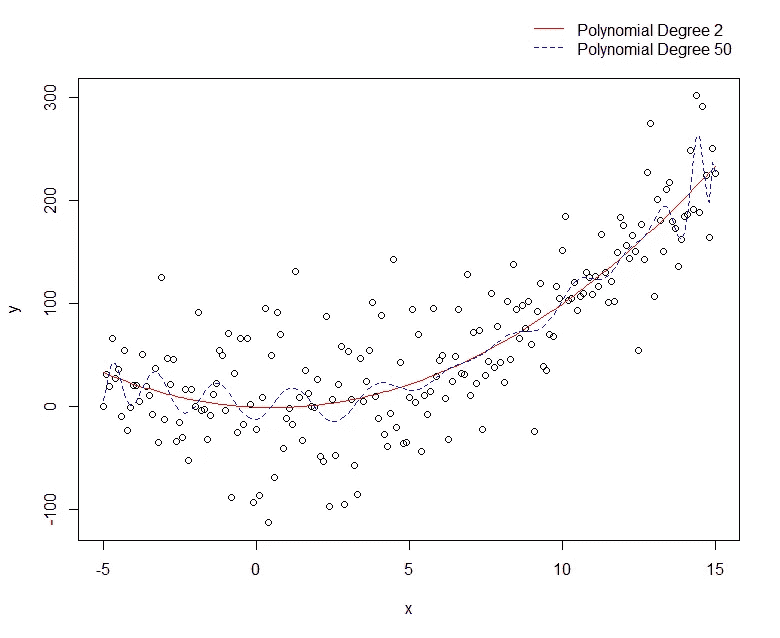**

**该数据由添加了随机噪声的简单 x 曲线生成。使用 2 次多项式(红色)和 50 次多项式(蓝色)比较曲线拟合。蓝色曲线的 *MSE* 为 ***2398.269*** ，红色曲线的 *MSE* 为 ***1988.317*** *。***

**50 次多项式提供了额外的弯曲，能够在空间中摆动，并能够到达更多较低次数多项式不能到达的点，因此它提供了更好的 *MSE* ，但随后产生的模型也更加复杂，并过度拟合数据集。**

**一种快速查看是否可能过度拟合数据的方法是，每次添加拟合的高次项时，查看 *MSE* 的变化。**

**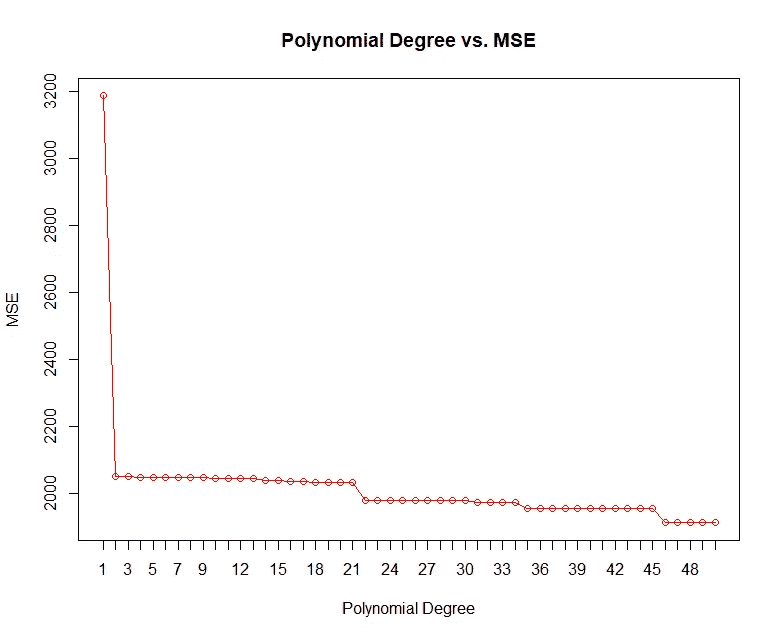**

**我们可以看到 *MSE* 随着高阶项的增加而缩小。尽管不断增加更高的学位术语，但有时 MSE 确实完全改变了。这里我们可以用 [*肘法*](https://en.wikipedia.org/wiki/Elbow_method_(clustering)) 它告诉我们当多项式次数为 2 时， *MSE* 减少最多。这是显而易见的，因为数据是由 2 次多项式生成的。因此，与其使用-50 度，我们还不如使用-2 度，牺牲一些准确性。**

# ****结论****

**总之，上面的例子实际上不是从一个简单的 x 生成的，它实际上是一个*正弦*曲线的微小部分，它实际上是从一个 x *⁰⁰⁰⁰* 多项式生成的，反正谁知道。关键是我们找到了一种稳健的方法来建模我们的数据，如果我们愿意做出一些牺牲，我们可能会更好地了解我们周围的世界。**

> **许多统计学家认为，所有的模型都是错误的，但有些是有用的。**

**还有，当你有疑问时，把它们画出来！**

**感谢您的阅读！🐣**

# ****附言****

**可视化工具可供您在以下位置使用:**

 **[## 可视化多边形拟合

### 编辑描述

斯蒂文利奥](https://stevenlio.shinyapps.io/polyfit/)** 

**Github:**

**[https://github.com/stevenlio88/Polyfit](https://github.com/stevenlio88/Polyfit)**

**或者在 R:**

```
**install.packages(“shiny”)
library(shiny)runGitHub("Polyfit","stevenlio88")**
```