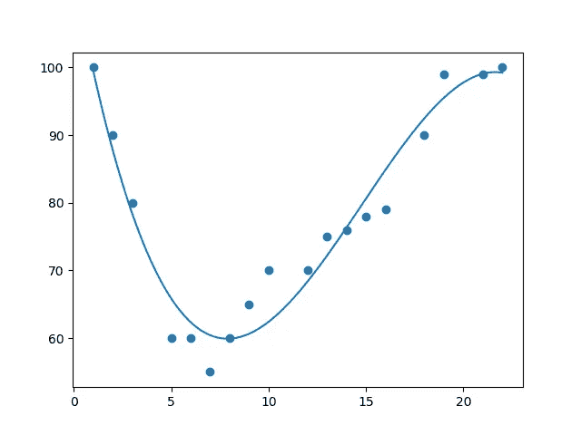
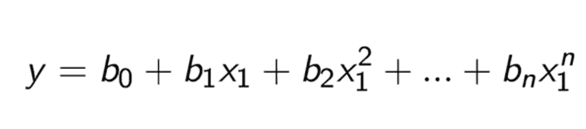
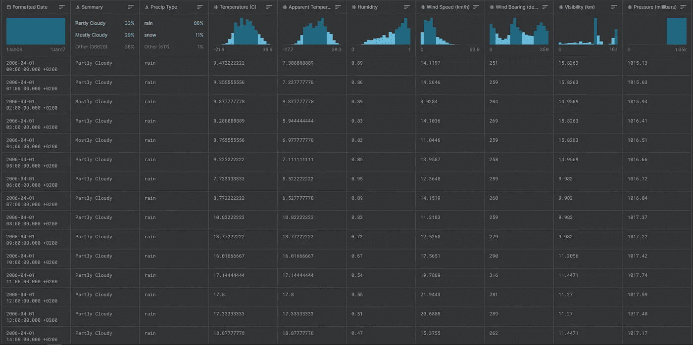

# Python 中的多项式回归

> 原文：<https://medium.com/analytics-vidhya/polynomial-regression-in-python-4a7c60e8c902?source=collection_archive---------10----------------------->

多项式回归

当您的线性回归算法(穿过数据集的直线)无法拟合数据点时，那么使用**多项式回归(PR)** 可能是理想的。

## 多项式回归:

多项式回归是自变量(X)和因变量(y)之间的**非线性**关系，建模为 X 中的 *n* 次多项式

> 问:如果它是非线性的，那么为什么它被称为多项式线性回归？
> 
> 回答:是线性回归的形式。在每个线性回归方程中，为了找到因变量(y)的值，我们首先需要找到系数(b1，b2，…，bn)和截距(b0)的值。对于自变量(X)的任何值，系数和截距的值将保持不变。在多项式回归中，我们做同样的事情，这就是为什么它被称为多项式线性回归。

多项式线性回归方程

现在，是时候使用 python 编写多项式回归代码了，

**最后我会给出代码的链接！！！**

## 1.首先，我们必须导入将用于训练模型的库和数据集。

下载数据集的链接:[https://www.kaggle.com/jaspreet007bhatia/weather-history](https://www.kaggle.com/jaspreet007bhatia/weather-history)

天气历史数据

## 2.现在我们需要清理我们的数据，

*   我们必须检查是否有丢失的值。
*   现在，我们将删除不必要的列，如“**格式的日期**列。
*   之后，我们需要**编码分类数据**意味着，我们将把我们的字符串值转换成 1 和 0。
*   最后，我们将数据集分成**独立(X)** 和**非独立(y)** 变量。

## 3.是时候将数据集分成训练集和测试集了，

我们将数据集分为训练集和测试集，以避免数据差异的影响。我们将把大部分数据分成一个训练集和一小部分测试集。

## 4.训练数据集，

为了训练数据集，我们将使用 scikit-learn 库中的**多项式特性**和**线性回归**类。

*   使用**多项式特性**类，我们将定义多项式的次数。
*   我们将使用 **LinearRegression** 类来训练数据集。

## 5.预测结果，

使用 predict()方法，我们将预测测试数据集的结果，或者我们也可以预测我们自己的结果。

## 6.系数和拦截器，

为了完成多项式回归方程，我们需要系数和截距的值。

代码链接:

> Kaggle 笔记本代码链接:[https://www.kaggle.com/rahulkadam0909/polynomial](https://www.kaggle.com/rahulkadam0909/polynomial)
> 
> Github 代码链接:[https://github . com/RAHUL-KAD/Machine-Learning/blob/main/Regrassion/Code/多项式 _ 回归. ipynb](https://github.com/RAHUL-KAD/Machine-Learning/blob/main/Regrassion/Code/Polynomial_Regression.ipynb)

> 编码快乐！！！