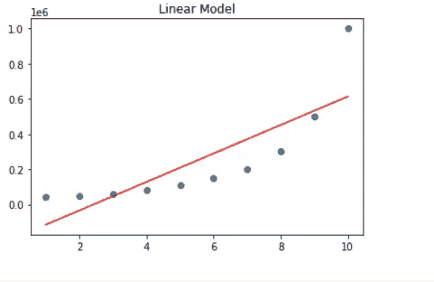

# Python 中的多项式回归。— ML 代表懒惰 2021

> 原文：<https://medium.com/analytics-vidhya/polynomial-regression-in-python-ml-for-lazy-2021-84d5bb4346ed?source=collection_archive---------4----------------------->


多项式回归是指简单的直线不能很好地拟合所有数据的回归。这是什么意思-这意味着输入要素和输出要素没有线性关系。

我们知道的最简单的线性关系是——Y = mX+c，这恰好也是一条简单直线的方程。

在许多情况下，数据不服从这个方程，我们不得不转向或倾向于一些比直线方程更复杂的其它方程。某些数据服从二次方程，而有些数据可能倾向于三次方程。在这些情况下，我们不得不将简单的线性回归放在一边，让它变得更加复杂，以适应这种数据类型。使用这些方程，我们得到最佳拟合线，不是直线，而是曲线或 S 形。

随着次数的增加，我们得到了很多曲线，这是这里要掌握的另一个概念。简而言之，就像从二次方程到三次方程到四次方程的转变一样，我们得到了更复杂的关系以及对不具有线性关系(即直线关系)的数据的更复杂的拟合。

# 一些重要的概念。

# 多项式。

多项式是一个方程，其中我们有一些未知的变量，整个表达式是该变量中小表达式的总和。这些变量有不同的功效。

## 多项式的次数。

多项式的次数被定义为该多项式的最高次幂。这是一个简单的概念，但在理解多项式回归和作为一个整体的回归时，却是一个引人注目的重要概念。

假设，我有一个多项式— y = ax + bx + cx + d

然后，我的多项式的最高次数是 3，它的次数是 3。这样，我们就定义了多项式的次数。

这里有一个重要的概念，就是根。它意味着这个多项式的解。

> *任意多项式的根/解的个数等于该多项式的次数。*

这意味着，二次方程有两个根，三次方程有三个根，等等。

## 几种常见的多项式图形


# 什么是多项式回归？

现在我们对多项式及其次数有了一个概念。如何知道多项式的次数，以及该多项式有多少根，即解。现在是时候了解多项式回归本身了。

伟大的维基百科说，

> *在统计学中，* ***多项式回归*** *是* ***回归*** *分析的一种形式，其中自变量 x 与因变量 y 之间的关系建模为 x 中的 n 次* ***多项式***
> 
> *[*Wikipedia.com*](https://en.wikipedia.org/wiki/Polynomial_regression#:~:text=In%20statistics%2C%20polynomial%20regression%20is,nth%20degree%20polynomial%20in%20x.)*

**简而言之，这意味着当我们的数据不是使用简单的线性方程(即 y = mx + c)来近似时，我们需要一个更复杂的高阶方程。上图是多项式次数增加的结果。**

# **为什么我们需要多项式回归？**

**假设我们有一个数据-**

****

**现在很清楚，如果我们通过这些数据画一条简单的线，这样的线在近似数据点方面不会做很大的工作。让我看看-**

****

**在这种情况下，如果我们有这种数据以及独立数据和从属数据之间的关系，我们需要更复杂的多项式来进行更好的近似。举个这样的例子，用一个 2 次多项式。**

****

# **如何实现多项式回归？**

**现在我们已经了解了多项式回归是如何工作的，以及为什么我们需要进行多项式回归。我们现在需要做的是用代码实现它；正如我们在多项式回归的幕后所看到的，现在我们已经准备好编写代码了。当我们编写代码时，我们将了解它如何工作以及为什么工作的每个细节，以及它如何以这种方式工作，它如何以这种方式工作，以及它为什么以这种方式工作。所以让我们开始吧。首先，我们需要导入库，我们将导入 NumPy Pandas 和 matplotlib，所以让我们导入它们。**

```
**import numpy as np import pandas as pd import matplotlib.pyplot as plt**
```

**现在是时候将数据加载到我们的环境中了。所以让我们利用熊猫图书馆来做这件事。**

```
**path = 'path' data = pd.read_csv(path) data.head()**
```

**我们的数据看起来像这样-**

****

**现在要做的事情是获取输入特征和输出特征。我们可以简单地得到它们，然后用点(。)值将它们转换成 numpy 数组。这里需要注意的是，我们只需要 level 列和 salary 列。**

```
**X = data.iloc[:, 1:-1].values y = data.iloc[:,-1].values**
```

**绘制散点图看起来像这样-**

****

**让我们研究一下简单的回归模型，看看这条线是如何拟合的。**

```
**from sklearn.linear_model import LinearRegression model1 = LinearRegression() model1.fit(X, y) plt.scatter(X, y) plt.plot(X, model1.predict(X), 'r') plt.title("Linear Model")**
```

****

**ooo…这款看起来没那么棒，肯定不是最适合的。**

**我们需要做的是创建一定次数的多项式特征。这很简单，可以用 sklearn 这样做**

```
**from sklearn.preprocessing import PolynomialFeatures xpoly = PolynomialFeatures(degree=2) xpolyFeat = xpoly.fit_transform(X)**
```

**现在，如果我们看看 xpolyFeat，这个特征向量有每个数据点— 1，n，n**

****

**现在，让我们看看，如果按照这些特征训练，模型会发生什么**

```
**polyModel1 = LinearRegression() polyModel1.fit(xpolyFeat, y) plt.scatter(X, y) plt.plot(X, polyModel1.predict(xpolyFeat), 'g')**
```

****

**该模型远优于之前基于相同数据训练的简单线性回归模型。如果我们继续增加度数，我们会越来越好地适应数据。让我们看看 3 度是什么样子的-**

****

**就这样，我们越来越契合。**

# **结论**

**这样，我们在 Python 中实现了多项式回归。**

**所以，我们回答了什么是多项式回归以及我们为什么需要它的问题。现在让我们站起来，用代码弄脏我们的手，将多项式回归粘贴到头脑中。**

**如果你喜欢这篇文章，并真正理解了它，请与你的朋友分享，享受学习的乐趣。**

**想看我之前的帖子，看这个— [如何从音频生成 MFCC。](https://mlforlazy.in/how-to-generate-mfcc-from-audio/)**

****

**我是一名来自克什米尔的计算机科学研究生。在这些日子里，我转向传播关于机器学习的信息，这是我的激情和未来的研究。目的是让人们了解和理解机器和深度学习本身的基本概念，这些概念对该领域的进一步成功至关重要。**

***原载于 2021 年 6 月 3 日*[*https://mlforlazy . in*](https://mlforlazy.in/polynomial-regression-in-python/)*。***